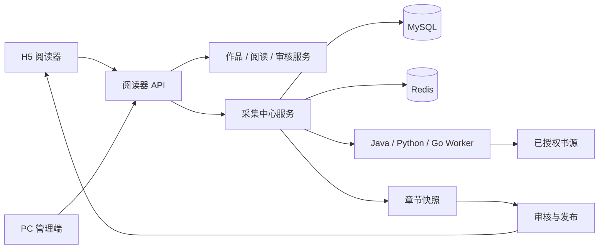

# 悦读 Reader 后端

悦读 Reader 后端是基于开源 [RuoYi-Vue-Plus](https://gitee.com/dromara/RuoYi-Vue-Plus) 6.X 构建的阅读平台服务端，面向 H5 阅读器和 PC 管理端提供作品、分类、榜单、目录、章节正文、书架、搜索、评论、审核、反馈和书源采集中心能力。

本仓库保留 RuoYi-Vue-Plus 的用户、角色、菜单、数据权限、日志、缓存、OSS、定时任务和系统监控能力；阅读器业务集中在 `ruoyi-modules/ruoyi-reader`，采集协议参考 Worker 位于 `tools/reader-source-worker`。

## 项目定位

- **阅读服务**：为 H5 提供首页、书城、作品详情、目录、章节正文、书架、历史、书签、评论、阅读进度和个人中心接口。
- **内容运营**：为 PC 管理端提供作品管理、作品分类、榜单配置、内容审核、发布记录、反馈工单和采集数据大盘。
- **授权采集**：以管理员明确授权的书源为边界，提供站点登记、许可确认、限流策略、解析规则、任务编排和全链路审计。
- **稳定续采**：任务按书籍和章节记录进度，Worker 通过租约领取工作；站点暂时不可用时，在其他已登记且授权的书源上续采缺失章节。

## 技术栈

| 层次 | 技术 |
| --- | --- |
| 运行时 | Java 21、Spring Boot 4.1、Maven |
| 权限认证 | Sa-Token、JWT、客户端授权 |
| 数据访问 | MyBatis、MyBatis-Plus、MySQL |
| 缓存与并发 | Redis、Redisson、分布式锁、租约 |
| 接口与运维 | SpringDoc、SSE/WebSocket、OSS、定时任务、操作日志 |
| 采集执行器 | Java、Python、Go 参考 Worker |

通用框架能力和组织方式参考 RuoYi-Vue-Plus 官方开源项目；阅读器特有的作品、章节、快照、审核和采集表结构位于 `ruoyi-modules/ruoyi-reader` 与 `script/sql`。

## 核心流程

### 阅读流程

1. H5 请求首页或书城数据，服务端返回作品卡片、实际分类、榜单、连载状态以及横版/竖版封面。
2. 用户进入详情后获取作者、简介、状态、推荐和目录分页数据。
3. 阅读页按章节读取格式化正文，服务端保存章节号、页码、滚动位置和阅读进度。
4. 书架、历史、书签、评论和统计由应用接口持久化；访客登录后可合并访客数据。

### 采集流程

1. 管理员登记站点，填写授权来源、允许主机和站点备注。
2. 完成采集许可确认，配置请求间隔、并发、分钟限流、每日额度、超时和熔断阈值。
3. 使用声明式 CSS 规则配置书籍列表、作品详情、章节目录和正文选择器，并测试后发布规则。
4. 创建单本、全站或分类任务，设置书籍数量、章节范围、增量模式和 Worker 类型。
5. 服务端把主任务拆成书籍/章节工作项，Worker 领取租约、按策略请求站点并返回结构化结果与正文哈希。
6. 服务端负责幂等写入、质量校验、进度、失败分类、日志、租约续期和重试；Worker 不负责绕过反爬限制。
7. 每日额度、分钟限流、401/403、5xx、超时、解析失败和熔断都会写入明确状态；跨日任务由每日重试机制继续推进。
8. 主站点无法继续时，系统从已配置且已授权的其他站点生成备用子任务，只补采主任务缺失章节。
9. 结果先进入章节快照和内容审核，审核通过后补偿写入作品管理、章节正文和发布数据。
10. 章节任务完成后可触发异步封面任务，匹配并绑定横版、竖版候选封面，同时保留来源和失败原因。

## 架构图

详细设计见 [`docs/reader-platform-architecture.md`](docs/reader-platform-architecture.md)，其中包含总体架构、状态流转、主子任务、备用书源和审核发布流程。



## 当前完成情况

- 作品、目录分页、章节正文、书架、历史、进度、书签、搜索、分类、榜单、评论、反馈和个人中心接口已接入。
- 作品支持横版/竖版封面、全局或作品级背景配置、连载状态和正文格式化。
- PC 管理端已接入作品管理、内容审核、发布记录、作品分类、榜单配置、采集中心和采集数据大盘。
- 采集中心包含站点、限流策略、解析规则、任务、运行记录、失败记录、任务日志、章节快照、任务书籍、主子任务和备用书源明细。
- 支持书籍数量限制、每日额度等待与重试、熔断重试、批量任务操作、Worker 租约、章节去重和快照补偿入库。
- Java、Python、Go Worker 共享同一服务端领取、许可、上报和错误协议，并保留对应测试或格式化工具。
- SQL 初始化脚本和增量升级脚本均保留在 `script/sql`，方便新库初始化和已有库升级。

## 后续规划

- 将任务执行从轮询进一步演进为可观测的分布式队列，并补充 Prometheus 指标、告警和 SLA 报表。
- 为每个书源增加结构化测试样本、规则回归测试、灰度发布和规则版本回滚。
- 强化备用书源的标题、作者、章节序号和正文指纹匹配，完善跨站差异合并。
- 补充全站任务的暂停、取消、续租、跨日恢复和大规模压测。
- 将封面和正文资源统一接入生产 OSS，补充版权来源、缓存失效和资源生命周期管理。

## 开发运行

```bash
./mvnw -pl ruoyi-admin -am spring-boot:run -Dspring-boot.run.profiles=dev
```

阅读器数据库初始化和升级脚本位于 `script/sql`。Worker 的环境变量、启动方式和安全边界见 [`tools/reader-source-worker/README.md`](tools/reader-source-worker/README.md)。生产环境必须使用正式数据库、OSS、授权站点和 Worker 密钥，不要提交本地日志、缓存、密钥或虚拟环境。
