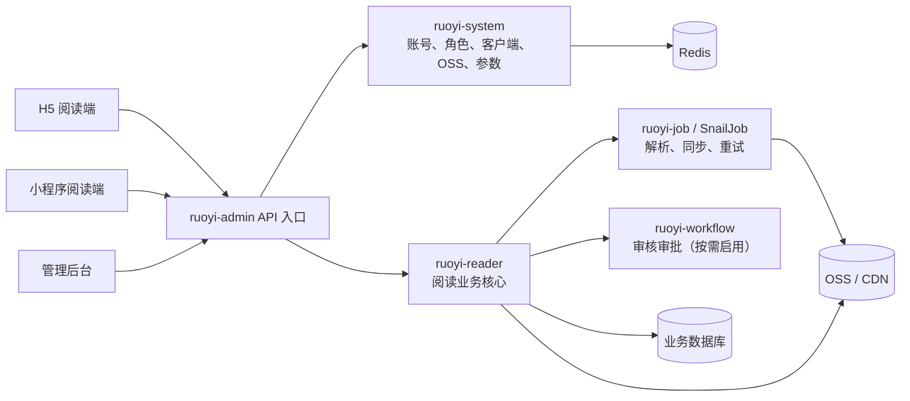

# RuoYi-Vue-Plus 6.X 后端底座解读与阅读器实施蓝图

## 文档说明

- 分析对象：`RuoYi-Vue-Plus` 当前本地 `6.X` 基线。
- 分析分支：`analysis/reader-backend-fit`。
- 分析时间：2026-08-09。
- 配套需求文档：[02-阅读器需求梳理与完善.md](/Users/yabin/code/ruoyi/RuoYi-Vue-Plus/doc/02-阅读器需求梳理与完善.md:1)。
- 目标：说明当前工程的真实能力边界，并给出阅读器项目可直接执行的后端模块、代码组织和迭代路线。

## 先读这一页

| 结论项 | 决策 |
| --- | --- |
| 底座定位 | 保留 RuoYi-Vue-Plus 作为后台基础设施和管理域，不把它当成阅读器成品。 |
| 业务模块 | 首期新增一个 `ruoyi-reader` Maven 模块，内部按领域分包；不在首期拆多个 Maven 模块或微服务。 |
| 内容来源 | 首期优先“文件导入 + 人工审核发布”；授权来源同步只在合同、API 和频率策略明确后启用。 |
| 多端策略 | H5、小程序、后台管理使用同一套后端 API，但通过 `sys_client`、权限和 DTO 分层隔离。 |
| 数据策略 | 阅读内容、阅读进度、书架、来源授权、审核记录都由阅读业务表持有；`ruoyi-system` 不承载阅读业务数据。 |
| 落地顺序 | 先建内容模型与文件导入，再建阅读端 API 与进度，最后接运营、审核和授权来源同步。 |

## 目标架构与职责边界



### 业务模块建议

首期只新增 `ruoyi-modules/ruoyi-reader`，保持一个可独立测试、可独立授权的阅读领域模块：

```text
ruoyi-reader
├── controller
│   ├── app          # H5 / 小程序读者接口
│   └── admin        # 后台管理接口
├── application      # 用例编排、事务、任务投递
├── domain
│   ├── content      # 作品、小说卷章、漫画章节与页
│   ├── ingest       # 文件导入、授权来源、解析任务
│   ├── reading      # 书架、进度、历史、书签、笔记
│   ├── operation    # 推荐、榜单、专题
│   └── audit        # 审核、下架、版权投诉
├── infrastructure   # Mapper、OSS、缓存、外部来源适配器
└── job              # 任务执行器
```

这种组织方式能避免把阅读业务散落到 `ruoyi-system`，同时为后续按领域拆分服务保留边界。

## 一句话结论

这不是一个现成的“阅读器后端”，而是一套功能较完整、适合二次开发的后台平台底座。  
它最有价值的部分是：认证权限、客户端管理、文件存储、任务调度、代码生成、日志审计、系统配置、监控能力已经比较齐全。  
对于阅读器项目来说，最推荐的用法是：**保留它做基础设施和管理域，新建阅读业务模块承载作品、章节、书架、进度、导入、同步等核心业务**。

## 项目定位

- 根 README 明确说明它是面向“分布式集群场景”的后台管理系统升级版，强调插件化、扩展性和基础设施能力，见 [README.md](/Users/yabin/code/ruoyi/RuoYi-Vue-Plus/README.md:18)。
- `ruoyi-admin` 的描述直接写的是“web 服务入口”，说明它本身是聚合启动层，不是单一业务模块，见 [ruoyi-admin/pom.xml](/Users/yabin/code/ruoyi/RuoYi-Vue-Plus/ruoyi-admin/pom.xml:14)。
- 业务模块、通用模块、扩展模块分层清晰，说明框架设计目标是“可组合式平台”，不是“单场景应用”。

## 目录与模块结构

### 1. 启动与聚合层

- `ruoyi-admin`
  - 作用：整个主应用入口，负责把系统、任务、AI、工作流、代码生成等模块组装起来。
  - 启动类： [DromaraApplication.java](/Users/yabin/code/ruoyi/RuoYi-Vue-Plus/ruoyi-admin/src/main/java/org/dromara/DromaraApplication.java:13)
  - 关键依赖：`ruoyi-system`、`ruoyi-job`、`ruoyi-ai`、`ruoyi-workflow`、`ruoyi-demo`，以及默认启用的 `ruoyi-gen`，见 [ruoyi-admin/pom.xml](/Users/yabin/code/ruoyi/RuoYi-Vue-Plus/ruoyi-admin/pom.xml:71)。

### 2. 通用能力层

- `ruoyi-common`
  - 作用：通用基础设施。
  - 拆分很细，包括：
    - `ruoyi-common-core`
    - `ruoyi-common-mybatis`
    - `ruoyi-common-redis`
    - `ruoyi-common-oss`
    - `ruoyi-common-satoken`
    - `ruoyi-common-security`
    - `ruoyi-common-log`
    - `ruoyi-common-excel`
    - `ruoyi-common-encrypt`
    - `ruoyi-common-push`
    - `ruoyi-common-social`
    - `ruoyi-common-sensitive`
    - `ruoyi-common-web`
  - 模块清单见 [ruoyi-common/pom.xml](/Users/yabin/code/ruoyi/RuoYi-Vue-Plus/ruoyi-common/pom.xml:18)。

### 3. 业务模块层

- `ruoyi-system`
  - 系统管理域。
  - 包含用户、角色、菜单、部门、字典、参数、公告、客户端、OSS 配置、消息等。
  - 它是当前项目里最接近“后台管理平台基础域”的模块，见 [ruoyi-system/pom.xml](/Users/yabin/code/ruoyi/RuoYi-Vue-Plus/ruoyi-modules/ruoyi-system/pom.xml:14)。

- `ruoyi-gen`
  - 代码生成器模块。
  - 可以根据数据库表快速生成 CRUD 代码和页面骨架，适合后续快速起阅读器后台业务，见 [GenController.java](/Users/yabin/code/ruoyi/RuoYi-Vue-Plus/ruoyi-modules/ruoyi-gen/src/main/java/org/dromara/gen/controller/GenController.java:36)。

- `ruoyi-job`
  - 任务调度模块。
  - 当前代码更偏任务执行样例与接入示例，适合承载导入、同步、重试、清理等异步任务。

- `ruoyi-workflow`
  - 工作流审批模块。
  - 如果后面要做内容审核、上架审批、版权投诉处理流，可以利用。

- `ruoyi-ai`
  - AI 相关模块。
  - 对阅读器首版不是必需，但后面可以用于智能标签、简介润色、审核辅助、问答推荐。

### 4. 扩展层

- `ruoyi-extend`
  - 例如监控中心、SnailJob 服务端、SnailAI 服务端等。
  - 更像配套运维与扩展能力，不是核心业务层。

### 5. SQL 脚本层

- `script/sql/ry_vue.sql`
  - 主系统表结构。
- `script/sql/ry_job.sql`
  - 任务相关表。
- `script/sql/ry_workflow.sql`
  - 工作流相关表。
- `script/sql/ry_ai.sql`
  - AI 相关表。

## 技术栈与基础配置

- JDK：21，见 [pom.xml](/Users/yabin/code/ruoyi/RuoYi-Vue-Plus/pom.xml:20)
- Spring Boot：4.1.0，见 [pom.xml](/Users/yabin/code/ruoyi/RuoYi-Vue-Plus/pom.xml:23)
- ORM：MyBatis Plus，见 [pom.xml](/Users/yabin/code/ruoyi/RuoYi-Vue-Plus/pom.xml:30)
- 多数据源：dynamic-datasource，见 [pom.xml](/Users/yabin/code/ruoyi/RuoYi-Vue-Plus/pom.xml:32)
- 权限认证：Sa-Token，见 [pom.xml](/Users/yabin/code/ruoyi/RuoYi-Vue-Plus/pom.xml:38)
- 缓存/锁：Redisson + Lock4j，见 [pom.xml](/Users/yabin/code/ruoyi/RuoYi-Vue-Plus/pom.xml:43)
- 文档：SpringDoc，见 [pom.xml](/Users/yabin/code/ruoyi/RuoYi-Vue-Plus/pom.xml:26)
- 文件存储：S3 协议兼容 OSS，见 [pom.xml](/Users/yabin/code/ruoyi/RuoYi-Vue-Plus/pom.xml:61)
- 调度：SnailJob，见 [pom.xml](/Users/yabin/code/ruoyi/RuoYi-Vue-Plus/pom.xml:45)

## 启动方式与应用入口

- 主启动类是 [DromaraApplication.java](/Users/yabin/code/ruoyi/RuoYi-Vue-Plus/ruoyi-admin/src/main/java/org/dromara/DromaraApplication.java:13)。
- 启动后对外是一个单体聚合服务，但内部通过模块拆分组织代码。
- `application.yml` 里能看到：
  - 默认端口 `8080`
  - Sa-Token 配置
  - SpringDoc 配置
  - 消息推送配置
  - 工作流与 LiteFlow 配置
  - 文件上传限制
  - 接口加密与数据加密开关
  - 这些都在 [application.yml](/Users/yabin/code/ruoyi/RuoYi-Vue-Plus/ruoyi-admin/src/main/resources/application.yml:1)

## 认证与登录设计

这是这套项目最适合你的地方之一。

### 1. 认证入口

- 登录统一从 `/auth/login` 进入，见 [AuthController.java](/Users/yabin/code/ruoyi/RuoYi-Vue-Plus/ruoyi-admin/src/main/java/org/dromara/web/controller/AuthController.java:75)。
- 请求体里包含：
  - `clientId`
  - `grantType`
  - 对应登录参数
- 后端先查 `sys_client`，再根据 `grantType` 分发认证策略。

### 2. 客户端模型

- `sys_client` 表内置了客户端、授权类型、设备类型、访问路径、IP 白名单、token 时效、状态等信息，见 [ry_vue.sql](/Users/yabin/code/ruoyi/RuoYi-Vue-Plus/script/sql/ry_vue.sql:847)。
- 实体定义在 [SysClient.java](/Users/yabin/code/ruoyi/RuoYi-Vue-Plus/ruoyi-modules/ruoyi-system/src/main/java/org/dromara/system/domain/SysClient.java:20)。
- 后台已有完整客户端管理接口，见 [SysClientController.java](/Users/yabin/code/ruoyi/RuoYi-Vue-Plus/ruoyi-modules/ruoyi-system/src/main/java/org/dromara/system/controller/system/SysClientController.java:35)。

### 3. 认证策略模式

- 策略入口在 [IAuthStrategy.java](/Users/yabin/code/ruoyi/RuoYi-Vue-Plus/ruoyi-admin/src/main/java/org/dromara/web/service/IAuthStrategy.java:19)。
- 当前已实现的策略包括：
  - 密码登录
  - 短信登录
  - 社交登录
  - 邮箱登录
  - 小程序登录
- 这意味着 H5、小程序、后台管理可以天然做成不同客户端、不同登录方式。

### 4. 小程序能力现状

- 项目确实预留了小程序登录策略，见 [XcxAuthStrategy.java](/Users/yabin/code/ruoyi/RuoYi-Vue-Plus/ruoyi-admin/src/main/java/org/dromara/web/service/impl/XcxAuthStrategy.java:35)。
- 但它还不是开箱即用成品：
  - 小程序密钥是占位文本。
  - `openid` 查用户和自动注册逻辑还是 `todo`。
- 结论：**架子有，业务没做完**。

## 系统管理域现成能力

`ruoyi-system` 基本可以直接作为阅读器项目的后台底座。

### 已有内容

- 用户管理：`sys_user`
- 角色管理：`sys_role`
- 菜单权限：`sys_menu`
- 部门岗位：`sys_dept`、`sys_post`
- 字典参数：`sys_dict_*`、`sys_config`
- 通知公告：`sys_notice`
- 操作日志、登录日志
- OSS 文件管理与配置
- 客户端管理
- 在线用户与缓存监控

### 代表性控制器

- 用户/角色/菜单/部门：位于 `ruoyi-system/src/main/java/org/dromara/system/controller/system`
- 文件管理： [SysOssController.java](/Users/yabin/code/ruoyi/RuoYi-Vue-Plus/ruoyi-modules/ruoyi-system/src/main/java/org/dromara/system/controller/system/SysOssController.java:37)
- 客户端管理： [SysClientController.java](/Users/yabin/code/ruoyi/RuoYi-Vue-Plus/ruoyi-modules/ruoyi-system/src/main/java/org/dromara/system/controller/system/SysClientController.java:35)

## 文件存储能力

这套项目对阅读器非常有帮助。

### 1. 数据表

- `sys_oss`：文件记录表，保存文件名、原名、后缀、URL、服务商等，见 [ry_vue.sql](/Users/yabin/code/ruoyi/RuoYi-Vue-Plus/script/sql/ry_vue.sql:796)
- `sys_oss_config`：文件存储配置表，见 [ry_vue.sql](/Users/yabin/code/ruoyi/RuoYi-Vue-Plus/script/sql/ry_vue.sql:815)

### 2. 工厂机制

- `OssFactory` 会从 Redis 缓存读取默认配置，再构建对应的 OSS Client，见 [OssFactory.java](/Users/yabin/code/ruoyi/RuoYi-Vue-Plus/ruoyi-common/ruoyi-common-oss/src/main/java/org/dromara/common/oss/factory/OssFactory.java:34)
- 说明它已经具备：
  - 配置动态切换
  - 客户端缓存
  - S3 协议兼容扩展

### 3. 现成接口

- 上传：`POST /resource/oss/upload`
- 下载：`GET /resource/oss/download/{ossId}`
- 列表与删除：同一控制器内已提供，见 [SysOssController.java](/Users/yabin/code/ruoyi/RuoYi-Vue-Plus/ruoyi-modules/ruoyi-system/src/main/java/org/dromara/system/controller/system/SysOssController.java:75)

### 4. 对阅读器的意义

可以直接承载：

- 小说原始导入文件
- 漫画压缩包或页面图
- 作品封面
- 章节插图
- 转换后的中间产物
- 审核附件

## 任务调度与异步能力

- README 说明项目以 SnailJob 作为分布式任务调度方案，见 [README.md](/Users/yabin/code/ruoyi/RuoYi-Vue-Plus/README.md:78)。
- `ruoyi-job` 中已有任务执行示例，适合你后续接：
  - 文件导入解析
  - 作品元数据补全
  - 漫画切页校验
  - 来源同步
  - 定时更新
  - 失败重试
  - 日志归档

## 代码生成能力

- 代码生成器入口在 [GenController.java](/Users/yabin/code/ruoyi/RuoYi-Vue-Plus/ruoyi-modules/ruoyi-gen/src/main/java/org/dromara/gen/controller/GenController.java:36)。
- 它支持：
  - 读取数据库表
  - 导入生成配置
  - 预览代码
  - 下载代码
  - 同步数据库字段
- 对阅读器项目的价值：
  - 先设计表结构
  - 批量生成作品、章节、分类、标签、书架、评论等后台 CRUD 骨架
  - 把精力放在阅读业务与接口设计上

## 当前项目的优点

- 模块边界清晰，适合新增业务模块。
- 认证体系对多端支持友好。
- 系统管理域较完整，能省掉大量后台基础开发。
- OSS 和任务调度对内容平台很关键，这里已有现成底座。
- 代码生成器能大幅提速后台业务开发。
- 监控、日志、审计、参数配置能力成熟度高于很多普通脚手架。

## 当前项目的不足

- 没有阅读器业务模型。
- 小程序登录是半成品，需要自己补完绑定/注册逻辑。
- 没有内容导入解析能力。
- 没有作品、章节、漫画页、阅读进度、书签、评论等领域模型。
- 没有适合前台阅读端的专用 API 分层。
- 没有现成的内容审核、版权投诉、同步来源治理业务。

## 它和“小说/漫画阅读器”需求的匹配方式

### 适合直接复用的部分

- 管理后台账号、角色、权限
- 客户端管理
- OSS 文件管理
- 参数配置、字典、公告
- 日志、审计、监控
- 定时任务/异步任务底座
- 代码生成器

### 适合扩展实现的部分

- H5 / 小程序登录
- 读者用户体系
- 内容导入与授权来源同步
- 阅读进度同步
- 消息通知
- 审核工作流

### 必须新建的阅读业务模块

必须新增 `ruoyi-reader` 模块，专门承载：

- 作品管理
- 作者、分类、标签
- 小说卷章
- 漫画章节与页序
- 书架、历史、进度、书签、笔记
- 评论、举报
- 导入任务、同步任务
- 审核发布

## 推荐的落地架构

### 方案建议

- 保留 `ruoyi-admin` 作为启动入口。
- 保留 `ruoyi-system` 作为管理基础域。
- 新增 `ruoyi-modules/ruoyi-reader` 作为唯一的阅读核心业务 Maven 模块。
- 在 `ruoyi-reader` 内部以 `content`、`ingest`、`reading`、`operation`、`audit` 五个领域分包。
- 阅读前台接口与后台管理接口在 Controller、DTO、权限点上分开组织，不复用后台实体直接对外。
- 异步任务只负责“长耗时和可重试”工作；API 请求内不解析大文件、不批量切漫画页、不拉取授权来源全量内容。

### 角色分工建议

- `ruoyi-system`
  - 管后台基础能力
- `ruoyi-reader`
  - 内容域与阅读域
- `ruoyi-job`
  - 导入、解析、同步、重试
- `ruoyi-workflow`
  - 内容审核、上架审批、投诉处理

## 需求到框架的映射

| 阅读器需求 | 直接复用 | 新增实现 | 关键约束 |
| --- | --- | --- | --- |
| H5 / 小程序登录 | `sys_client`、Sa-Token、认证策略 | 读者自动注册、OpenID 绑定、游客数据合并 | 小程序登录现有代码仍有 `todo`，必须补齐。 |
| 后台权限 | 用户、角色、菜单、数据权限、日志 | 阅读器菜单与权限标识 | 不把 C 端读者作为后台 `sys_user` 的直接替代。 |
| 文件导入 | OSS、文件记录、参数配置、任务调度 | 格式识别、章节/图片解析、任务状态机 | 原始文件与解析产物必须可追溯。 |
| 授权来源同步 | 参数配置、调度、日志、缓存、锁 | 授权记录、来源适配器、限流、熔断、去重 | 仅允许合同或 API 明确授权的来源。 |
| 阅读内容 | MyBatis Plus、Redis、OSS/CDN | 作品、章节、页、目录、内容访问 API | 小说正文与漫画图片不可使用同一读取模型。 |
| 阅读进度 | Redis、分布式锁、任务能力 | 进度合并、异步落库、跨端冲突规则 | 以用户和作品维度保证“最近进度优先”。 |
| 审核运营 | 工作流、公告、字典、日志 | 审核单、推荐位、榜单、专题 | 导入完成不代表自动发布。 |

## 推荐实施路线

### 第一阶段：建立可阅读内容闭环

1. 建立 `ruoyi-reader`、核心表和基础权限。
2. 完成小说/漫画作品、章节、页、目录的后台 CRUD。
3. 完成文件上传、导入任务、异步解析、草稿内容生成。
4. 完成审核发布状态机和 H5 / 小程序共用的作品、目录、阅读接口。
5. 完成书架、阅读进度、历史记录。

验收结果：管理员可导入一部小说或漫画，审核后发布；读者可在 H5 和小程序阅读并跨端继续阅读。

### 第二阶段：运营与治理闭环

1. 推荐位、榜单、专题、搜索热词。
2. 书签、笔记、消息、评论举报。
3. 数据看板、失败告警、导入质量报表。
4. 小程序登录的账号绑定和游客数据合并。

### 第三阶段：授权来源同步

1. 先完成授权合同、来源白名单、字段映射和频率规则的后台配置。
2. 每个来源实现独立适配器，禁止在通用业务层写站点特定解析逻辑。
3. 启用条件请求、限速、失败退避、熔断、人工暂停、审计日志。
4. 默认进入草稿与审核队列；只有来源合同明确允许时才可配置自动发布。

## 对当前项目的理解建议

如果你准备长期基于它开发，推荐按这个顺序读代码：

1. 先看根模块与启动配置  
   [pom.xml](/Users/yabin/code/ruoyi/RuoYi-Vue-Plus/pom.xml:15)  
   [application.yml](/Users/yabin/code/ruoyi/RuoYi-Vue-Plus/ruoyi-admin/src/main/resources/application.yml:1)

2. 再看认证链路  
   [AuthController.java](/Users/yabin/code/ruoyi/RuoYi-Vue-Plus/ruoyi-admin/src/main/java/org/dromara/web/controller/AuthController.java:75)  
   [IAuthStrategy.java](/Users/yabin/code/ruoyi/RuoYi-Vue-Plus/ruoyi-admin/src/main/java/org/dromara/web/service/IAuthStrategy.java:31)

3. 再看系统模块  
   `ruoyi-modules/ruoyi-system/src/main/java/org/dromara/system`

4. 再看 SQL 初始化脚本  
   [ry_vue.sql](/Users/yabin/code/ruoyi/RuoYi-Vue-Plus/script/sql/ry_vue.sql:1)

5. 最后看代码生成器和 OSS  
   [GenController.java](/Users/yabin/code/ruoyi/RuoYi-Vue-Plus/ruoyi-modules/ruoyi-gen/src/main/java/org/dromara/gen/controller/GenController.java:36)  
   [SysOssController.java](/Users/yabin/code/ruoyi/RuoYi-Vue-Plus/ruoyi-modules/ruoyi-system/src/main/java/org/dromara/system/controller/system/SysOssController.java:37)

## 最终判断

对于你的项目，这套框架**值得作为后端基础底座继续推进**。  
但请从一开始就接受一个前提：  
**它能帮你省掉后台平台和基础设施开发，不会替你完成阅读器业务本身。**

如果后面继续做阅读器开发，最合理的路线不是“魔改 `ruoyi-system`”，而是“以它为底座，新增 `ruoyi-reader`，用清晰领域边界承接阅读业务”。
