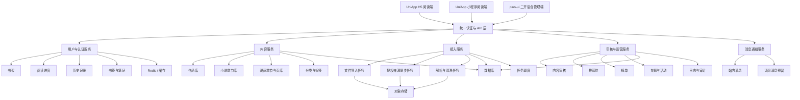
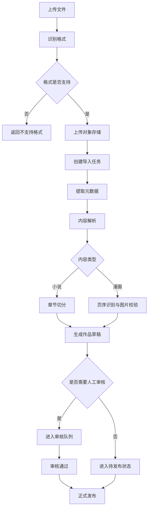
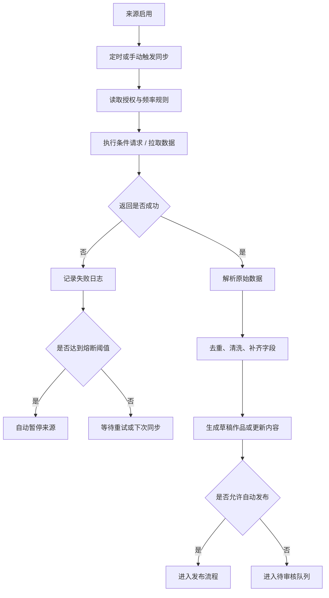
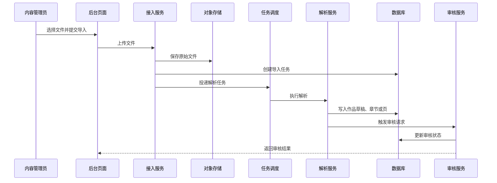
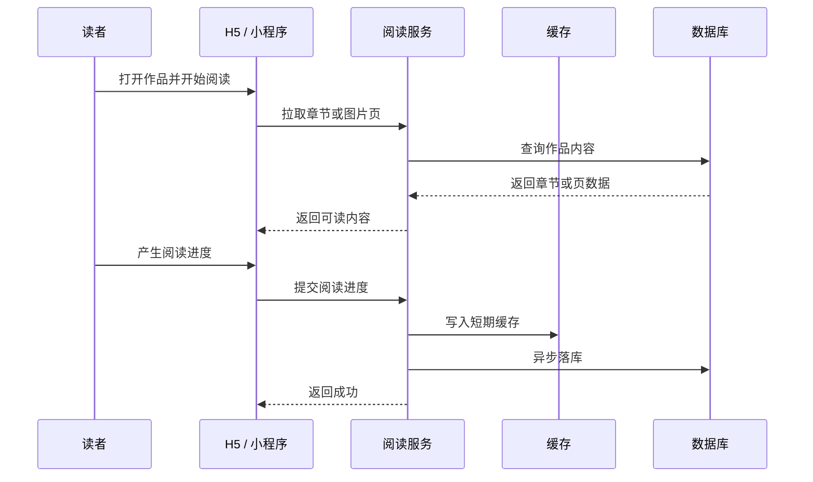
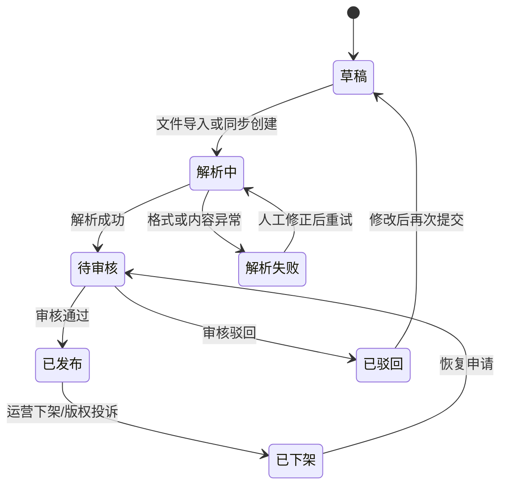
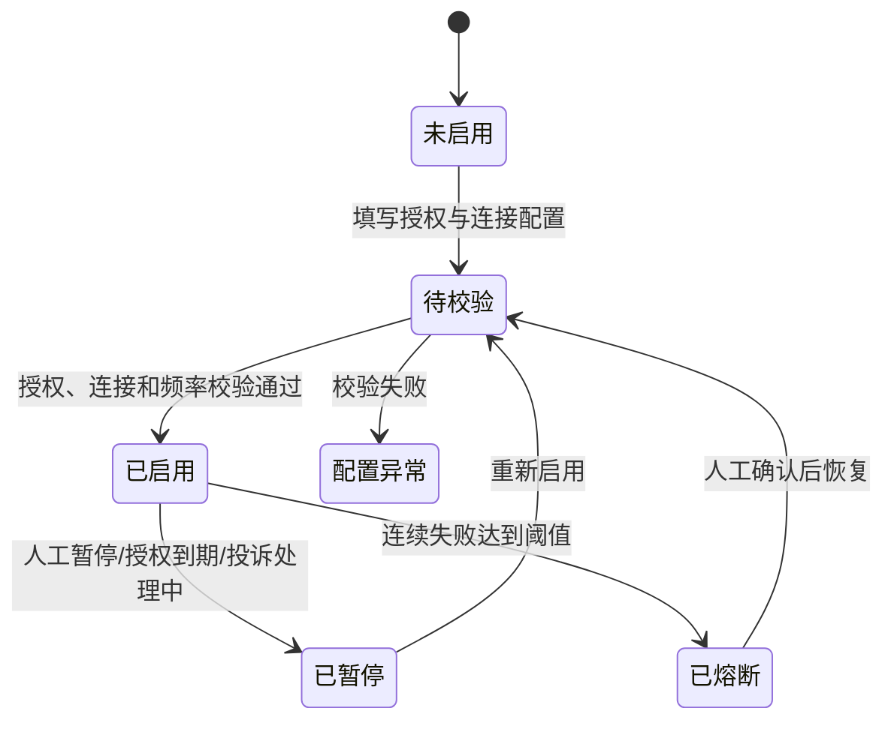

# 小说漫画阅读器 PRD：需求、边界与实施拆解

## 1. 文档说明

- 文档目标：把“小说 + 漫画阅读器”产品需求细化到可进入原型、表结构、接口设计和任务拆解的粒度。
- 产品形态：
  - 阅读端：H5、小程序
  - 管理端：专属后台管理平台
- 内容接入：文件导入、合规授权来源同步
- 当前版本定位：第一版以后端业务范围和模块边界清晰为目标，不在本阶段定义视觉设计稿。
- 当前日期基线：2026-08-09。
- 配套后端底座文档：[01-RuoYi-Vue-Plus-6X后端项目解读.md](/Users/yabin/code/ruoyi/RuoYi-Vue-Plus/doc/01-RuoYi-Vue-Plus-6X后端项目解读.md:1)。
- 配套前端实施文档：[03-阅读器前端实施方案与界面蓝图.md](/Users/yabin/code/ruoyi/RuoYi-Vue-Plus/doc/03-阅读器前端实施方案与界面蓝图.md:1)。

> 最新口径：C 端前端统一以 `UniApp` 为主工程，输出小程序 + H5 + App；`plus-ui` 仅承担后台管理端。以下凡涉及“`plus-ui` 承担 H5”的旧表述，均以本条为准覆盖。

## 1.5 关键决策摘要

| 决策项 | 当前确定方案 |
| --- | --- |
| 客户端形态 | C 端由 `UniApp` 一套工程输出 H5、小程序、App；后台管理由 `plus-ui` 承担；前台与后台 API、DTO、权限独立。 |
| 内容形态 | 小说和漫画共用作品元数据；小说使用“卷-章-正文”，漫画使用“章-页-图片”。 |
| 内容来源 | 文件导入是首发主链路；授权来源同步只支持已签约、已获 API/数据包授权的来源。 |
| 合规边界 | 不做未经授权抓取，不做绕过访问限制、验证码、封禁或身份伪装。 |
| 首发范围 | 完成“导入 -> 审核 -> 发布 -> 阅读 -> 书架/进度”的闭环；授权来源同步不作为首发上线前置条件。 |
| 后端组织 | 基于 RuoYi-Vue-Plus 新增单一 `ruoyi-reader` 模块，内部按内容、接入、阅读、运营、审核分包。 |
| C 端前端框架 | 使用 `UniApp` 作为统一前端实现框架，支持输出小程序、H5 和 App，保留平台适配层。 |
| 后台前端框架 | 后台管理页面基于当前 `RuoYi-Vue-Plus` 官方配套的 `plus-ui`（Vue + Element Plus）二次开发。前端仓库路径为 `/Users/yabin/code/ruoyi/plus-ui`，分支为 `6.X-Vue`。 |
| 数据原则 | 内容来源、原始文件、解析版本、审核记录、发布版本均必须可回溯。 |
| 运营原则 | 导入或同步完成默认生成草稿；是否自动发布由来源合同、审核规则和运营配置共同决定。 |

## 1.6 技术与框架约束

- C 端端：明确采用 `UniApp`，首期同时覆盖微信小程序与 H5，后续可扩展 App。
- 后台管理端：必须基于 `plus-ui` 现有权限、路由、标签页、字典、请求封装和菜单体系扩展阅读器业务页面。
- 前后端接口：`reader app API` 从首期开始就要兼容 `UniApp` 输出的 H5、小程序与 App 的共用 DTO 和错误码约定。

### 阅读顺序

1. 先读本节和“产品边界”，确认不做什么。
2. 再读“内容接入”“内容模型”“阅读端需求”，确认业务闭环。
3. 最后读“版本计划与验收标准”和“基于 RuoYi 的落地建议”，用于排期和开发拆分。

## 2. 产品定义

这是一个同时支持小说与漫画阅读的内容平台，面向 C 端读者提供 H5、小程序和后续 App 体验，面向运营和内容管理员提供后台管理能力。

其中，C 端前端框架确定为 `UniApp`；后台管理页面确定基于 `RuoYi-Vue-Plus` 官方配套的 `plus-ui` 进行二次开发。

平台的核心价值是：

- 让读者稳定、连续、跨端地阅读小说和漫画。
- 让内容管理员可以把来自文件导入和授权来源同步的内容统一纳入平台治理。
- 让运营可以完成作品上架、推荐、审核、分类、数据分析和活动配置。

## 3. 产品目标

### 3.1 业务目标

- 建立统一的小说/漫画内容库。
- 建立稳定的内容导入、同步、审核、发布链路。
- 建立读者书架、进度、历史、消息通知等基础阅读闭环。
- 为未来会员、付费章节、创作者合作和活动运营预留扩展空间。

### 3.2 用户目标

- 读者可以快速找到作品并继续上次阅读。
- 读者在 H5 和小程序之间切换时，书架、历史和进度保持一致。
- 运营可以在不依赖研发的前提下完成大部分内容维护与推荐配置。

### 3.3 系统目标

- 内容接入过程可追踪、可暂停、可审计、可重试。
- 所有高风险内容操作都有状态记录和日志留痕。
- 平台底层支持小说和漫画双内容形态共存。

## 4. 用户角色与权限范围

### 4.1 游客读者

- 可浏览首页、详情、目录、部分公开章节。
- 可使用搜索、筛选、榜单、推荐浏览。
- 不可使用云书架、云进度、评论、通知等账户能力。

### 4.2 登录读者

- 拥有游客全部能力。
- 可加入书架、同步阅读进度、保存书签、查看历史、接收消息。
- 可提交评论、举报、反馈。

### 4.3 内容管理员

- 管理文件导入任务。
- 管理授权来源和同步任务。
- 处理解析失败、图片异常、章节异常、任务重试。
- 可编辑作品内容，但不一定有最终发布权限。

### 4.4 审核管理员

- 审核作品、章节、图片、简介、标签等内容。
- 处理上架、驳回、下架、冻结。
- 处理版权投诉、违规举报。

### 4.5 运营管理员

- 管理推荐位、轮播、榜单、活动位、公告、搜索热词。
- 查看数据报表。
- 管理分类、标签、专题。

### 4.6 超级管理员

- 管理后台账号、角色、权限。
- 管理系统参数、客户端配置、OSS、任务策略。
- 可执行全部高危操作。

## 5. 产品边界

### 5.1 当前纳入范围

- 小说阅读
- 漫画阅读
- H5
- 小程序
- 后台管理
- 文件导入
- 合规授权来源同步
- 内容审核发布
- 基础用户体系
- 基础消息通知
- 基础数据报表

### 5.2 当前不纳入范围

- 未经授权的公开站点内容抓取
- 绕过访问限制、绕过封禁、伪装身份规避限制
- 完整创作者分润结算系统
- 复杂社区关系链
- 音频书、有声书正式能力
- 多语言国际化首版全覆盖

## 6. 核心业务原则

### 6.1 内容原则

- 小说和漫画共享“作品层”，但不共享“阅读载体层”。
- 小说以卷、章、正文为核心。
- 漫画以章节、页、图片资源为核心。

### 6.2 接入原则

- 所有接入内容都必须能追溯来源。
- 所有来源都必须有可审计授权记录或导入记录。
- 平台不提供规避来源限制的能力。

### 6.3 发布原则

- 导入成功不等于自动上架。
- 同步成功不等于自动发布。
- 发布行为必须经过配置化流程控制。

### 6.4 用户原则

- 阅读进度、书架、历史属于用户核心数据，必须优先保证一致性。
- 阅读器交互优先“继续阅读”而不是“重新发现”。

### 6.5 合规来源同步原则

- 只接受三类来源：签约 API、来源方主动推送、可证明授权的数据文件包。
- 每个来源必须配置授权主体、授权范围、授权有效期、可同步字段、最大频率、发布限制和联系人。
- “避免 IP 被封禁”只通过低频、限流、条件请求、退避、缓存、熔断和人工暂停实现；不使用代理池、伪造身份、绕过风控等规避措施。
- 来源授权失效、接口协议变更、连续失败或投诉未结案时，系统必须自动暂停同步。

## 6.6 图示总览

### 6.6.1 整体架构图

### 6.6.2 文件导入流程图

### 6.6.3 合规来源同步流程图

### 6.6.4 文件导入时序图

### 6.6.5 阅读进度同步时序图

### 6.6.6 内容与发布状态机

### 6.6.7 授权来源状态机

## 7. 内容接入总方案

内容接入分为两条主链路：

- 文件导入链路
- 合规授权来源同步链路

两条链路最终都会进入统一的内容处理、审核、发布流程。

## 8. 文件导入模块需求

## 8.1 功能目标

- 支持运营或内容管理员上传本地内容文件。
- 自动识别格式并进入相应解析流程。
- 尽可能自动提取元数据并减少人工录入成本。

## 8.2 支持格式

### 小说格式

- `TXT`
- `EPUB`
- `PDF`
- `DOCX`

### 漫画格式

- `CBZ`
- `ZIP 图片包`
- `PDF`

## 8.3 导入入口

- 后台“接入中心 > 文件导入”
- 支持单文件导入
- 支持批量导入
- 支持断点查看历史任务

## 8.4 导入表单字段

- 导入文件
- 内容类型：小说 / 漫画 / 自动识别
- 来源备注
- 是否自动提取封面
- 是否自动切分章节
- 是否进入人工审核
- 作品默认分类
- 作品默认标签
- 语言
- 编码方式：自动 / 指定
- 可见范围：全部可见 / 测试可见 / 指定渠道

## 8.5 文件导入处理流程

1. 上传文件到对象存储
2. 创建导入任务
3. 识别文件类型
4. 识别编码
5. 提取元数据
6. 解析内容结构
7. 生成草稿作品
8. 进入人工确认或审核
9. 完成发布或驳回

## 8.6 自动解析细节

### 小说解析

- 自动识别书名
- 自动识别作者
- 自动识别简介
- 自动识别章节标题
- 自动识别卷和章
- 统计总字数
- 检测空章节
- 检测重复章节标题
- 检测乱码

### 漫画解析

- 自动识别封面图
- 自动识别章节目录
- 自动识别页序
- 自动检测图片缺页
- 自动检测图片损坏
- 自动记录图片尺寸
- 自动生成缩略图

## 8.7 导入任务状态

- 待上传
- 上传中
- 待解析
- 解析中
- 待人工确认
- 待审核
- 审核中
- 待发布
- 已发布
- 已驳回
- 解析失败
- 已取消

## 8.8 导入任务详情页

- 任务编号
- 提交人
- 提交时间
- 文件名
- 文件大小
- 文件格式
- 内容类型
- 解析进度
- 解析日志
- 错误信息
- 生成作品链接
- 重试按钮
- 取消按钮
- 审核入口

## 8.9 导入异常场景

- 文件上传失败
- 文件格式不支持
- 编码识别失败
- 小说无法切章
- 漫画页序异常
- 图片损坏
- 元数据提取为空
- 重复导入

## 8.10 导入规则

- 同一文件可通过 hash 做重复导入检测。
- 解析失败的任务可重试，但必须保留失败日志。
- 已发布作品再次导入同名文件时，不允许直接覆盖正式内容，必须进入版本流程。

## 9. 合规授权来源同步模块需求

## 9.1 功能目标

- 面向已授权 API、RSS、公开数据源或书面授权站点建立稳定同步链路。
- 所有来源必须在后台可配置、可启停、可审计。

## 9.2 来源管理列表字段

- 来源编号
- 来源名称
- 来源类型
- 同步方式：API / RSS / Feed / 文件拉取 / 其他
- 授权状态：待确认 / 有效 / 即将过期 / 已过期 / 已禁用
- 来源域名或地址
- 负责人
- 最近同步时间
- 最近同步结果
- 启用状态

## 9.3 来源配置字段

- 来源名称
- 来源编码
- 来源类型
- 来源地址
- 授权说明
- 授权开始时间
- 授权结束时间
- 凭据类型
- 凭据内容
- 请求方式
- 请求头模板
- 请求频率上限
- 最大并发数
- 单次拉取条数
- 每日总配额
- 是否启用缓存
- 是否启用条件请求
- 是否自动发布
- 是否需要人工审核
- 异常阈值
- 熔断阈值
- 备注

## 9.4 同步任务功能

- 手动立即同步
- 定时自动同步
- 按作品同步
- 按时间范围同步
- 全量同步
- 增量同步
- 暂停
- 恢复
- 重试
- 熔断后人工恢复

## 9.5 同步任务状态

- 待执行
- 执行中
- 已完成
- 部分成功
- 失败
- 已暂停
- 已熔断
- 已取消

## 9.6 同步日志记录项

- 请求时间
- 响应状态码
- 请求耗时
- 请求条数
- 新增作品数
- 更新作品数
- 忽略条数
- 失败条数
- 错误原因

## 9.7 合规稳定性策略

平台仅提供合规稳定访问，不提供绕过限制能力。

- 强缓存
- 条件请求
- 全局限速
- 单来源限速
- 单来源并发控制
- 指数退避
- 遇到 `403` 自动暂停来源
- 遇到 `429` 按 `Retry-After` 或默认退避策略暂停
- 连续失败达到阈值后自动熔断
- 来源授权到期前提醒

## 9.8 来源异常处理

- 授权过期
- 接口结构变更
- 返回空数据
- 返回重复数据
- 部分字段缺失
- 图片下载失败
- 章节正文异常
- 页序缺失

## 10. 内容模型需求

## 10.1 通用作品模型

### 基础字段

- 作品 ID
- 作品类型：小说 / 漫画
- 主标题
- 副标题
- 原始标题
- 作者
- 原始作者名
- 简介
- 封面
- 横版封面
- 状态
- 发布状态
- 连载状态：连载中 / 已完结 / 暂停更新
- 来源类型：导入 / 授权来源 / 自建
- 来源 ID
- 来源作品 ID
- 默认分类
- 标签集合
- 推荐权重
- 是否推荐
- 是否热门
- 是否首页展示
- 是否允许搜索
- 是否允许评论
- 是否允许分享

### 统计字段

- 总章节数
- 总话数
- 总字数
- 总页数
- 浏览量
- 阅读人数
- 收藏数
- 点赞数
- 评论数
- 完读率

## 10.2 小说模型

### 卷

- 卷 ID
- 作品 ID
- 卷名
- 卷序
- 状态

### 章节

- 章节 ID
- 作品 ID
- 卷 ID
- 章节标题
- 原始章节标题
- 章节序号
- 正文内容
- 摘要
- 字数
- 发布时间
- 排序值
- 状态
- 可见状态

## 10.3 漫画模型

### 漫画章节

- 章节 ID
- 作品 ID
- 章节标题
- 原始章节标题
- 章节序号
- 发布时间
- 排序值
- 状态

### 漫画页

- 页 ID
- 章节 ID
- 页序
- 原图地址
- 展示图地址
- 缩略图地址
- 宽
- 高
- 文件大小
- 清晰度级别
- 是否损坏
- 是否缺失

## 10.4 标签与分类模型

- 分类支持层级结构
- 标签支持多选
- 同一作品可挂多个标签
- 分类和标签都需要支持启用/禁用

## 10.5 数据所有权与不可变记录

| 数据类别 | 主体表/对象 | 是否允许覆盖 | 设计要求 |
| --- | --- | --- | --- |
| 原始文件 | `import_task_file`、`sys_oss` | 不允许覆盖 | 保存文件校验值、来源、上传人和存储地址。 |
| 解析产物 | 作品、章节、漫画页 | 可生成新版本 | 解析重试不能覆盖已发布内容。 |
| 发布内容 | `work`、章节/页发布版本 | 不直接覆盖 | 修改后保留版本、审核记录和生效时间。 |
| 来源授权 | `content_source`、授权附件 | 不允许静默覆盖 | 必须保留有效期、合同/授权材料、操作人。 |
| 阅读行为 | 书架、进度、历史、书签 | 可按规则合并 | 用户、作品、终端、更新时间必须可追踪。 |

阅读进度的冲突规则固定为：同一用户同一作品以 `progress_updated_at` 最新的有效记录为准；同一时刻的重复上报必须幂等。

## 11. 阅读端需求

## 11.1 首页模块

### 页面目标

- 提供快速发现内容的入口
- 提供继续阅读入口
- 承接运营推荐与榜单

### 首页模块构成

- 顶部搜索框
- 轮播图
- 分类入口
- 频道切换：小说 / 漫画
- 推荐作品区
- 最新更新区
- 热门榜单区
- 最近阅读区
- 专题位

### 首页功能细节

- 支持按照客户端配置返回不同首页模块。
- 支持根据作品类型返回不同推荐列表。
- 最近阅读区仅登录用户可见。
- 当用户无阅读历史时，最近阅读区展示“热门推荐”兜底。

## 11.2 搜索与发现模块

### 搜索框功能

- 支持关键字模糊搜索
- 支持标题优先搜索
- 支持作者搜索
- 支持标签搜索
- 支持搜索联想
- 支持热词展示

### 搜索结果筛选项

- 内容类型
- 分类
- 标签
- 状态
- 更新时间
- 热度

### 搜索结果页功能

- 支持列表模式
- 支持双列卡片模式
- 支持按热度排序
- 支持按更新时间排序
- 支持按完结状态筛选

### 搜索异常处理

- 无结果时展示相关推荐
- 热词为空时展示默认热词
- 非法字符需要过滤

## 11.3 作品详情页模块

### 基础展示区

- 封面
- 标题
- 作者
- 分类
- 标签
- 连载状态
- 更新时间
- 简介
- 阅读人数
- 收藏数

### 操作区

- 加入书架
- 取消收藏
- 立即阅读
- 继续阅读
- 分享

### 内容区

- 目录列表
- 最新章节或话数
- 更新记录
- 相关推荐
- 评论区

### 目录功能

- 支持顺序
- 支持倒序
- 支持已读标识
- 支持定位上次阅读章节

## 11.4 小说阅读器模块

### 核心目标

- 让小说正文阅读连续、轻量、低打扰。

### 阅读器功能

- 上一章 / 下一章
- 目录跳转
- 自动保存阅读进度
- 字号调节
- 行距调节
- 页边距调节
- 背景主题切换
- 夜间模式
- 亮度调节
- 横竖屏适配
- 阅读时长统计
- 书签添加与删除
- 划线
- 笔记
- 长按复制

### 阅读器状态

- 加载中
- 正常阅读
- 章节为空
- 加载失败
- 已到底部

### 规则

- 每次退出章节时自动记录进度。
- 用户再次进入作品时默认进入最近阅读章节和滚动位置。
- 当章节下架或失效时，提示并跳转到可读章节。

## 11.5 漫画阅读器模块

### 核心目标

- 让漫画图片加载稳定、翻阅流畅、失败可恢复。

### 阅读模式

- 长图滚动模式
- 分页模式
- 左右翻页模式

### 阅读器功能

- 章节切换
- 目录跳转
- 进度同步
- 双击缩放
- 双指缩放
- 图片预加载
- 图片失败重试
- 清晰度切换
- 阅读方向设置
- 隐藏顶部底部栏

### 状态与异常

- 图片加载中
- 图片加载失败
- 当前页缺失
- 当前章节缺页
- 网络较差提示

### 规则

- 阅读进度以“章节 + 当前页”保存。
- 当某一页加载失败时，不阻塞用户继续浏览其他页，但必须展示重试入口。
- 长图模式下需要记住滚动位置。

## 11.6 书架模块

### 书架列表

- 支持小说与漫画混合展示
- 支持按最近阅读排序
- 支持按加入时间排序
- 支持按更新时间排序

### 书架操作

- 加入书架
- 移出书架
- 批量管理
- 查看更新标记
- 继续阅读

### 书架状态

- 已更新
- 未更新
- 已完结
- 已下架

## 11.7 阅读历史模块

### 记录内容

- 作品
- 阅读章节
- 阅读页
- 最近阅读时间
- 阅读来源端

### 功能

- 列表查看
- 清空历史
- 删除单条
- 快速继续阅读

## 11.8 书签与笔记模块

### 书签

- 小说支持按章节位置添加书签
- 漫画支持按章节页添加书签
- 支持编辑书签备注
- 支持删除书签

### 笔记

- 小说支持划线与文本笔记
- 漫画支持章节级图片备注
- 支持按作品筛选
- 支持导出预留

## 11.9 消息中心模块

### 消息类型

- 作品更新提醒
- 系统公告
- 活动通知
- 审核结果通知
- 违规处理通知

### 功能

- 未读数展示
- 全部已读
- 删除消息
- 按类型筛选

## 11.10 个人中心模块

### 页面模块

- 基本资料
- 书架入口
- 历史入口
- 书签入口
- 笔记入口
- 消息入口
- 设置入口

### 设置项

- 阅读偏好
- 夜间模式默认值
- 漫画阅读方向默认值
- 清晰度偏好
- 消息开关

## 12. 用户与账号体系需求

## 12.1 登录方式

- 手机号 + 验证码
- 密码登录
- 微信登录
- 微信小程序登录

## 12.2 游客模式

- 游客可浏览、可阅读公开内容
- 游客书架和进度仅保存在本地
- 游客登录后可触发本地数据合并

## 12.3 数据合并规则

- 本地书架与云书架去重合并
- 本地进度与云进度取“最近更新时间更晚”的版本
- 本地书签与云书签按唯一键去重

## 12.4 用户状态

- 正常
- 禁言
- 限制评论
- 冻结
- 注销

## 13. 后台管理平台需求

后台建议拆成七大中心：

- 内容中心
- 接入中心
- 审核发布中心
- 运营中心
- 用户中心
- 数据中心
- 系统中心

## 14. 内容中心需求

## 14.1 作品管理

### 列表字段

- 作品 ID
- 标题
- 类型
- 作者
- 分类
- 标签
- 来源类型
- 来源名称
- 连载状态
- 发布状态
- 更新时间
- 推荐状态

### 筛选条件

- 类型
- 来源
- 状态
- 分类
- 标签
- 作者
- 更新时间

### 操作

- 新建作品
- 编辑作品
- 查看详情
- 上架
- 下架
- 提交审核
- 删除草稿
- 复制作品

## 14.2 作品编辑页

### 基础信息区

- 标题
- 副标题
- 作者
- 简介
- 封面
- 横版封面
- 分类
- 标签
- 连载状态
- 关键词
- 来源备注

### 配置区

- 是否允许搜索
- 是否允许评论
- 是否允许分享
- 是否首页展示
- 推荐权重
- 发布渠道

## 14.3 小说章节管理

### 列表字段

- 章节 ID
- 章节标题
- 卷名
- 字数
- 序号
- 状态
- 发布时间

### 功能

- 新增章节
- 编辑章节
- 批量调整排序
- 批量发布
- 批量下架
- 预览正文
- 检测空章

## 14.4 漫画章节管理

### 列表字段

- 章节 ID
- 标题
- 页数
- 序号
- 状态
- 发布时间

### 功能

- 新增章节
- 编辑章节
- 上传图片页
- 调整页序
- 批量替换图片
- 检测缺页
- 章节预览

## 14.5 分类管理

- 支持一级、二级分类
- 支持排序
- 支持启用/停用
- 支持绑定频道

## 14.6 标签管理

- 标签名称
- 标签颜色
- 标签排序
- 标签状态
- 标签适用类型：小说 / 漫画 / 通用

## 14.7 作者管理

- 作者名称
- 作者别名
- 作者简介
- 作者头像
- 作者状态
- 关联作品数

## 15. 接入中心需求

## 15.1 文件导入任务管理

- 查看任务列表
- 查看任务详情
- 重试任务
- 取消任务
- 导出任务日志

## 15.2 授权来源管理

- 新增来源
- 编辑来源
- 启停来源
- 校验来源配置
- 查看授权状态
- 查看过期提醒

## 15.3 来源同步任务管理

- 手动同步
- 增量同步
- 全量同步
- 暂停
- 恢复
- 熔断后恢复
- 查看同步日志

## 15.4 解析与清洗中心

- 查看解析结果
- 人工修改自动提取字段
- 手工映射分类和标签
- 手工选择封面
- 手工修复章节名

## 16. 审核发布中心需求

## 16.1 内容审核列表

### 列表字段

- 审核单号
- 内容类型
- 作品标题
- 来源
- 提交人
- 提交时间
- 当前状态

### 操作

- 查看详情
- 通过
- 驳回
- 挂起
- 转交

## 16.2 审核详情页

- 基础信息
- 作品信息
- 章节预览
- 图片预览
- 敏感词结果
- 历史版本
- 审核意见

## 16.3 发布状态流转

- 草稿
- 待审核
- 审核中
- 审核通过
- 已发布
- 已下架
- 已驳回
- 已冻结

## 16.4 下架原因分类

- 主动下架
- 内容违规
- 版权投诉
- 来源失效
- 数据异常

## 16.5 版权投诉处理

- 投诉单创建
- 绑定作品
- 上传投诉证据
- 审核处理
- 下架或恢复
- 留痕归档

## 17. 运营中心需求

## 17.1 首页推荐位管理

- 轮播位
- 大图推荐位
- 小卡推荐位
- 频道推荐位
- 最近更新位

### 配置字段

- 推荐位名称
- 推荐位类型
- 展示端
- 生效时间
- 失效时间
- 排序
- 状态

## 17.2 榜单管理

- 热门榜
- 新书榜
- 更新榜
- 收藏榜
- 漫画榜

### 功能

- 自动榜单
- 手动榜单
- 混合榜单
- 配置展示数量

## 17.3 搜索热词管理

- 热词新增
- 热词排序
- 热词生效时间
- 热词状态

## 17.4 专题与活动位

- 专题标题
- 专题封面
- 专题作品集合
- 活动开始时间
- 活动结束时间
- 跳转链接

## 17.5 公告管理

- 站内公告
- 活动公告
- 系统维护公告

## 18. 用户中心需求

## 18.1 前台用户管理

### 列表字段

- 用户 ID
- 昵称
- 手机号
- 注册时间
- 最近活跃时间
- 书架数量
- 阅读时长
- 状态

### 操作

- 查看详情
- 冻结
- 解冻
- 限制评论
- 发送消息

## 18.2 评论管理

- 查看评论列表
- 按作品筛选
- 按用户筛选
- 审核通过
- 删除
- 屏蔽

## 18.3 举报管理

- 举报类型
- 举报对象
- 举报理由
- 举报时间
- 处理状态
- 处理结果

## 18.4 黑名单管理

- 黑名单用户
- 黑名单原因
- 生效时间
- 解除时间
- 操作人

## 19. 数据中心需求

## 19.1 首页数据看板

- 今日新增用户
- 今日活跃用户
- 今日阅读人数
- 今日阅读时长
- 新增作品数
- 上架作品数
- 导入成功数
- 同步成功数

## 19.2 内容数据

- 作品浏览量
- 作品阅读人数
- 章节阅读量
- 完读率
- 收藏率
- 更新转化率

## 19.3 接入数据

- 文件导入成功率
- 小说解析成功率
- 漫画解析成功率
- 同步成功率
- 来源错误率
- 熔断次数

## 19.4 运营数据

- 首页点击率
- 推荐位点击率
- 榜单点击率
- 搜索结果点击率
- 热词点击率

## 20. 系统中心需求

## 20.1 后台账号与角色

- 账号新增
- 角色分配
- 密码重置
- 启停用
- 登录日志

## 20.2 客户端配置

- H5 客户端
- 小程序客户端
- 后台客户端
- token 时效
- 登录方式开关
- IP 白名单

## 20.3 OSS 配置

- 默认存储配置
- 不同资源桶配置
- 访问域名
- 图片处理策略
- 资源清理策略

## 20.4 系统参数

- 是否开放注册
- 是否允许游客阅读
- 是否允许评论
- 是否开启敏感词检测
- 默认审核策略
- 默认推荐数量

## 20.5 任务策略

- 导入任务并发
- 同步任务并发
- 重试次数
- 熔断阈值
- 日志保留天数

## 21. 消息与通知需求

## 21.1 触发场景

- 作品更新
- 审核通过
- 审核驳回
- 举报处理
- 系统公告

## 21.2 通知渠道

- 站内消息
- 小程序订阅消息预留
- 短信预留

## 21.3 通知规则

- 可按用户消息偏好开关
- 可按作品订阅状态发送
- 已下架作品不发送更新提醒

## 22. 非功能需求

## 22.1 性能需求

- 首页、详情、目录需要缓存。
- 漫画图片必须走对象存储与 CDN。
- 阅读进度写入要支持异步缓冲或短周期合并。

## 22.2 稳定性需求

- 所有接入任务支持重试。
- 同步任务支持暂停、恢复、熔断。
- 关键任务失败必须告警。

## 22.3 安全需求

- 高危后台操作必须记录操作日志。
- 文件上传要校验类型、大小、扩展名。
- 私有资源访问需预留签名或鉴权能力。
- 来源授权材料必须留档。

## 22.4 数据一致性需求

- 书架、阅读历史、阅读进度必须保证用户维度一致性。
- 正式发布内容变更必须保留版本记录。
- 导入内容与正式内容必须可区分。

## 23. MVP 范围建议

## 23.1 P0 必须做

- H5 与小程序的基础浏览、详情、目录、小说/漫画阅读能力。
- 后台作品、分类、标签、章节/页、审核发布管理。
- 文件上传、导入任务、异步解析、失败重试、草稿生成。
- 小说 `TXT/EPUB`、漫画 `CBZ/ZIP 图片包` 的首批解析支持；`PDF/DOCX` 只在验证解析质量后启用。
- 书架、历史、跨端阅读进度、继续阅读。
- 基础搜索、首页推荐位、缓存与 OSS/CDN 访问。
- 操作日志、导入日志、授权材料留档字段、发布版本记录。

## 23.2 P1 建议做

- 合规授权来源同步：仅接签约 API、推送或数据包来源，逐来源开发适配器。
- 书签
- 笔记
- 评论
- 举报
- 消息中心
- 数据看板

## 23.3 P2 预留做

- 会员体系
- 付费章节
- 专题活动强化
- 创作者中心
- 智能推荐

## 24. 基于当前 RuoYi-Vue-Plus 的落地建议

### 可以直接复用

- 后台账号、角色、菜单权限
- 客户端管理
- OSS 文件上传与配置
- 系统参数
- 公告与日志
- 定时任务与异步任务
- 代码生成器
- `plus-ui` 的路由、权限、菜单、请求封装、字典与标签页体系

### 前端落地约束

- C 端统一采用 `UniApp`，不再并行评估 `Taro`、原生小程序双写等替代方案。
- 后台管理端统一基于 `plus-ui` 二开，不重新从零搭建单独的后台前端基座。
- H5 阅读端由 `UniApp` 输出，需采用独立移动端布局和样式层，避免直接复用后台管理台壳导致阅读体验失真。
- 后续前端开发任务拆分时，应按“`reader-uniapp` C 端工程”与“`plus-ui` 后台工程”分别规划，但接口契约保持统一。

### 建议新增业务模块

- 新增一个 Maven 模块：`ruoyi-modules/ruoyi-reader`。
- 在模块内部按以下包划分，而不是在首期拆成多个 Maven 模块：
  - `domain.content`
  - `domain.ingest`
  - `domain.reading`
  - `domain.operation`
  - `domain.audit`
  - `controller.app`
  - `controller.admin`
  - `job`

这样既能明确领域边界，也能避免首期跨模块依赖、权限配置和发布链路过早复杂化。

### 建议核心表

- `content_source`
- `content_source_auth_log`
- `import_task`
- `import_task_file`
- `sync_task`
- `sync_task_log`
- `work`
- `work_author`
- `work_category`
- `work_tag`
- `work_recommend`
- `novel_volume`
- `novel_chapter`
- `comic_chapter`
- `comic_page`
- `bookshelf`
- `reading_progress`
- `reading_history`
- `bookmark`
- `user_note`
- `comment`
- `report_record`
- `content_audit_record`
- `copyright_claim_record`
- `message_notice`

## 25. 版本计划与验收标准

### 25.1 P0 交付物

| 交付域 | 完成标准 |
| --- | --- |
| 内容导入 | 管理员导入一部小说或漫画后，可查看任务进度、失败原因、原始文件和解析结果。 |
| 内容发布 | 解析成功内容默认进入待审核；审核通过后才可在前台检索和阅读。 |
| H5 / 小程序阅读 | 两端均可浏览、检索、阅读小说和漫画，并能进入上次阅读位置。 |
| 跨端进度 | H5 与小程序切换后，最近有效进度在 5 秒内可读取；重复上报不产生重复记录。 |
| 运维治理 | 导入任务可重试、可取消、可追踪；高危发布/下架操作有日志。 |

### 25.2 P0 验收场景

1. 导入一本 `EPUB` 小说，系统切出目录与章节，管理员修正封面后提交审核，审核通过后 H5 和小程序均可阅读。
2. 导入一个 `CBZ` 漫画包，系统识别章节和页序；故意删除一页时，任务或章节详情能定位缺页并阻止发布。
3. 同一读者在 H5 读到小说第 3 章 60%，切换到小程序后点击“继续阅读”能定位到相同章节与位置。
4. 内容管理员上传不支持格式、超限文件或损坏压缩包时，任务失败但不会生成半发布内容。
5. 没有授权记录的来源不能启用同步；已启用来源连续失败达到阈值后自动熔断并记录原因。

### 25.3 上线前质量门槛

- 所有 P0 接口具备权限校验、参数校验、幂等或防重复提交策略。
- 导入、审核、发布、下架、来源启停都有审计日志。
- 小说正文、漫画原图、原始导入文件按访问级别区分公开 URL、签名 URL 或受控下载。
- 数据库迁移脚本、接口文档、后台菜单权限和任务告警配置同步交付。

## 26. 总结

当前需求已经从“做一个看小说看漫画的阅读器”收敛成了一个相对完整的内容平台需求：

- 前台是 `UniApp` 统一输出的 H5 / 小程序 / App 阅读器
- 后台是内容接入、审核、运营和系统管理平台
- 内容来源是文件导入 + 合规授权来源同步
- 技术底座可以基于当前 `RuoYi-Vue-Plus 6.X`
- C 端框架确定为 `UniApp`
- 后台管理框架确定为官方 `plus-ui` 二开

这份 PRD 已将“产品想法”收敛为可实施的首期闭环，并明确把合规授权来源同步放在具备授权条件后的迭代。

下一步最适合继续做的是：

1. 数据库表结构草案
2. `ruoyi-reader` 模块骨架和菜单权限
3. 前后台 API 清单与 DTO
4. 文件导入任务、解析器和审核发布状态机
5. `reader-uniapp` C 端工程方案与 `plus-ui` 后台管理工程方案
