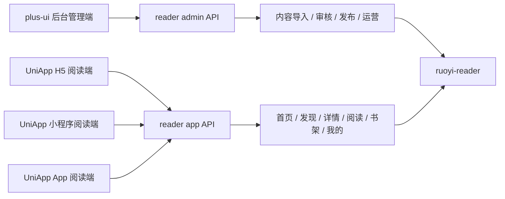
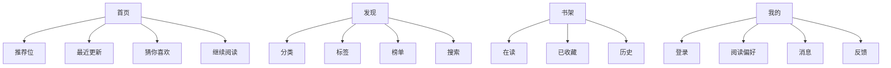
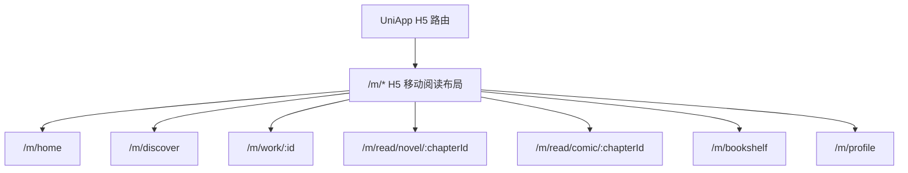
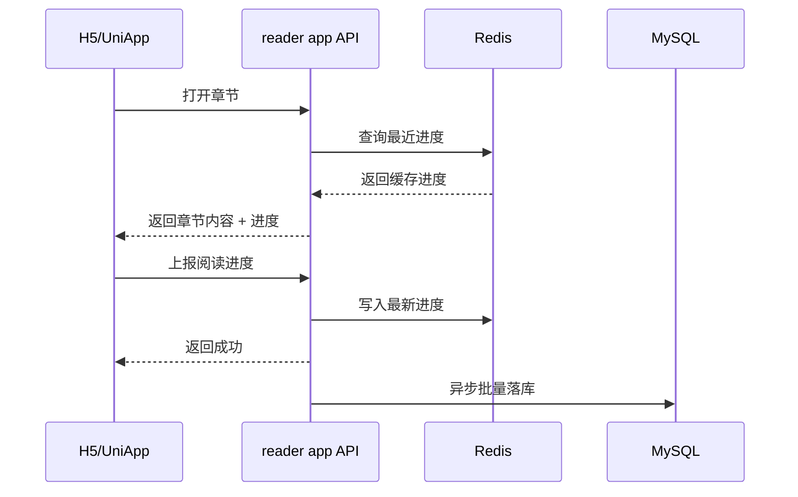

# 阅读器前端实施方案与界面蓝图

## 1. 文档目的

- 把已确认的前端技术决策落到可执行层面，避免后续在 Web、H5、小程序三端反复摇摆。
- 让后端接口设计、前端仓库拆分、页面布局和阶段排期保持一致。
- 当前日期基线：2026-08-09。

> 2026-08-09 最新修正：C 端前端统一由 `UniApp` 承担，输出 H5、小程序和后续 App；`plus-ui` 仅承担后台管理端。本文中更早出现的“`plus-ui` H5 阅读端”相关表述，统一以本条为准覆盖。

配套文档：

- [01-RuoYi-Vue-Plus-6X后端项目解读.md](/Users/yabin/code/ruoyi/RuoYi-Vue-Plus/doc/01-RuoYi-Vue-Plus-6X后端项目解读.md:1)
- [02-阅读器需求梳理与完善.md](/Users/yabin/code/ruoyi/RuoYi-Vue-Plus/doc/02-阅读器需求梳理与完善.md:1)
- [2026-08-09-reader-system-design.md](/Users/yabin/code/ruoyi/RuoYi-Vue-Plus/docs/superpowers/specs/2026-08-09-reader-system-design.md:1)
- [04-前端项目目录规划与方案设计.md](/Users/yabin/code/ruoyi/RuoYi-Vue-Plus/doc/04-前端项目目录规划与方案设计.md:1)

## 2. 已确认技术基线

| 项目 | 已确定方案 |
| --- | --- |
| C 端框架 | `UniApp` |
| C 端产物 | H5、小程序、App |
| 后台管理基座 | `plus-ui` 二次开发 |
| `plus-ui` 仓库路径 | `/Users/yabin/code/ruoyi/plus-ui` |
| `plus-ui` 分支 | `6.X-Vue` |
| `plus-ui` 现状技术栈 | `Vue 3`、`TypeScript`、`Vite`、`Pinia`、`Element Plus`、`UnoCSS` |
| 后端对接模块 | `/Users/yabin/code/ruoyi/RuoYi-Vue-Plus/ruoyi-modules/ruoyi-reader` |

前端硬约束：

- C 端不再评估 `Taro`、原生双写或其他跨端方案。
- C 端统一在 `UniApp` 上二开并输出 H5、小程序、App。
- 后台管理端继续复用 `plus-ui` 的权限、菜单、标签页、请求封装和字典体系。

## 3. 三端职责划分



职责边界：

- `plus-ui` 后台管理端：给运营、审核、内容管理员使用。
- `UniApp` H5 阅读端：给手机浏览器读者使用，强调免安装、传播、搜索落地页。
- `UniApp` 小程序端：给微信生态读者使用，强调继续阅读、分享和登录闭环。
- `UniApp` App 阅读端：作为后续原生壳输出预留。

## 4. 仓库与工程边界

### 4.1 `plus-ui` 仓库承担的内容

- 后台管理页面
- 后台管理相关 API 请求层与 TypeScript 类型层
- 需要共享的工具函数、枚举、错误码映射、内容卡片基础组件

### 4.2 `UniApp` 工程承担的内容

- H5、小程序、App 专属页面和路由
- 微信登录、分享、订阅消息、安全区适配
- 与三端保持一致的数据结构，但保留平台适配层

### 4.3 不建议的做法

- 不建议把 C 端页面继续塞到 `plus-ui` 仓库里混做。
- 不建议 H5 阅读端直接沿用后台桌面式布局。
- 不建议后台管理页面与读者端页面共用一套路由守卫语义。

## 5. 页面结构蓝图

## 5.1 读者端一级信息架构



一级导航统一采用：

- 首页
- 发现
- 书架
- 我的

## 5.2 `UniApp` H5 页面清单

| 页面 | 核心模块 | 说明 |
| --- | --- | --- |
| 首页 | 轮播、推荐位、最近更新、继续阅读 | 面向自然流量与回访流量 |
| 发现页 | 分类、标签、榜单、搜索、筛选 | 高密度浏览页 |
| 搜索页 | 热词、历史、联想、结果列表 | 支持小说/漫画混搜 |
| 作品详情页 | 封面、简介、目录、相关推荐、加入书架 | 强转化页 |
| 目录页 | 卷/章树、更新时间、是否已读 | 小说与漫画目录分形态展示 |
| 小说阅读页 | 正文、字号、背景、目录、书签、进度 | 沉浸阅读页 |
| 漫画阅读页 | 页图流、翻页方式、预加载、进度 | 重点做图片性能 |
| 书架页 | 在读、收藏、历史、批量管理 | 读者核心资产入口 |
| 我的页 | 登录、消息、偏好、反馈、设置 | 轻账户中心 |

## 5.3 `UniApp` 小程序页面清单

小程序与 `UniApp H5` 的业务页面基本同构，但交互侧重点不同：

- 首页：继续阅读权重更高，首屏信息密度略低。
- 发现：减少复杂筛选，保留分类、榜单、搜索入口。
- 书架：默认展示“最近阅读”与“继续阅读”。
- 我的：突出微信登录、头像昵称、消息订阅授权。
- 阅读页：优先适配安全区、手势、分享和回到首页能力。

## 5.4 后台管理页面清单

| 菜单 | 页面能力 |
| --- | --- |
| 作品管理 | 列表、查询、编辑、封面、标签、上下架 |
| 小说内容管理 | 卷、章、正文、排序、发布状态 |
| 漫画内容管理 | 章节、页面、图片校验、缺图修复 |
| 文件导入任务 | 上传、任务状态、错误日志、重试 |
| 内容审核 | 待审核、驳回原因、通过、下架 |
| 推荐与专题 | 首页推荐、榜单、专题位 |
| 读者数据 | 书架、阅读趋势、活跃作品 |
| 系统配置 | 阅读器参数、导入规则、客户端开关 |

## 6. 布局与路由约束

## 6.1 `plus-ui` 后台管理端

- 使用现有 `Layout`、菜单、标签页、面包屑能力。
- 阅读器后台页面应进入独立业务菜单，例如“阅读器管理”。
- 仅后台页面进入权限菜单动态加载链路。

## 6.2 `UniApp` H5 阅读端

- 使用 `UniApp` 输出 H5 页面。
- 建议独立路由前缀仍采用 `/m`。
- 不使用后台左侧菜单和标签页。
- 需要支持游客访问、登录后补齐云书架与进度。

建议路由分层：



## 6.3 `UniApp` 小程序

- 底部四 Tab：首页、发现、书架、我的。
- 阅读页、详情页、目录页作为非 Tab 页面。
- 登录、分享、订阅授权通过平台能力封装处理。

## 7. API 分组与鉴权边界

## 7.1 API 分组

| API 组 | 使用方 | 说明 |
| --- | --- | --- |
| `reader app API` | `UniApp` H5 / 小程序 / App | 读者态接口 |
| `reader admin API` | plus-ui 后台 | 管理态接口 |
| `system API` | plus-ui 后台 | 继续复用现有系统管理能力 |

## 7.2 鉴权边界

- `UniApp H5` 游客：允许访问首页、发现、详情、目录、公开阅读内容。
- `UniApp H5` 登录用户：新增书架、进度、历史、书签、消息能力。
- 小程序用户：通过微信登录绑定后使用云同步能力。
- 后台管理员：沿用 `plus-ui` 后台权限模型，不与读者态 token 混用。

## 7.3 阅读进度时序



## 8. 建议目录结构

## 8.1 `plus-ui` 建议新增目录

```text
src/
├── api/
│   └── reader/
│       └── admin/
├── router/
│   └── modules/
│       └── reader-admin.ts
└── views/
    └── reader-admin/
```

说明：

- `reader-admin` 目录用于后台管理页面。
- C 端页面与状态不再放入 `plus-ui`。

## 8.2 `UniApp` 建议目录

```text
/Users/yabin/code/ruoyi/reader-uniapp
├── src/
│   ├── api/
│   ├── pages/
│   │   ├── home/
│   │   ├── discover/
│   │   ├── bookshelf/
│   │   ├── profile/
│   │   ├── work/
│   │   └── reader/
│   ├── store/
│   ├── components/
│   └── utils/
```

## 9. 分阶段实施建议

### Phase 1：前后台接口打通与页面骨架

- 完成后台菜单、路由、权限占位页面。
- 完成 `UniApp` 工程初始化与四个 Tab 页、H5 壳和阅读壳。

### Phase 2：核心阅读闭环

- 完成作品详情、目录、小说阅读、漫画阅读。
- 完成书架、历史、进度同步。
- 完成游客到登录用户的数据合并。

### Phase 3：内容运营与体验增强

- 完成推荐位、榜单、专题页。
- 完成阅读主题、字号、翻页、图片预加载优化。
- 完成消息、反馈、热词等周边能力。

## 10. 联调验收标准

- `plus-ui` 后台可以完成导入任务查看、审核、发布。
- `UniApp H5` 可以完成首页浏览、详情打开、目录查看、小说/漫画阅读。
- `UniApp` 小程序可以完成首页、书架、阅读和继续阅读闭环。
- 同一读者在 `UniApp H5` 与小程序之间切换后，最近进度能正确恢复。

## 11. 当前建议的下一步

1. 在 `plus-ui` 中先搭出 `reader-admin` 后台路由骨架。
2. 在后端 `ruoyi-reader` 中冻结第一版 app/admin DTO，避免前端重复返工。
3. 新建 `UniApp` 工程并做最小四 Tab 壳、H5 壳与阅读页壳。
4. 先走“导入 -> 审核 -> `UniApp H5` 阅读 -> 书架/进度 -> 小程序继续阅读”这一条主链路。
