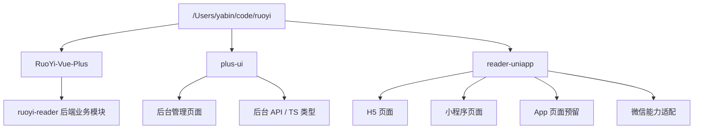
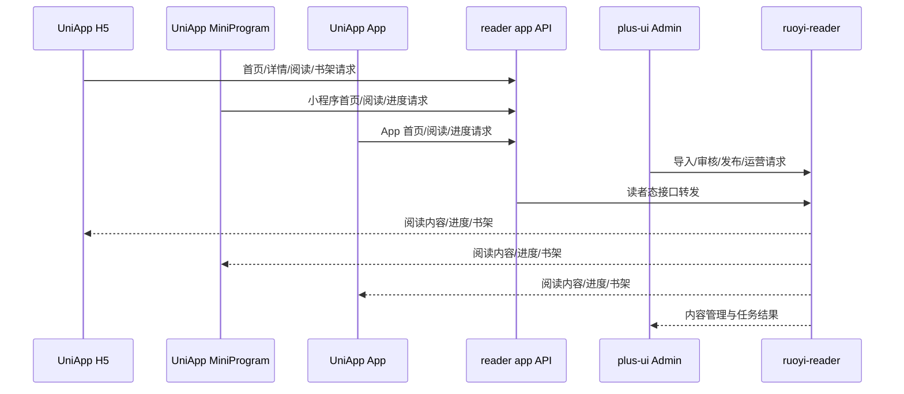

# 阅读器前端项目目录规划与方案设计

## 1. 文档目标

- 明确小说漫画阅读器前端项目在 `/Users/yabin/code/ruoyi` 目录下的最终放置方案。
- 明确 H5、后台管理端、小程序三端的工程边界，避免后续重复拆仓或职责混乱。
- 为下一步前端开发、联调、部署和多人协作提供统一基线。

当前日期基线：2026-08-09。

> 2026-08-09 最新修正：C 端由 `UniApp` 一套工程统一输出 H5、小程序和 App；`plus-ui` 仅承担后台管理端。本文中更早出现的“`plus-ui` 承担 H5”表述，统一以本条覆盖。

配套文档：

- [02-阅读器需求梳理与完善.md](/Users/yabin/code/ruoyi/RuoYi-Vue-Plus/doc/02-阅读器需求梳理与完善.md:1)
- [03-阅读器前端实施方案与界面蓝图.md](/Users/yabin/code/ruoyi/RuoYi-Vue-Plus/doc/03-阅读器前端实施方案与界面蓝图.md:1)
- [2026-08-09-reader-system-design.md](/Users/yabin/code/ruoyi/RuoYi-Vue-Plus/docs/superpowers/specs/2026-08-09-reader-system-design.md:1)

## 2. 最终采用方案

### 2.1 方案结论

前端项目统一放在 `/Users/yabin/code/ruoyi` 目录下，采用“两工程 + 一后端”的组织方式：

```text
/Users/yabin/code/ruoyi
├── RuoYi-Vue-Plus          # 后端主仓库
├── plus-ui                 # 后台管理前端仓库
└── reader-uniapp           # C 端前端仓库（UniApp：H5/小程序/App）
```

### 2.2 关键决策

| 项目 | 采用方案 |
| --- | --- |
| 后台管理端 | 继续基于 `/Users/yabin/code/ruoyi/plus-ui` 二次开发 |
| C 端前端 | 统一使用 `/Users/yabin/code/ruoyi/reader-uniapp` 工程 |
| C 端框架 | `UniApp` |
| C 端输出 | H5、小程序、App |
| 后台技术底座 | `plus-ui` 当前技术栈：`Vue 3 + TypeScript + Vite + Pinia + Element Plus` |
| 后端对接 | `/Users/yabin/code/ruoyi/RuoYi-Vue-Plus` 中的 `ruoyi-reader` |

## 3. 为什么采用这个目录方案

### 3.1 C 端统一使用 `UniApp` 的原因

- 你已经明确说明 H5 指的是小程序版本的 H5。
- `UniApp` 一套工程可以统一输出 H5、小程序，后续还能扩展 App。
- 这比“C 端 H5 在 `plus-ui`、小程序在 `UniApp`”的双工程方式更统一，后期维护成本更低。
- C 端真正需要统一的是页面、状态、接口契约和平台适配层，这更符合 `UniApp` 的定位。

### 3.2 `plus-ui` 只保留后台管理的原因

- `plus-ui` 更适合后台管理场景，已经具备菜单、权限、标签页和表单表格体系。
- 把 C 端页面继续放进 `plus-ui`，会造成后台与阅读场景混杂。
- 后台与读者端拆清后，前端职责更稳定，联调边界也更清晰。

## 4. 目录落位设计

## 4.1 当前推荐目录结构



## 4.2 `plus-ui` 内部职责

建议只保留后台管理方向：

```text
/Users/yabin/code/ruoyi/plus-ui/src
├── api/reader/
│   └── admin/
├── router/modules/
│   └── reader-admin.ts
└── views/reader-admin/
```

其中：

- `reader-admin`：后台运营、审核、内容管理页面
- C 端页面不再继续落到 `plus-ui`

## 4.3 `reader-uniapp` 内部职责

建议目录：

```text
/Users/yabin/code/ruoyi/reader-uniapp
├── src/
│   ├── api/
│   ├── components/
│   ├── pages/
│   │   ├── home/
│   │   ├── discover/
│   │   ├── bookshelf/
│   │   ├── profile/
│   │   ├── work/
│   │   └── reader/
│   ├── store/
│   ├── utils/
│   └── platform/
├── static/
├── pages.json
├── manifest.json
└── package.json
```

其中：

- `platform/`：微信登录、分享、安全区、订阅消息封装
- `pages/reader/`：小说阅读页、漫画阅读页
- `api/`：与 `reader app API` 对接
- `store/`：书架、进度、读者状态

## 5. 三端职责边界

| 工程 | 面向对象 | 主要职责 |
| --- | --- | --- |
| `plus-ui` | 运营、审核、内容管理员 | 导入、审核、发布、运营配置 |
| `reader-uniapp` | 浏览器读者、微信生态读者、后续 App 读者 | H5、小程序、App 的浏览、详情、阅读、书架、历史、继续阅读 |

## 6. 技术边界设计

## 6.1 共享层

共享的是“协议”，不是“代码仓强行共用”：

- 统一 `reader app API`
- 统一字段命名
- 统一分页协议
- 统一错误码语义
- 统一书架/历史/进度数据模型

## 6.2 分离层

`plus-ui` 与 `reader-uniapp` 分离内容：

- 页面组件实现
- 路由体系
- 平台登录能力
- 构建工具与发布链路
- 样式体系细节

## 7. 页面与路由方案

## 7.1 H5 路由方案

H5 改为放在 `reader-uniapp` 内输出，建议路由前缀固定为 `/m`：

```text
/m/home
/m/discover
/m/bookshelf
/m/profile
/m/work/:id
/m/read/novel/:chapterId
/m/read/comic/:chapterId
```

优势：

- 便于 Nginx、网关和埋点按前缀识别移动站
- 便于后续做独立 SEO、活动落地页和 H5 传播
- 便于与小程序共用页面结构与状态设计

## 7.2 小程序页面方案

四个 Tab 固定：

- 首页
- 发现
- 书架
- 我的

非 Tab 页面：

- 作品详情
- 目录页
- 小说阅读页
- 漫画阅读页

## 8. 联调架构方案



## 9. 分阶段落地建议

### Phase 1：目录落位与工程骨架

- 保持 `plus-ui` 作为后台前端仓库
- 创建 `/Users/yabin/code/ruoyi/reader-uniapp`
- 完成 `plus-ui` 的 `reader-admin` 路由骨架
- 完成 `reader-uniapp` 的四 Tab 壳与 H5 壳

### Phase 2：核心链路联调

- 先打通作品详情、目录、小说阅读、漫画阅读
- 再打通书架、历史、进度同步
- 最后打通微信登录与游客数据合并

### Phase 3：运营与体验增强

- 推荐位
- 榜单
- 专题
- 阅读主题
- 预加载与性能优化

## 10. 分支建议

建议保持三仓各自独立分支：

| 仓库 | 当前 / 建议分支 |
| --- | --- |
| `/Users/yabin/code/ruoyi/RuoYi-Vue-Plus` | `analysis/reader-backend-fit` |
| `/Users/yabin/code/ruoyi/plus-ui` | `analysis/reader-frontend-fit` |
| `/Users/yabin/code/ruoyi/reader-uniapp` | 建议初始化后使用 `analysis/reader-miniapp-fit` |

## 11. 当前推荐执行结论

1. 后台管理继续使用 `/Users/yabin/code/ruoyi/plus-ui`。
2. C 端 H5、小程序、App 统一放在 `/Users/yabin/code/ruoyi/reader-uniapp`。
3. 三端都放在 `/Users/yabin/code/ruoyi` 下，满足统一工作区要求。
4. 后续开发顺序优先级：
   - `reader-uniapp` 骨架工程
   - 后台管理联调页
