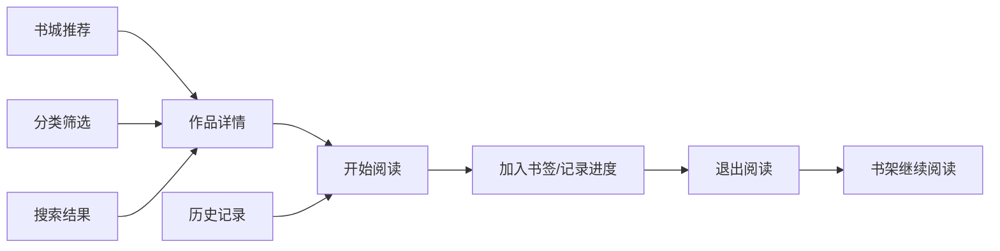
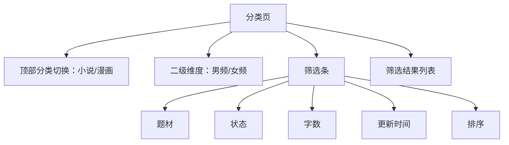
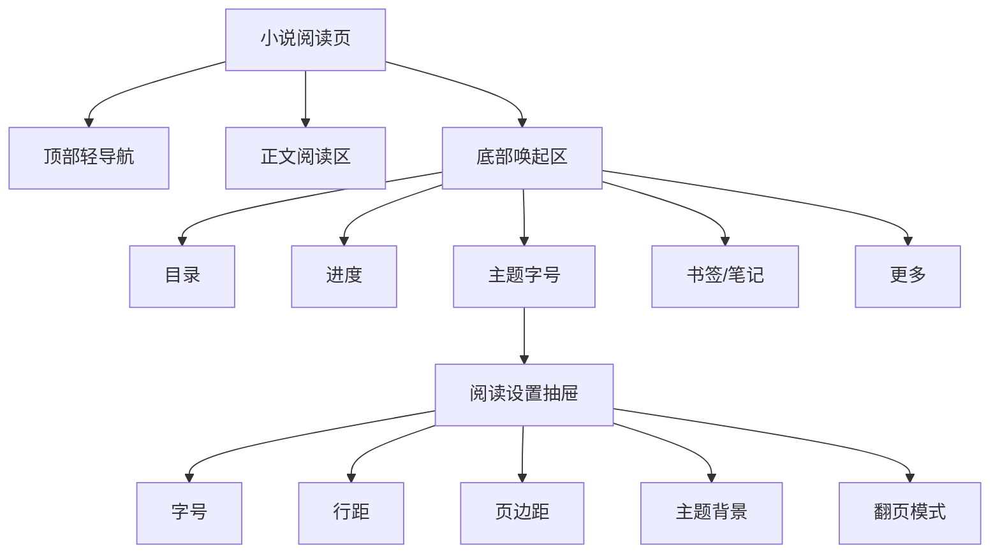

# 小程序完整产品设计方案（竞品参考版）

## 1. 文档定位

- 文档目标：为当前小说/漫画阅读器小程序提供一套可直接执行的完整产品设计方案，减少“看到哪里改哪里”的碎片式迭代。
- 适用范围：`UniApp` 小程序端为主，同时兼容后续同构输出的 H5 与 App。
- 核对日期：2026-08-15。
- 当前实现基线：
  - 小程序工程：`/Users/yabin/code/ruoyi/reader-uniapp`
  - 后端工程：`/Users/yabin/code/ruoyi/RuoYi-Vue-Plus`
  - 后台管理端：`/Users/yabin/code/ruoyi/plus-ui`

说明：

- 本文本轮已调整为“以竞品 `APP 版本` 为主参考对象”，重点参考其在 `App Store`、`Google Play` 等应用分发页面公开可见的产品描述、功能卖点与页面截图信息。
- 官网、品牌站、书城网页等公开站点信息，只作为补充参考，用于辅助理解内容运营方向，不再作为小程序页面结构设计的主依据。
- 本文中的页面结构、模块拆分、交互路径和视觉方向，是基于竞品 `APP 端能力` 做的产品推演，并非逐像素复刻某个现有产品。

参考来源：

- [番茄小说 App Store 页面](https://apps.apple.com/cn/app/%E7%95%AA%E8%8C%84%E5%B0%8F%E8%AF%B4-%E7%83%AD%E9%97%A8%E7%9F%AD%E5%89%A7%E5%85%A8%E6%9C%AC%E5%B0%8F%E8%AF%B4%E7%94%B5%E5%AD%90%E4%B9%A6%E9%98%85%E8%AF%BB%E5%99%A8/id1468454200)
- [QQ阅读 App Store 页面](https://apps.apple.com/cn/app/qq%E9%98%85%E8%AF%BB/id487608658)
- [书旗小说 App Store 页面](https://apps.apple.com/cn/app/%E4%B9%A6%E6%97%97%E5%B0%8F%E8%AF%B4-%E7%9C%8B%E5%B0%8F%E8%AF%B4%E5%A4%A7%E5%85%A8%E7%9A%84%E7%94%B5%E5%AD%90%E4%B9%A6%E9%98%85%E8%AF%BB%E7%A5%9E%E5%99%A8/id733689509)
- [书旗小说 Google Play 页面](https://play.google.com/store/apps/details?hl=zh&id=com.shuqinovel.controller)
- [番茄小说官网](https://fanqienovel.com/)
- [阅文集团数字产品页](https://www.yuewen.com/app)

---

## 2. How Might We

### 2.1 问题定义

How might we 为“移动端重度阅读用户”设计一款在微信生态内也足够顺手、足够沉浸、足够稳定的小说/漫画阅读器，让用户在“找书、收藏、继续阅读、沉浸阅读、个性化设置、账号同步”几个关键环节上几乎不需要重新学习？

### 2.2 目标用户

- 核心用户 A：每天有固定阅读时长的网文用户，最关注“找得到书、追更快、继续阅读方便、阅读过程舒服”。
- 核心用户 B：在微信生态中碎片化阅读的轻中度用户，最关注“打开即看、无门槛、书架不丢、阅读页不折腾”。
- 核心用户 C：漫画与小说双栖用户，希望书架、历史、进度、偏好在同一账号下统一管理。

### 2.3 成功标准

- 用户第一次进入小程序，在 10 秒内看到可阅读内容。
- 用户第二次回来时，能在首页或书架 1 次点击进入“继续阅读”。
- 用户在阅读页不需要离开正文，就能完成目录切换、主题设置、字号调整、书签操作。
- 用户在书架、书城、分类、我的四个一级页面里，不会产生“这个入口应该放哪”的困惑。

---

## 3. 竞品拆解与收敛结论

## 3.1 番茄小说给我们的启发

公开可见特征：

- App Store 公开信息明确可见“免费阅读”“海量正版内容”“短剧原著联动”等产品定位。
- 从产品卖点与市场呈现来看，番茄更强调“低门槛进入 + 强推荐分发 + 高频内容消费”。
- 官网内容结构可作为补充信号，反映其男频、女频、排行、最近更新、IP 改编等运营导向。

提炼结论：

- 首页必须做“推荐流 + 最近更新 + 继续阅读”三件套，而不是只放轮播和几个静态卡片。
- 男频/女频不一定要做成一级 Tab，但必须是首页、分类、榜单里的稳定筛选维度。
- 作品详情页要突出“是否影视/动漫改编”“更新状态”“是否完结”“继续阅读”。

## 3.2 QQ 阅读给我们的启发

公开可见特征：

- App Store 页面明确强调个性化推荐、排行榜、精排版、听书、漫画、同人、账号同步。
- 最近版本信息里能看到“状态”“笔记”“听书播放优化”“分享成就”等持续迭代方向。
- 这说明 QQ 阅读的 APP 不是单纯书籍列表，而是“内容供给 + 阅读能力 + 用户资产”的完整阅读平台。

提炼结论：

- 我们的“书城/发现”不能只做分类，还要做榜单、推荐、主题书单、完结专区。
- 阅读页不能只做正文展示，必须把阅读设置、书签/笔记、听书入口、分享结果页考虑进去。
- “我的”页面要能承接阅读成就、偏好、消息、反馈、微信用户信息，而不是只留几个占位入口。

## 3.3 书旗小说给我们的启发

公开可见特征：

- App Store 与 Google Play 公开信息都能看到书旗在阅读器能力层面的长期强调。
- Google Play 页面明确强调本地阅读、边听边读、自动阅读、夜间模式、缓存、搜索和分类标签。
- 这说明书旗的 APP 竞争力不只在内容分发，更在“阅读器工具链完整”和“找书效率”。

提炼结论：

- 小程序虽然不做“本地 TXT 导入阅读端 MVP”，但阅读器自身必须支持夜间模式、自动翻页/自动阅读预留、缓存/预加载策略。
- 分类页不应该只是一个“分类名列表”，而应支持多维筛选：分类、状态、字数、更新时间、题材标签。
- 书架要考虑“云书架 + 访客书架 + 历史 + 下载/缓存预留”的长期结构。

## 3.4 我们最终不照抄的点

- 不直接照搬番茄那种重福利金币化首屏。
- 不直接照搬 QQ 阅读那种内容宇宙过大的一级导航。
- 不直接照搬书旗那种偏工具化、偏搜索导向的冷启动体验。

---

## 4. 推荐方向

推荐方向是：

“番茄式低门槛进入 + QQ 阅读式完整阅读能力 + 书旗式找书/阅读器工具完备性”的中间路线。

一句话定义：

这不是“最全内容平台”，而是“在微信里也能真正长期用的沉浸式阅读器”。

产品原则：

- 原则 1：继续阅读优先于一切。
- 原则 2：阅读器体验优先于活动入口。
- 原则 3：书架是资产中心，不是作品列表。
- 原则 4：分类不是装饰，必须具备筛选价值。
- 原则 5：我的页面承接的是“读者状态”，不是“设置垃圾桶”。

---

## 5. 信息架构总览

## 5.1 一级导航

固定四个 Tab：

- 书城
- 分类
- 书架
- 我的

说明：

- 当前工程里的 `首页 + 发现` 建议重构为 `书城 + 分类` 的更清晰结构。
- “书城”承接推荐、热榜、最近更新、专题、搜索入口。
- “分类”承接精确找书与筛选。

## 5.2 全局结构图

```mermaid
flowchart TD
  A["书城"] --> A1["顶部搜索入口"]
  A --> A2["轮播/运营位"]
  A --> A3["继续阅读横条"]
  A --> A4["猜你喜欢"]
  A --> A5["热门榜单"]
  A --> A6["最近更新"]
  A --> A7["完结精选"]
  A --> A8["漫画专区"]

  B["分类"] --> B1["男频/女频/漫画"]
  B --> B2["分类筛选"]
  B --> B3["标签筛选"]
  B --> B4["状态筛选"]
  B --> B5["字数筛选"]
  B --> B6["排序"]
  B --> B7["结果列表"]

  C["书架"] --> C1["最近在读"]
  C --> C2["我的收藏"]
  C --> C3["阅读历史"]
  C --> C4["批量管理"]
  C --> C5["更新提醒"]

  D["我的"] --> D1["微信用户信息"]
  D --> D2["阅读偏好"]
  D --> D3["消息与反馈"]
  D --> D4["阅读成就"]
  D --> D5["设置与帮助"]

  E["作品详情"] --> E1["封面简介"]
  E --> E2["数据标签"]
  E --> E3["目录"]
  E --> E4["相关推荐"]
  E --> E5["加入书架/开始阅读"]

  F["小说阅读页"] --> F1["正文区"]
  F --> F2["顶部轻控制"]
  F --> F3["底部功能面板"]
  F --> F4["阅读设置抽屉"]
  F --> F5["目录/书签/笔记"]
```

## 5.3 关键导流路径

---

## 6. 页面级完整方案

## 6.1 书城页

### 6.1.1 页面目标

- 承接首次进入和回访流量。
- 用最低成本让用户进入作品详情或直接继续阅读。
- 兼顾推荐流与更新流。

### 6.1.2 页面结构

从上到下：

1. 顶部搜索栏
2. 轮播运营位
3. 继续阅读横条
4. 金刚区
5. 猜你喜欢
6. 热门榜单
7. 最近更新
8. 完结精选
9. 漫画专区

### 6.1.3 模块说明

顶部搜索栏：

- 左侧：搜索占位词，如“搜书名 / 作者 / 关键词”
- 右侧：签到/消息入口预留
- 点击进入独立搜索页

轮播运营位：

- 最多 3-5 张
- 支持作品、专题、活动、榜单跳转
- 小程序首屏不宜过高，建议占 220rpx-260rpx

继续阅读横条：

- 未登录或访客态：展示最近阅读作品
- 已登录：展示云端最新阅读进度
- 展示字段：作品名、章节名、已读百分比、更新时间
- 点击直接进入阅读页

金刚区：

- 推荐 4 个入口：
  - 男频热读
  - 女频热读
  - 完结专区
  - 排行总榜

猜你喜欢：

- 2 列卡片或横滑卡片
- 重点展示封面、标题、题材标签、一句话卖点

热门榜单：

- 至少提供：
  - 热门榜
  - 飙升榜
  - 完结榜
  - 新书榜

最近更新：

- 书名 + 最新章节 + 更新时间
- 更适合回访用户追更

### 6.1.4 状态设计

- 首次冷启动：推荐流优先，不展示空白框架
- 无继续阅读记录：展示“去书城找本好书”
- 网络异常：保留最近阅读和本地书架入口

## 6.2 分类页

### 6.2.1 页面目标

- 解决“我不想被推荐，我只想精确找书”的需求。
- 成为长尾找书主入口。

### 6.2.2 页面结构

### 6.2.3 筛选维度

- 内容类型：小说 / 漫画
- 频道：男频 / 女频
- 题材：玄幻、都市、言情、悬疑、历史、科幻、校园、同人等
- 连载状态：连载中 / 已完结
- 字数区间：30 万以下、30-100 万、100-200 万、200 万以上
- 更新时间：3 天内、7 天内、30 天内
- 排序：最热、最新、好评、完结优先

### 6.2.4 结果卡片

- 封面
- 书名
- 作者
- 题材标签
- 简介 1-2 行
- 连载状态
- 最新章节/更新时间

## 6.3 搜索页

### 6.3.1 页面目标

- 快速命中已知作品
- 辅助发现未知作品

### 6.3.2 页面结构

- 搜索输入框
- 热门搜索
- 搜索历史
- 联想词
- 结果页 Tabs：综合 / 小说 / 漫画 / 作者

### 6.3.3 搜索交互

- 输入即联想，但 300ms 防抖
- 空关键词默认展示热搜词和近期历史
- 结果页支持二次筛选和排序

## 6.4 作品详情页

### 6.4.1 页面目标

- 承接转化：加入书架、开始阅读、继续阅读
- 让用户快速判断这本书值不值得看

### 6.4.2 页面结构

从上到下：

1. 封面 + 标题 + 作者 + 标签
2. 评分/热度/字数/状态
3. 简介折叠区
4. 最近阅读/最新更新提示
5. CTA 按钮区
6. 目录预览
7. 相关推荐

### 6.4.3 核心按钮

- 主按钮：继续阅读 / 开始阅读
- 次按钮：加入书架 / 已在书架
- 三按钮预留：下载缓存 / 听书 / 分享

### 6.4.4 目录区

- 默认展示前 10 章 + “查看全部目录”
- 支持正序/倒序切换
- 已读章节显示弱化样式

## 6.5 书架页

### 6.5.1 页面目标

- 成为“第二次打开小程序最常访问的页面”
- 解决继续阅读、追更、收藏管理

### 6.5.2 页面结构

- 顶部：书架标题 + 编辑按钮
- 最近在读区
- 我的收藏区
- 阅读历史区
- 更新提醒区

### 6.5.3 视图模式

- 默认：宫格书架视图
- 可切换：列表视图

### 6.5.4 书架交互

- 长按进入编辑模式
- 支持：
  - 移出书架
  - 批量删除
  - 置顶
  - 标记已读

### 6.5.5 更新提示

- 有更新时在作品卡片右上角展示小红点或“更新”
- 作品条目下显示“更新至第 xxx 章”

## 6.6 我的页

### 6.6.1 页面目标

- 承接账号、偏好、反馈和读者身份

### 6.6.2 页面结构

- 用户卡片
- 阅读数据卡片
- 功能入口分组
- 帮助与设置

### 6.6.3 功能分组

账号相关：

- 微信用户信息
- 登录/绑定手机
- 访客数据合并

阅读偏好：

- 默认字号
- 默认主题
- 默认翻页模式
- 是否自动进入上次阅读

功能入口：

- 消息中心
- 阅读成就
- 意见反馈
- 帮助中心
- 关于我们

### 6.6.4 用户卡片设计

- 未登录：突出“微信一键登录，同步书架和进度”
- 已登录：展示头像、昵称、连续阅读天数、累计阅读时长

---

## 7. 小说阅读页完整方案

## 7.1 设计目标

- 一进入正文就足够沉浸
- 关键操作不超过两步
- 设置项足够全，但不压过正文

## 7.2 页面结构

## 7.3 顶部区域

默认隐藏，点击中间区域唤起。

顶部展示：

- 返回
- 书名
- 章节名
- 更多操作

更多操作内：

- 分享作品
- 分享当前章节
- 加入书架
- 开启听书
- 举报内容

## 7.4 正文区

正文规则：

- 默认单列排版
- 保留首行缩进
- 行高适中，避免过密
- 段间距轻微大于行距
- 章节标题单独排版，支持居中或左对齐两种主题模式

默认视觉建议：

- 主阅读背景：米白纸感
- 正文颜色：深灰褐
- 标题颜色：更深一级

## 7.5 底部功能面板

固定 5 个核心入口：

- 目录
- 上一章/下一章
- 进度条
- 设置
- 书签

说明：

- 小程序空间有限，不建议一口气塞太多按钮
- 笔记、听书、翻页模式等放入二级面板

## 7.6 阅读设置面板

### 7.6.1 字号

- 至少 6 档
- 中间档作为默认

### 7.6.2 行距

- 紧凑
- 舒适
- 宽松

### 7.6.3 页边距

- 窄
- 标准
- 宽

### 7.6.4 主题

至少 5 套：

- 纸张米白
- 浅灰
- 护眼绿
- 夜间黑
- 深棕

### 7.6.5 翻页方式

- 滚动
- 仿真翻页
- 覆盖翻页

MVP 建议：

- 先落地滚动阅读
- 仿真翻页与覆盖翻页先设计结构、后做实现

## 7.7 目录面板

- 左侧抽屉或全屏底部弹层
- 支持：
  - 正序/倒序
  - 已读章节标记
  - 当前章节高亮
  - 跳章后自动关闭

## 7.8 书签与笔记

书签：

- 一键加入当前章节书签
- 记录章节名、时间、阅读位置

笔记：

- MVP 不做复杂划线
- 先支持“章节级简短笔记”

## 7.9 阅读进度

- 进入章节时自动恢复
- 退出时自动保存
- 滚动到一定比例时自动上报
- 支持“本地优先，云端同步兜底”

## 7.10 长时阅读体验细节

- 连续阅读 30 分钟后可轻提示休息
- 章节切换时保留轻过渡，避免突兀闪屏
- 夜间主题下亮度与对比度要克制，避免纯黑纯白刺眼

## 7.11 阅读页状态

- 正文加载中
- 正文加载失败
- 章节已下架
- 目录为空
- 网络断开但本章已缓存

---

## 8. 漫画阅读页方案

虽然你这次重点提的是看小说，但漫画页也要和小说页保持体系一致。

核心原则：

- 结构一致：顶部导航、目录、进度、书架、设置逻辑统一
- 阅读模式不同：小说偏排版，漫画偏图片性能

漫画页关键点：

- 支持长图纵向阅读
- 支持预加载前后 1 章
- 支持图片失败重试
- 支持页码同步

---

## 9. 全局视觉与布局方向

## 9.1 视觉关键词

- 温润
- 沉浸
- 有内容感
- 不花哨
- 不电商化

## 9.2 不建议的视觉方向

- 不要做过度游戏化首页
- 不要做大量高饱和活动色块
- 不要让阅读页像工具设置页

## 9.3 字体与排版

- 首页/分类/书架：信息清晰、卡片有节奏
- 阅读页：正文优先，控件弱化

## 9.4 图标风格

- 尽量线性图标 + 少量面性强化
- 避免过于社交化、商城化图标语言

---

## 10. 与当前 UniApp 工程的落地映射

## 10.1 一级页面重命名建议

当前：

- `pages/home/index`
- `pages/discover/index`
- `pages/bookshelf/index`
- `pages/profile/index`

建议未来语义调整为：

- `home` => 书城
- `discover` => 分类
- `bookshelf` => 书架
- `profile` => 我的

## 10.2 建议新增页面

- `pages/search/index`
- `pages/work/catalog`
- `pages/reading/bookmarks`
- `pages/reading/settings` 或抽屉组件化
- `pages/rank/index`
- `pages/topic/index`
- `pages/complete/index`
- `pages/message/index`
- `pages/feedback/index`

## 10.3 组件化拆分建议

- `components/reader/ReaderTopBar.vue`
- `components/reader/ReaderBottomPanel.vue`
- `components/reader/ReaderSettingsDrawer.vue`
- `components/work/WorkCard.vue`
- `components/work/WorkSection.vue`
- `components/bookshelf/BookshelfGrid.vue`
- `components/bookshelf/ContinueReadingBar.vue`

---

## 11. 分阶段范围

## 11.1 MVP

- 书城
- 分类
- 书架
- 我的
- 搜索
- 作品详情
- 目录
- 小说阅读页基础能力
- 漫画阅读页基础能力
- 游客态书架/进度
- 微信登录与数据合并

## 11.2 P1

- 书签
- 章节级笔记
- 听书
- 完整榜单体系
- 专题页
- 阅读成就

## 11.3 P2

- 仿真翻页
- 更细颗粒度的阅读笔记
- 社区/书评
- 会员/付费体系

---

## 12. 关键假设与验证

- [ ] 用户更愿意使用“书城 + 分类”而不是“首页 + 发现”的命名。
- [ ] 小程序端把“继续阅读”放到书城首屏，能明显提升二次打开转化。
- [ ] 阅读页先做滚动模式，再做仿真翻页，不会影响 MVP 接受度。
- [ ] 访客云端态 + 微信登录后合并数据，能覆盖大部分小程序用户场景。

---

## 13. 明确不做

- 不做首页大而杂的福利中心。
- 不做第一阶段的复杂社区互动。
- 不做一开始就非常重的会员商业化界面。
- 不做和后台管理端复用同一套视觉与布局。

---

## 14. 最终结论

这套小程序方案的核心不是“页面更多”，而是把四个一级页面职责彻底拉清：

- 书城负责推荐和回访导流
- 分类负责精准找书
- 书架负责继续阅读和资产管理
- 我的负责读者身份与偏好沉淀

而真正决定留存的，不是首页有多少模块，而是小说阅读页是否足够舒服、继续阅读是否足够顺、书架是否足够稳定。

如果后续要按这份方案执行，建议下一步直接进入：

1. 小程序信息架构重构
2. 书城页与分类页重设计
3. 小说阅读页组件化重构
4. 书架与我的页面补全
