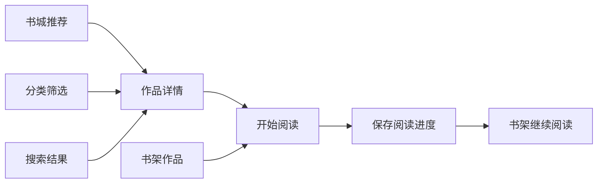
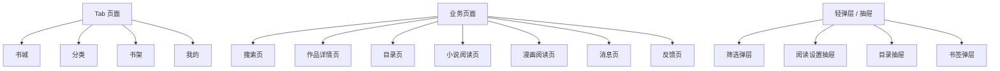
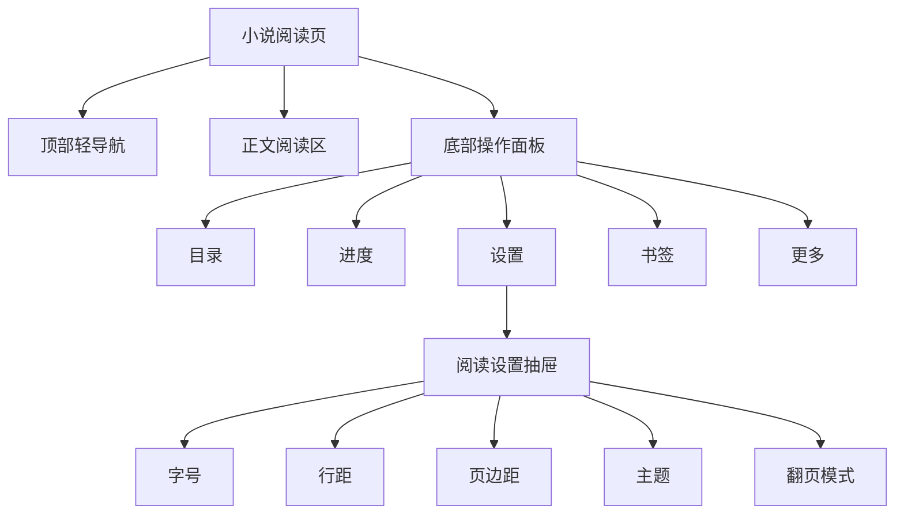
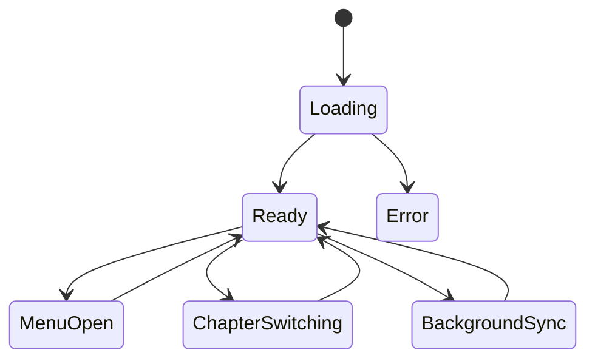
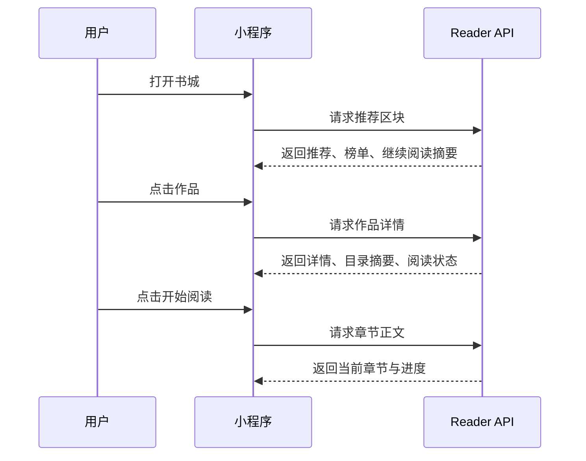
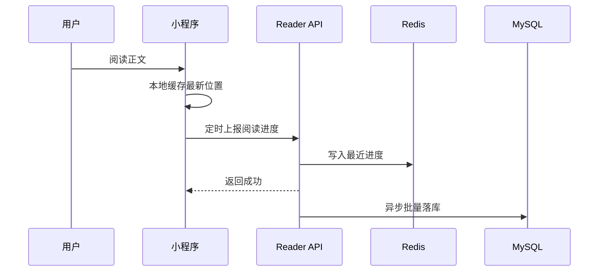

# 小程序 APP 化页面蓝图与交互设计

## 1. 文档目的

- 文档目标：将已确认的阅读器小程序产品方向，进一步细化成可直接指导 `UniApp` 页面重构与视觉落地的 `APP 化页面蓝图`。
- 适用对象：产品、前端、后端、测试、运营。
- 适用工程：
  - 小程序工程：`/Users/yabin/code/ruoyi/reader-uniapp`
  - 后端工程：`/Users/yabin/code/ruoyi/RuoYi-Vue-Plus`
  - 后台管理端：`/Users/yabin/code/ruoyi/plus-ui`
- 文档日期：2026-08-15。

说明：

- 本文以热门阅读器 `APP 版本` 的公开能力与市场呈现为主参考，不以网页书城结构作为主设计依据。
- 本文重点解决“页面应该长什么样、用户如何走、每个页面承接什么、UniApp 应该如何拆页面与组件”四个问题。

参考来源：

- [番茄小说 App Store 页面](https://apps.apple.com/cn/app/%E7%95%AA%E8%8C%84%E5%B0%8F%E8%AF%B4-%E7%83%AD%E9%97%A8%E7%9F%AD%E5%89%A7%E5%85%A8%E6%9C%AC%E5%B0%8F%E8%AF%B4%E7%94%B5%E5%AD%90%E4%B9%A6%E9%98%85%E8%AF%BB%E5%99%A8/id1468454200)
- [QQ 阅读 App Store 页面](https://apps.apple.com/cn/app/qq%E9%98%85%E8%AF%BB/id487608658)
- [书旗小说 App Store 页面](https://apps.apple.com/cn/app/%E4%B9%A6%E6%97%97%E5%B0%8F%E8%AF%B4-%E7%9C%8B%E5%B0%8F%E8%AF%B4%E5%A4%A7%E5%85%A8%E7%9A%84%E7%94%B5%E5%AD%90%E4%B9%A6%E9%98%85%E8%AF%BB%E7%A5%9E%E5%99%A8/id733689509)
- [书旗小说 Google Play 页面](https://play.google.com/store/apps/details?id=com.shuqinovel.controller)
- [番茄小说官网](https://fanqienovel.com/)

---

## 2. 产品收敛结论

### 2.1 参考对象的共同特征

- 番茄小说更强在“低门槛进入、强推荐、免费阅读、短剧原著联动、听书”。
- QQ 阅读更强在“完整阅读器能力、内容矩阵、书架资产、账号体系、个性化推荐”。
- 书旗小说更强在“阅读器工具完整、分类找书效率、本地阅读心智、夜间模式、自动阅读与缓存预留”。

### 2.2 我们的小程序最终路线

- 首页不做网页书城式堆砌，改做 `APP 化书城首屏`。
- 分类不做纯入口页，改做 `可筛选、可排序、可快速找书` 的效率页。
- 书架不做简单列表，改做 `继续阅读 + 收藏资产 + 更新提醒` 的核心资产页。
- 阅读页不做“能看就行”，改做 `接近成熟阅读 APP 的沉浸式小说阅读器`。

### 2.3 一句话定位

这是一款适合微信生态长期使用的小说/漫画阅读器，目标是让用户在 `找书、加书架、继续阅读、沉浸阅读、同步偏好` 五个关键动作上，获得接近独立阅读 APP 的体验。

---

## 3. 设计总原则

### 3.1 页面原则

- 首屏 3 秒内让用户看到“可阅读内容”。
- 第二次回来 1 次点击进入“继续阅读”。
- 阅读器操作不打断正文，设置能力尽量收敛在弹层、抽屉、底部面板内。
- 页面层级尽量浅，避免用户在小程序里反复返回。

### 3.2 视觉原则

- 视觉关键词：纸感、温润、克制、沉浸、轻运营。
- 不做重活动化大红大紫首屏。
- 不做后台感的密集表格与大按钮。
- 阅读页的控件视觉权重必须低于正文。

### 3.3 小程序约束原则

- 所有一级页面默认适配微信安全区与沉浸式状态栏。
- 顶部导航尽量轻量，能用页面内标题就不依赖过重原生导航。
- 阅读页优先保证滚动阅读性能，再扩展仿真翻页。
- 游客态也要可读、可加临时书架、可保留进度。

---

## 4. 一级信息架构

### 4.1 底部导航

固定四个 Tab：

- 书城
- 分类
- 书架
- 我的

### 4.2 信息架构图

```mermaid
flowchart TD
  A["书城"] --> A1["搜索入口"]
  A --> A2["轮播推荐"]
  A --> A3["继续阅读"]
  A --> A4["猜你喜欢"]
  A --> A5["热门榜单"]
  A --> A6["最近更新"]
  A --> A7["完结精选"]
  A --> A8["漫画专区"]

  B["分类"] --> B1["小说/漫画切换"]
  B --> B2["男频/女频切换"]
  B --> B3["题材筛选"]
  B --> B4["状态筛选"]
  B --> B5["字数筛选"]
  B --> B6["排序"]
  B --> B7["结果列表"]

  C["书架"] --> C1["继续阅读卡"]
  C --> C2["在读作品"]
  C --> C3["我的收藏"]
  C --> C4["阅读历史"]
  C --> C5["更新提醒"]

  D["我的"] --> D1["用户卡片"]
  D --> D2["阅读数据"]
  D --> D3["偏好设置"]
  D --> D4["消息反馈"]
  D --> D5["帮助设置"]
```

### 4.3 关键转化路径

---

## 5. 页面蓝图总览

### 5.1 页面层级图

### 5.2 页面优先级

- `P0`：书城、分类、书架、我的、搜索、作品详情、小说阅读页。
- `P1`：目录页、漫画阅读页、消息页、反馈页、书签页。
- `P2`：榜单页、专题页、成就页、听书页、自动阅读设置。

---

## 6. 书城页蓝图

### 6.1 页面定位

- 对应成熟阅读 APP 的“主推荐页”。
- 同时承接首次进入、回访继续阅读、找新书三类需求。

### 6.2 版块布局

从上到下建议如下：

1. 顶部轻导航区
2. 搜索框
3. 轮播推荐
4. 继续阅读条
5. 四宫格快捷入口
6. 猜你喜欢
7. 热门榜单
8. 最近更新
9. 完结精选
10. 漫画专区

### 6.3 布局说明

顶部轻导航区：

- 左侧展示品牌名或频道名，如“阅读器”或“书城”。
- 右侧预留消息、签到、活动入口，但默认只展示一个高优先级图标，避免过杂。

搜索框：

- 占位文案建议为“搜书名、作者、关键词”。
- 点击进入独立搜索页。
- 可在右侧预留扫码或语音入口，但 `MVP` 不做。

轮播推荐：

- 每屏 1 张主卡，支持左右滑动。
- 卡片信息：封面图、主标题、副标题、标签、按钮。
- 跳转目标：作品详情、专题、榜单、活动。

继续阅读条：

- 这是书城首屏最重要的功能卡之一。
- 字段：作品封面缩略图、作品名、最新阅读章节、进度百分比、继续阅读按钮。
- 无历史记录时展示“去挑一本书开始阅读”。

四宫格快捷入口：

- 建议固定为：
  - 男频热读
  - 女频热读
  - 排行总榜
  - 完结专区

猜你喜欢：

- 2 列双卡布局。
- 每个卡片显示：封面、书名、1 个主标签、1 行卖点、状态。

热门榜单：

- 顶部切换 Tabs：热门榜、飙升榜、完结榜、新书榜。
- 每个榜单区建议只展示 3 到 5 本，并提供“查看更多”。

最近更新：

- 更适合追更用户。
- 卡片信息：书名、最新章节名、更新时间、是否已在书架。

### 6.4 交互状态

- 冷启动：优先显示推荐流与榜单，继续阅读卡显示空态。
- 已有阅读记录：继续阅读卡上移，首屏直接可见。
- 网络较慢：先渲染继续阅读、本地缓存书架摘要，再异步补充书城内容。

### 6.5 小程序实现建议

- 书城首屏使用分段懒加载，轮播与榜单先返回摘要数据。
- 推荐区块统一使用 `section + list` 的可配置结构，便于后端运营位扩展。

---

## 7. 分类页蓝图

### 7.1 页面定位

- 对应成熟阅读 APP 的“效率找书页”。
- 主要服务“我不想被推荐，我要自己筛”的用户。

### 7.2 页面结构

1. 顶部标题与搜索入口
2. 小说 / 漫画切换
3. 男频 / 女频切换
4. 横向筛选条
5. 结果列表

### 7.3 筛选项

- 题材：玄幻、都市、言情、悬疑、历史、科幻、校园、同人、仙侠、轻小说
- 状态：连载中、已完结
- 字数：30 万以下、30 到 100 万、100 到 200 万、200 万以上
- 更新时间：3 天内、7 天内、30 天内
- 排序：最热、最新、评分优先、完结优先

### 7.4 结果布局

- 默认使用单列大卡片，提高信息密度与可读性平衡。
- 卡片字段：
  - 封面
  - 书名
  - 作者
  - 标签
  - 1 到 2 行简介
  - 连载状态
  - 最新章节或最近更新时间

### 7.5 交互建议

- 筛选项使用底部弹层，避免在页面顶部堆太多芯片。
- 用户切换筛选条件后，保留当前滚动位置和已选项状态。
- 页面顶部支持“已选筛选条件回显”，方便用户清除条件。

### 7.6 漫画模式差异

- 切换到漫画时，结果卡片更强调封面比例、画风标签、更新状态。
- 小说与漫画复用同一页面容器，但使用不同卡片组件。

---

## 8. 搜索页蓝图

### 8.1 页面定位

- 对应阅读 APP 的“直达页”。
- 主要解决已知书名快速命中与未知内容辅助发现。

### 8.2 页面结构

1. 顶部搜索输入框
2. 热门搜索
3. 搜索历史
4. 联想建议
5. 结果 Tabs

### 8.3 结果 Tabs

- 综合
- 小说
- 漫画
- 作者

### 8.4 搜索交互

- 输入触发联想，建议 300ms 防抖。
- 回车直接进入结果页。
- 点击历史词或热搜词直接搜索。
- 搜索结果页可二次排序。

### 8.5 搜索结果卡片

- 小说结果：封面、书名、作者、标签、简介、状态。
- 作者结果：作者名、作品数、代表作。
- 漫画结果：封面、名称、题材、更新状态。

---

## 9. 书架页蓝图

### 9.1 页面定位

- 这是小程序里最接近“用户资产中心”的页面。
- 核心目标不是展示藏书量，而是让用户最快回到阅读状态。

### 9.2 页面结构

1. 顶部标题栏
2. 继续阅读主卡
3. 书架视图切换
4. 在读作品区
5. 我的收藏区
6. 阅读历史区
7. 更新提醒区

### 9.3 视图模式

- 默认：两列宫格。
- 次模式：单列列表。

### 9.4 卡片信息

- 封面
- 书名
- 最新阅读章节
- 更新状态
- 已读进度
- 是否有新章节提示

### 9.5 关键交互

- 点击作品卡：进入继续阅读或作品详情。
- 长按作品卡：进入编辑模式。
- 编辑模式支持：
  - 移出书架
  - 置顶
  - 批量删除
  - 标记已读更新

### 9.6 空状态设计

- 完全空书架：展示插图 + “去书城找本书开始阅读”按钮。
- 有历史但无收藏：展示最近阅读与推荐加书架入口。

### 9.7 更新提醒设计

- 作品卡右上角显示“更新”小标记。
- 作品底部显示“更新至第 X 章”。
- 点击更新作品可直接从最新未读章进入。

---

## 10. 我的页蓝图

### 10.1 页面定位

- 读者身份页，不是杂项入口堆放页。

### 10.2 页面结构

1. 顶部用户卡片
2. 阅读数据卡片
3. 功能入口区
4. 帮助与设置区

### 10.3 用户卡片

- 未登录：
  - 展示默认头像
  - 展示“微信一键登录，同步书架和阅读进度”
  - 展示游客数据可合并提示
- 已登录：
  - 展示头像、昵称、连续阅读天数、累计阅读时长

### 10.4 阅读数据卡片

- 今日阅读时长
- 连续阅读天数
- 已加入书架数量
- 最近阅读作品

### 10.5 功能入口分组

账号相关：

- 微信用户信息
- 登录与绑定
- 游客数据合并

阅读偏好：

- 默认字号
- 默认主题
- 默认阅读模式
- 自动进入上次阅读

服务相关：

- 消息中心
- 阅读成就
- 意见反馈
- 帮助中心
- 关于我们

---

## 11. 作品详情页蓝图

### 11.1 页面定位

- 详情页的任务不是展示很多信息，而是让用户快速决定“要不要开始读”和“要不要加书架”。

### 11.2 页面结构

1. 顶部返回与分享
2. 封面信息区
3. 作品数据标签区
4. 简介折叠区
5. 阅读动作区
6. 目录预览区
7. 相关推荐区

### 11.3 封面信息区

- 封面
- 标题
- 作者
- 频道标签
- 题材标签
- 状态

### 11.4 数据标签区

- 热度
- 字数
- 评分
- 最近更新时间
- 是否完结

### 11.5 动作区

- 主按钮：开始阅读 / 继续阅读
- 次按钮：加入书架 / 已在书架
- 辅助按钮预留：下载缓存、听书、分享

### 11.6 目录预览区

- 默认显示前 10 章或最近 10 章。
- 支持正序 / 倒序切换。
- 已读章节弱化显示。
- 当前阅读章节高亮显示。

### 11.7 转化逻辑

- 如果用户已有阅读进度，主按钮默认显示“继续阅读”。
- 如果无阅读进度但已在书架，主按钮显示“开始阅读”，次按钮显示“已在书架”。

---

## 12. 小说阅读页蓝图

### 12.1 页面定位

- 阅读页是整个产品的留存核心。
- 目标是让它尽可能接近成熟小说阅读 APP，而不是一个普通详情页跳转出来的正文列表。

### 12.2 页面结构

### 12.3 默认阅读形态

- `MVP` 使用纵向滚动阅读。
- 正文单列排版。
- 首行缩进保留。
- 标题与正文之间有清晰节奏。
- 阅读区域宽度适中，避免一行过长。

### 12.4 顶部轻导航

- 默认隐藏，点击屏幕中部唤起。
- 展示：
  - 返回
  - 书名
  - 当前章节名
  - 更多操作

更多操作建议包括：

- 分享作品
- 分享当前章节
- 加入书架
- 听书入口
- 举报内容

### 12.5 底部操作面板

- 目录
- 上一章 / 下一章
- 进度条
- 设置
- 书签

说明：

- 进度条可以与章节跳转联动。
- “更多”入口承接听书、翻页模式、帮助说明。

### 12.6 阅读设置抽屉

字号：

- 至少 6 档

行距：

- 紧凑
- 舒适
- 宽松

页边距：

- 窄
- 标准
- 宽

主题：

- 米白纸感
- 浅灰
- 护眼绿
- 夜间黑
- 深棕

翻页模式：

- 滚动
- 覆盖翻页
- 仿真翻页

### 12.7 目录与书签

目录抽屉：

- 支持正序 / 倒序切换
- 支持当前章节高亮
- 支持已读标识

书签：

- 支持一键收藏当前章节
- 记录章节名、时间、位置

章节级笔记：

- `MVP` 仅支持章节备注
- 划线与段落评论作为后续阶段能力

### 12.8 阅读状态机

### 12.9 性能策略

- 进入章节时先渲染标题与首屏正文。
- 后续段落可继续异步补全。
- 预拉取下一章摘要，减少切章等待。
- 阅读进度本地先存，后台再同步云端。

### 12.10 为什么不能做成“一本书只有一章”

- 用户阅读心智是“作品 > 章节目录 > 某一章正文”。
- 章节必须可独立跳转、可独立保存进度、可独立记录更新时间。
- 阅读器应该围绕“章节级体验”设计，而不是把整本书当成一个超长正文文件。

---

## 13. 漫画阅读页蓝图

### 13.1 页面定位

- 与小说阅读页共享阅读器外壳与资产体系。
- 与小说阅读页最大的不同在于图片性能与连续预加载。

### 13.2 页面结构

1. 顶部轻导航
2. 漫画正文图片区
3. 底部章节与设置面板
4. 目录抽屉

### 13.3 核心差异

- 支持长图连续阅读。
- 支持前后章节图片预加载。
- 支持图片失败重试。
- 支持页码同步与当前章节定位。

---

## 14. 页面时序设计

### 14.1 书城到阅读页时序

### 14.2 阅读页进度同步时序

---

## 15. UniApp 路由与组件落地建议

### 15.1 路由建议

当前页面基线：

- `pages/home/index`
- `pages/discover/index`
- `pages/bookshelf/index`
- `pages/profile/index`
- `pages/work/detail`
- `pages/reader/novel`
- `pages/reader/comic`

建议语义升级为：

- `home`：书城
- `discover`：分类
- `bookshelf`：书架
- `profile`：我的

建议新增：

- `pages/search/index`
- `pages/work/catalog`
- `pages/message/index`
- `pages/feedback/index`
- `pages/reading/bookmarks`

### 15.2 组件拆分建议

书城相关：

- `components/home/HomeSearchBar.vue`
- `components/home/HomeBanner.vue`
- `components/home/ContinueReadingCard.vue`
- `components/home/HomeSection.vue`
- `components/home/RankMiniList.vue`

分类相关：

- `components/discover/CategoryTabs.vue`
- `components/discover/FilterBar.vue`
- `components/discover/FilterDrawer.vue`
- `components/discover/NovelResultCard.vue`
- `components/discover/ComicResultCard.vue`

书架相关：

- `components/bookshelf/BookshelfHeader.vue`
- `components/bookshelf/BookshelfGrid.vue`
- `components/bookshelf/BookshelfList.vue`
- `components/bookshelf/ReadingUpdateTag.vue`

阅读器相关：

- `components/reader/ReaderTopBar.vue`
- `components/reader/ReaderBottomPanel.vue`
- `components/reader/ReaderSettingsDrawer.vue`
- `components/reader/ReaderCatalogDrawer.vue`
- `components/reader/ReaderBookmarkPanel.vue`

---

## 16. 分阶段实施建议

### 16.1 第一阶段

- 先统一 Tab 命名与页面职责。
- 先把书城、分类、书架、我的改成 APP 化版式。
- 先把小说阅读页做成完整滚动阅读器。

### 16.2 第二阶段

- 补目录页、书签、章节笔记、消息反馈。
- 补漫画阅读页性能优化与预加载。

### 16.3 第三阶段

- 补听书、阅读成就、榜单专区、专题页。
- 视需求再落地仿真翻页与更细颗粒度阅读笔记。

---

## 17. 最终结论

这版蓝图的重点不是“模仿某个 APP 的皮”，而是把热门阅读器 `APP` 的成熟能力，翻译成适合当前项目的小程序实现方式。

真正要对齐的不是网页书城，而是这些成熟阅读 APP 的核心方法：

- 首屏让用户快速进入内容
- 书架围绕继续阅读与追更组织
- 分类页承担效率找书职责
- 详情页承担转化职责
- 阅读页承担留存职责

如果按本文执行，后续 `reader-uniapp` 的重构顺序建议固定为：

1. 书城页重构
2. 分类页重构
3. 书架页重构
4. 我的页重构
5. 作品详情页补强
6. 小说阅读页重构
7. 漫画阅读页补强
