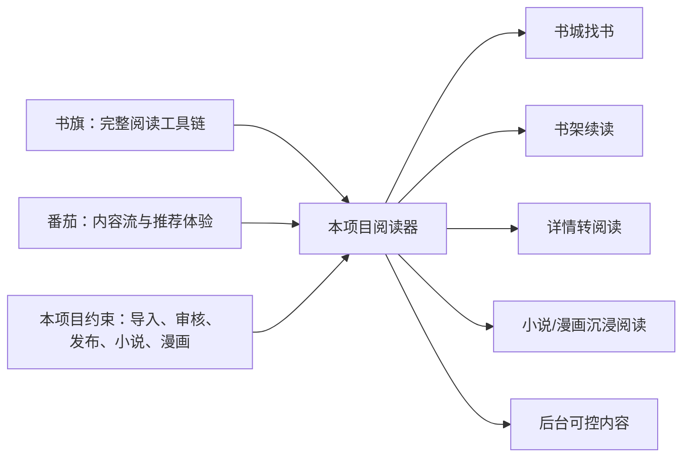
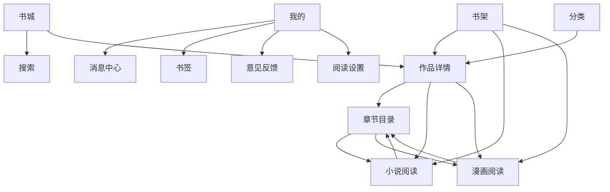
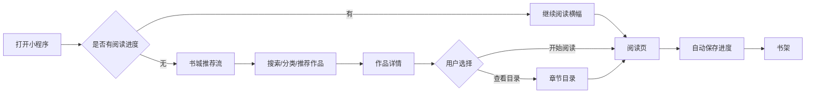

# 阅读器小程序前端重构设计方案

> 版本：V1.0  
> 日期：2026-08-15  
> 适用项目：`/Users/yabin/code/ruoyi/reader-uniapp`  
> 技术边界：UniApp，统一支持微信小程序、H5，后续可扩展 App  
> 当前阶段：先完成界面、交互和 Mock 数据，再按页面实际需要开发后端接口

## 1. 设计结论

当前小程序的问题不只是颜色和间距，而是产品层级偏离了阅读 App：

- 页面大量使用大标题、说明文案、统计卡片和渐变容器，视觉上更像产品演示页。
- 用户进入首页后，不能第一时间看到“继续阅读、热门作品、分类入口和搜索”。
- 书架没有形成真正的内容资产管理感，历史、在读、收藏和更新提醒的关系不够清晰。
- 作品详情页、目录页和阅读页之间缺少连续的沉浸式阅读路径。
- 页面普遍使用“一个功能一个卡片”的布局，信息密度和内容浏览效率偏低。
- 当前页面的设计说明文字过多，实际可操作内容反而不突出。

本次重构采用以下产品方向：

> **以书为中心，以续读为主线，以书城发现为增长入口，以沉浸阅读为核心体验。**

不直接复制书旗小说或番茄小说的品牌、素材和页面，而是学习它们成熟的内容组织方式，再结合本项目“自有文件导入、小说与漫画并存、后台审核后发布”的特点，形成自己的阅读器界面。

## 2. 竞品学习范围

### 2.1 书旗小说的可借鉴点

公开应用资料显示，书旗小说强调书城检索、分类找书、书架管理、本地阅读、听书、自动阅读和夜间模式等基础阅读能力。citeturn0search0turn0search22

本项目借鉴：

- 书城与书架作为最核心的一级入口。
- 分类和榜单承担“找书”职责，而不是只展示静态标签。
- 阅读页提供目录、设置、书签、夜间模式和自动阅读等高频操作。
- 书架突出最近阅读和更新状态。
- 作品详情页直接提供开始阅读、加入书架和目录入口。

不引入或暂不实现：

- 未经授权的外部内容抓取。
- 付费章节、会员、金币等商业化能力。
- 与本项目无关的复杂听书业务。

### 2.2 番茄小说的可借鉴点

番茄小说官方应用资料强调正版免费阅读、分类推荐、听书、书荒广场和书圈等内容消费与社区能力。citeturn0search1turn0search5

本项目借鉴：

- 首页采用内容流，而不是功能说明页。
- 推荐内容按“最近更新、热门作品、类型偏好、同类推荐”组织。
- 作品详情页强化“为什么值得读”的信息表达。
- 阅读页保持低干扰，并让用户通过轻触呼出操作栏。
- 消息中心、意见反馈和用户偏好作为独立的个人服务入口。

本项目暂不引入：

- 短剧、金币、广告激励、社区广场和书圈。
- 需要额外内容审核体系的用户评论。
- 与阅读核心链路无关的复杂运营活动。

### 2.3 适合本项目的取舍



## 3. 产品信息架构

### 3.1 一级导航

保留四个一级 Tab，名称和职责固定：

| Tab | 页面 | 核心任务 |
|---|---|---|
| 书城 | `pages/home/index` | 搜索、推荐、最近更新、热门内容 |
| 分类 | `pages/discover/index` | 小说/漫画分类、榜单、筛选、发现 |
| 书架 | `pages/bookshelf/index` | 在读、收藏、历史、更新提醒 |
| 我的 | `pages/profile/index` | 用户资料、偏好、消息、反馈、设置 |

设计原则：

- 不再把“首页”设计成产品介绍页。
- 不再在一级页面展示不影响决策的统计数字。
- 一级页面只保留用户高频任务。
- 详情、目录、阅读、消息、反馈等作为二级页面，通过明确入口进入。

### 3.2 页面关系



### 3.3 核心用户路径



## 4. 视觉方向

### 4.1 视觉关键词

- 内容优先
- 温和但不幼稚
- 轻量卡片
- 高可读性
- 低干扰阅读
- 小说与漫画统一品牌，阅读页允许不同表现

### 4.2 颜色

不继续使用当前大面积米色渐变和多层发光背景。建议改成“暖白底 + 深墨色文字 + 枣红橙色强调”的平面化体系：

| Token | 建议值 | 使用场景 |
|---|---|---|
| `--reader-bg` | `#F7F7F5` | 普通页面背景 |
| `--reader-surface` | `#FFFFFF` | 内容区和列表主体 |
| `--reader-text-primary` | `#252525` | 标题和正文 |
| `--reader-text-secondary` | `#8A8A8A` | 辅助信息 |
| `--reader-accent` | `#D85B3F` | 主按钮、选中态、进度 |
| `--reader-accent-deep` | `#B94732` | 强调文字和操作 |
| `--reader-soft` | `#FFF0EB` | 选中背景、弱提示 |
| `--reader-divider` | `#EEEEEC` | 列表分割线 |
| `--reader-reader-bg` | `#F4ECD8` | 小说阅读默认主题 |

不使用：

- 紫色渐变作为默认主题。
- 每个区块都使用阴影。
- 页面背景、卡片背景和按钮都使用不同暖色渐变。
- 大面积装饰性光晕抢占内容视觉。

### 4.3 字体和排版

- 页面标题：30-36rpx，字重 600-700。
- 作品标题：28-34rpx。
- 列表正文：26-28rpx。
- 辅助信息：22-24rpx。
- 小说正文：30-34rpx，行高 1.9-2.15。
- 章节标题：34-38rpx。
- 一屏不超过两个主要视觉焦点。

### 4.4 内容卡片原则

- 卡片只用于独立内容模块，不给每一行都套卡片。
- 书籍列表优先使用“封面 + 标题 + 标签 + 最新章节”的轻列表。
- 推荐横向滑动使用紧凑封面卡。
- 统计数据只在个人中心或管理型页面出现，不放在首页首屏。
- 列表使用分割线、留白和对齐完成分组，少用阴影。

## 5. 页面详细设计

## 5.1 书城首页

### 页面目标

让用户在 3 秒内完成以下任一动作：

- 继续阅读上次作品。
- 搜索一本作品。
- 从推荐内容中打开一本作品。
- 进入分类或榜单。

### 页面结构

```text
顶部安全区
├─ 左侧：问候语或品牌标识
├─ 中间：搜索入口
└─ 右侧：消息图标

继续阅读区（有进度时展示）
├─ 作品封面
├─ 作品名、最近章节
├─ 阅读进度
└─ 继续阅读按钮

快捷入口
├─ 小说
├─ 漫画
├─ 最近更新
└─ 排行榜

推荐内容流
├─ 今日精选：横向封面卡
├─ 最近更新：轻量列表
├─ 小说专区：横向滑动
└─ 漫画专区：横向滑动
```

### 交互要求

- 搜索框点击后进入独立搜索页，不在首页展开复杂表单。
- 继续阅读卡点击任意区域进入最近章节，按钮文案为“继续阅读”。
- 推荐卡点击进入详情，不直接进入正文，避免误触。
- 首页下拉刷新时只刷新内容区，不重置用户当前 Tab。
- 无阅读进度时，继续阅读区替换为“开始阅读”的轻量引导，不展示空统计卡。

### 首页 Mock 数据

```ts
interface HomeMockData {
  continueReading?: {
    workId: string;
    title: string;
    chapterName: string;
    progress: number;
    coverUrl: string;
  };
  quickEntries: Array<'NOVEL' | 'COMIC' | 'UPDATED' | 'RANKING'>;
  featured: ReaderWorkCard[];
  latest: ReaderWorkCard[];
  novels: ReaderWorkCard[];
  comics: ReaderWorkCard[];
}
```

## 5.2 分类与榜单

### 页面目标

帮助用户根据类型、内容形态和更新状态找书。

### 页面结构

```text
顶部搜索入口

内容类型切换
├─ 全部
├─ 小说
└─ 漫画

横向分类栏
├─ 玄幻
├─ 都市
├─ 言情
├─ 悬疑
├─ 历史
└─ 更多

榜单切换
├─ 热门榜
├─ 新书榜
├─ 更新榜
└─ 完结榜

作品结果列表
└─ 封面 + 标题 + 类型 + 简介 + 最新章节
```

### 交互要求

- 分类栏支持横向滚动，不使用大面积分类卡片。
- 榜单和分类是两个独立筛选维度。
- 筛选条件变化后保留当前滚动位置，列表显示加载骨架。
- 作品列表默认轻列表，漫画可以增加“页数/更新状态”标签。
- 结果为空时展示“换个分类或搜索词”的行动按钮。

## 5.3 书架

### 页面目标

让书架成为用户的“阅读资产页”，而不是书架和历史的简单拼接。

### 页面结构

```text
顶部标题
├─ 编辑
└─ 排序

分段控件
├─ 在读
├─ 收藏
└─ 历史

更新提示
└─ 有更新作品数量和一键查看

作品列表
├─ 封面
├─ 标题、类型、最新章节
├─ 阅读进度条
└─ 继续阅读按钮
```

### 交互要求

- 默认进入“在读”。
- “历史”只展示最近阅读过的作品，不和在读列表混在一起。
- 长按或点击编辑后进入多选模式，可批量移除。
- 点击作品行进入详情，点击“继续阅读”直接进入正文。
- 书架为空时提供“去书城找书”和“导入本地作品说明”两个入口，但不在小程序直接做文件导入。

## 5.4 我的

### 页面目标

承接用户资料、阅读偏好、消息和帮助，不展示无意义的运营数据。

### 页面结构

```text
用户信息区
├─ 头像
├─ 昵称
└─ 登录/游客状态

阅读概览
├─ 在读
├─ 收藏
├─ 历史
└─ 书签

功能列表
├─ 消息中心
├─ 阅读设置
├─ 书签
├─ 意见反馈
├─ 关于阅读器
└─ 清理本地缓存
```

### 交互要求

- 游客状态必须明确展示“游客阅读”，不能伪装成已登录用户。
- 登录入口只在真正有登录能力时展示，不使用假登录成功提示。
- 阅读设置优先提供主题、字体、行距、翻页模式和自动保存开关。
- 消息中心显示未读数量角标。
- 意见反馈提交后展示真实提交状态；在接口未开发前使用 Mock 状态，并明确标记为本地演示。

## 5.5 搜索页

### 页面结构

```text
顶部固定搜索框
├─ 返回
├─ 输入框
└─ 取消

搜索前
├─ 热门搜索
└─ 历史搜索

输入中
└─ 搜索建议列表

搜索后
├─ 结果数量和筛选入口
└─ 作品轻列表
```

### 交互要求

- 支持清空关键词。
- 搜索历史支持单项删除和全部清空。
- 输入防抖只用于建议，不阻塞用户提交正式搜索。
- 搜索结果点击进入详情。

## 5.6 作品详情页

### 页面目标

完成“了解作品 → 加入书架 → 开始阅读”的转化。

### 页面结构

```text
顶部返回和分享

作品摘要区
├─ 封面
├─ 标题
├─ 类型、状态、章节数
├─ 标签
└─ 简介展开/收起

主操作区
├─ 继续阅读 / 开始阅读
└─ 加入书架

最新章节
└─ 最新章节标题 + 更新时间

目录预览
├─ 章节数量
├─ 查看全部
└─ 最近章节或首章

相关推荐
└─ 横向作品卡
```

### 交互要求

- 主按钮固定突出“继续阅读”或“开始阅读”。
- 简介默认最多展示 3 行，点击展开。
- 目录预览不展示大段说明文案。
- 相关推荐点击进入新的详情页。
- 上架、审核、内容权限只由后端决定，小程序不展示后台管理操作。

## 5.7 章节目录页

### 页面结构

```text
顶部作品信息
├─ 封面缩略图
├─ 作品名
└─ 当前阅读章节

目录工具栏
├─ 正序/倒序
├─ 章节搜索
└─ 回到当前阅读

章节列表
├─ 章节标题
├─ 卷名
├─ 已读标识
└─ 当前章节高亮
```

### 交互要求

- 目录列表使用虚拟滚动或分段加载，避免几千章一次性渲染。
- 点击章节直接进入对应阅读页。
- 当前章节使用左侧色条或浅色背景，不使用大面积高亮卡片。
- 目录页保留“回到当前阅读”快捷操作。

## 5.8 小说阅读页

### 页面原则

小说阅读页必须和普通业务页面完全分离，不再复用带大标题和说明文案的 `PageFrame`。

### 页面结构

```text
默认状态：纯正文

轻触屏幕中央后显示：
顶部工具栏
├─ 返回
├─ 作品名
└─ 章节进度

底部工具栏
├─ 目录
├─ 上一章
├─ 下一章
├─ 书签
└─ 设置
```

### 阅读设置

- 主题：米白、纯白、护眼绿、夜间黑。
- 字号：小、中、大、特大。
- 行距：紧凑、舒适、宽松。
- 边距：窄、标准、宽。
- 翻页模式：滚动、仿真翻页，第一阶段优先滚动。
- 自动保存进度：默认开启。

### 阅读体验

- 首次进入自动隐藏工具栏。
- 工具栏只在轻触后出现，延迟后自动隐藏。
- 上一章、下一章在章节边界处显示禁用态或结束提示。
- 正文按段落渲染，避免整篇正文拼成一个超长文本节点。
- 章节切换时使用轻量加载，不出现整页业务卡片。

## 5.9 漫画阅读页

### 页面原则

漫画阅读页优先保证图片展示面积和加载稳定性。

### 页面结构

```text
黑色或深灰阅读背景
├─ 漫画图片纵向连续展示
├─ 图片间距可调
└─ 长图按屏幕宽度适配

轻触后显示底部控制栏
├─ 目录
├─ 上一章
├─ 下一章
├─ 当前页码
└─ 阅读设置
```

### 交互要求

- 图片懒加载。
- 当前页码和总页数固定在控制栏。
- 图片加载失败显示单页重试，不阻塞其他图片。
- 章节切换后恢复到顶部。
- 记录页码和章节进度。

## 5.10 消息、书签和反馈

### 消息中心

- 使用分组列表，不再使用统计卡片。
- 未读消息标题加粗，已读消息降低对比度。
- 进入页面可批量标记已读。
- 消息没有内容时使用简单空状态。

### 书签

- 书签属于阅读页的辅助能力，不作为首页主内容。
- 书签列表展示作品、章节、创建时间和跳转按钮。
- 前端先提供本地 Mock 与本地缓存，后续再接云端同步。

### 意见反馈

- 反馈类型：内容问题、阅读体验、功能建议、其他。
- 输入内容、联系方式可选、当前页面上下文自动带入。
- 提交后显示“提交成功/失败/待重试”三种状态。
- 后台接口完成前，前端保留 Mock 提交流程，不展示“已提交到后台”的虚假文案。

## 6. 组件重构方案

当前 `PageFrame.vue` 适合普通说明页，不适合继续作为所有页面的统一外壳。建议拆成以下组件：

| 组件 | 职责 |
|---|---|
| `ReaderTabPage.vue` | 四个一级 Tab 的安全区、滚动容器和底部留白 |
| `ReaderTopBar.vue` | 页面标题、搜索入口、消息入口 |
| `ReaderSearchEntry.vue` | 首页/分类页的搜索入口 |
| `ReaderContinueCard.vue` | 首页和书架的继续阅读 |
| `ReaderWorkRow.vue` | 标准作品轻列表 |
| `ReaderWorkCard.vue` | 横向推荐封面卡 |
| `ReaderQuickEntry.vue` | 小说、漫画、榜单、更新等快捷入口 |
| `ReaderSegmentedTabs.vue` | 在读/收藏/历史、类型、榜单切换 |
| `ReaderEmptyState.vue` | 统一空数据、无网络、无权限状态 |
| `ReaderDetailHeader.vue` | 作品详情摘要区 |
| `ReaderCatalogList.vue` | 章节列表、当前章节、高亮和加载 |
| `ReaderReaderToolbar.vue` | 阅读页顶部和底部工具栏 |
| `ReaderReaderSettings.vue` | 小说/漫画阅读设置 |
| `ReaderBottomTabBar.vue` | H5 兼容的底部导航表现 |

### 组件原则

- 组件提供展示和交互，不直接拼装后端请求。
- 页面负责加载数据和管理状态。
- Mock 数据与真实接口返回结构保持一致。
- 组件内部不写死作品、章节和用户数据。
- 所有阅读器新增组件必须补充文件、类比注释、Props/Emits 注释和关键流程注释。

## 7. Mock-first 前端实施方式

在后端接口开发前，前端先建立统一 Mock 数据层：

```text
src/
├─ mocks/
│  ├─ home.ts
│  ├─ discover.ts
│  ├─ bookshelf.ts
│  ├─ work.ts
│  ├─ reader.ts
│  ├─ profile.ts
│  └─ index.ts
├─ components/reader/
├─ composables/
│  ├─ useReaderHome.ts
│  ├─ useReaderShelf.ts
│  ├─ useReaderWork.ts
│  └─ useReaderSettings.ts
└─ pages/
```

### Mock 开关

建议增加：

```env
VITE_READER_USE_MOCK=true
```

行为约定：

- `true`：页面使用 Mock 数据，完成布局和交互验收。
- `false`：页面调用真实后端接口。
- Mock 返回结构必须与未来接口返回结构一致。
- 不在页面中同时写两套数据结构。

### 前端先行的验收方式

每个页面先完成以下状态：

- 首次加载态。
- 正常数据态。
- 空数据态。
- 加载失败态。
- 下拉刷新态。
- 登录/游客态。
- 小程序窄屏态。
- H5 页面态。

## 8. 后端接口后置映射

界面稳定后再按下面顺序开发接口：

| 顺序 | 前端能力 | 后端接口方向 |
|---:|---|---|
| 1 | 首页内容流、继续阅读 | 首页聚合、最近进度 |
| 2 | 分类和榜单 | 分类、榜单、筛选、排序 |
| 3 | 作品详情和相关推荐 | 详情、目录、相关推荐 |
| 4 | 书架和历史 | 书架、历史、进度 |
| 5 | 阅读器 | 小说正文、漫画图片、下一章 |
| 6 | 偏好设置 | 主题、字号、行距、阅读模式 |
| 7 | 消息中心 | 消息列表、已读状态 |
| 8 | 书签 | 云端书签同步 |
| 9 | 意见反馈 | 反馈提交和后台处理 |

登录、微信绑定、手机号登录不应为了配合页面而伪造接口成功，必须等微信 AppID/AppSecret、用户绑定策略和短信服务配置明确后再接入。

## 9. 开发顺序


### 第一阶段：视觉基础

- 重构全局颜色、字号、间距和圆角。
- 移除默认大面积渐变背景。
- 将 `PageFrame` 限制为非阅读页的兼容组件。
- 新增 Tab 页面壳、顶部栏、轻列表和空状态。

### 第二阶段：核心页面

- 书城首页。
- 分类与榜单。
- 书架。
- 我的。

### 第三阶段：内容消费链路

- 搜索。
- 作品详情。
- 章节目录。
- 小说阅读。
- 漫画阅读。

### 第四阶段：辅助能力

- 消息中心。
- 书签。
- 阅读设置。
- 意见反馈。

### 第五阶段：后端适配

- 先接首页、详情、目录和阅读正文。
- 再接书架、历史和进度。
- 最后接偏好、消息、书签和反馈。

## 10. 前端验收标准

### 视觉验收

- 首屏不出现“APP 化作品详情”“当前展示全部内容”等开发说明文案。
- 首页首屏能看到搜索、继续阅读或推荐内容。
- 普通页面不超过一个主视觉渐变区。
- 作品列表不再全部使用独立大卡片。
- 阅读页没有普通页面的 Hero 区和统计卡片。
- H5 和微信小程序的页面结构保持一致，只适配安全区和导航差异。

### 交互验收

- 首页推荐点击详情，详情点击阅读。
- 书架可直接续读。
- 目录可正序、倒序和定位当前章节。
- 阅读页轻触显示工具栏，再次轻触隐藏。
- 小说和漫画拥有各自适配的阅读布局。
- 所有加载、空数据、失败和游客状态可演示。

### 工程验收

- 页面数据不写死在模板中。
- Mock 和真实 API 使用同一套 TypeScript 类型。
- 不在前端伪造登录成功。
- 不在页面组件内散落请求地址。
- 新增代码遵循 `AGENTS.md` 中的注释规范。
- `pnpm build:h5` 和 `pnpm build:mp-weixin` 均通过。

## 11. 本次重构暂不做的内容

- 不直接复制书旗小说或番茄小说的品牌素材。
- 不实现未经授权的内容抓取。
- 不在小程序端做管理后台功能。
- 不在没有真实配置前实现微信登录成功假流程。
- 不提前开发支付、会员、金币、广告、评论和社区。
- 不在后端接口未确认前为了页面临时增加大量不稳定表结构。

## 12. 结论

本次重构不再沿用“说明文案 + 渐变 Hero + 多个统计卡片”的页面模式，而是改为：

```text
书城负责找书
分类负责探索
书架负责续读
我的负责管理
详情负责转化
目录负责跳章
阅读器负责沉浸
```

这套方案先在 UniApp 中用 Mock 数据完成视觉和交互验收，待页面结构稳定后，再以页面实际调用点为依据补齐后端接口，避免出现“后端接口已经开发，但前端页面仍然错版”的反复修改。

