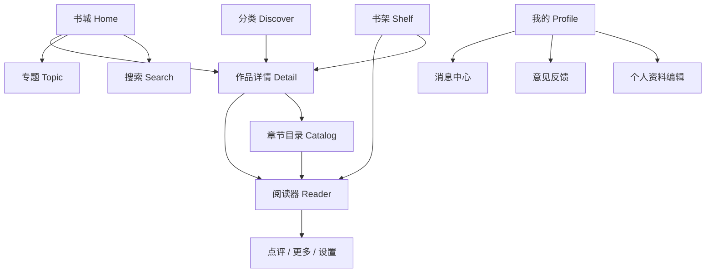
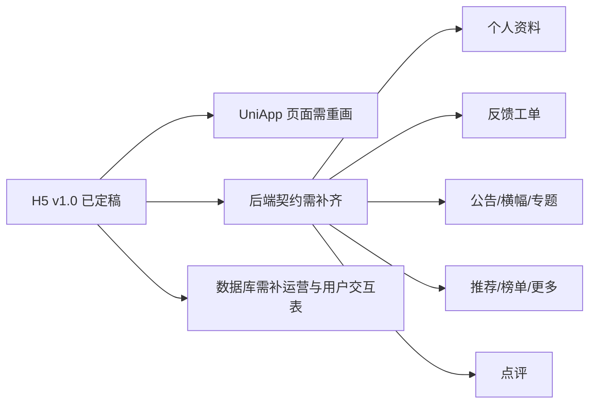

# H5 设计稿 v1.0 驱动的小程序与后端实施方案

## 1. 文档定位

- 文档目标：以当前已经定稿的 `reader-h5-demo v1.0` 为唯一产品基线，反向驱动 `UniApp` 小程序页面、小程序接口接入、RuoYi 阅读器后端接口与数据库结构建设。
- 适用工程：
  - H5 设计稿：`/Users/yabin/code/ruoyi/reader-h5-demo`
  - 小程序工程：`/Users/yabin/code/ruoyi/reader-uniapp`
  - 后端工程：`/Users/yabin/code/ruoyi/RuoYi-Vue-Plus`
  - 后台管理端：`/Users/yabin/code/ruoyi/plus-ui`
- 设计日期：2026-08-15。

## 2. 核心原则

### 2.1 基线原则

- `reader-h5-demo` 当前效果正式定稿为 `v1.0`。
- 后续小程序页面与后端能力，均以 H5 v1.0 为准，不再以旧版 UniApp 页面为准。
- H5 v1.0 中出现的页面、交互、状态与数据结构，凡是涉及服务端数据的，都必须在后端具备正式接口与落库能力。

### 2.2 技术原则

- 小程序与 H5 客户端统一使用 `UniApp` 体系建设，后续支持微信小程序、H5，并预留 App 输出能力。
- 管理端前端基于 `plus-ui` 现有 `6.X-Vue` 分支能力二开。
- 后端继续基于 `RuoYi-Vue-Plus 6.X` 的阅读器模块 `ruoyi-modules/ruoyi-reader` 演进。

### 2.3 实施原则

- 先做契约，再做实现：先明确页面到接口、接口到表结构的映射，再编码。
- 先做垂直闭环，不做横向堆积：每一批开发必须至少打通一个可联调链路。
- 本地偏好与弱状态可前端缓存，跨设备同步、审核发布、用户资料、消息、反馈、运营位、点评等必须后端承接。

## 3. H5 v1.0 功能总览

### 3.1 页面总览

### 3.2 H5 v1.0 已确认的关键能力

- 书城：
  - 顶部消息、搜索、界面主题入口
  - 公告滚动条
  - 小说/漫画/榜单/更新快捷入口
  - 焦点推荐位
  - 榜单切换
  - 更多推荐、最近更新、漫画区、专题区
  - 底部继续阅读条
- 分类：
  - 小说/漫画类型切换
  - 题材筛选
  - 连载状态筛选
  - 搜索联动
  - 结果列表
- 书架：
  - 在读 / 收藏 / 历史
  - 继续阅读
  - 管理模式
- 我的：
  - 个人档案卡
  - 个人资料编辑
  - 界面主题设置
  - 消息中心
  - 意见反馈
  - 微信号 / 手机号展示
- 详情：
  - 作品资料、简介、标签、目录预览、相关推荐
  - 加入书架 / 开始阅读 / 继续阅读
- 目录：
  - 正序 / 倒序
  - 当前阅读章节定位
  - 跳章
- 阅读器：
  - 顶部标题随章节滚动切换
  - 连续阅读，当前章节结束后自动衔接下一章
  - 中部点击显示顶部和底部栏
  - 顶部下载、点评、更多
  - 底部上一章、下一章、夜间/日间切换、设置
  - 设置面板：亮度、字号、背景、翻页方式、行高/高度、护眼模式等
  - 点评能力：针对选中文本发表评论

## 4. 当前现状与缺口

## 4.1 小程序现状

- 当前 `reader-uniapp` 已有：
  - 书城、分类、书架、我的、搜索、详情、目录、小说阅读、漫画阅读、消息、反馈、书签页面骨架
  - 基础 API 门面
  - 游客态本地书架、本地进度、本地书签能力
- 当前 `reader-uniapp` 缺口：
  - 仍不是 H5 v1.0 的正式页面形态
  - “我的”页尚未切到 H5 v1.0 确认版布局
  - 缺少个人资料编辑页
  - 反馈页仍是本地演示表单，未接后端
  - 阅读器交互与 H5 v1.0 仍存在明显差距
  - 部分页面调用了尚未存在的正式接口

## 4.2 后端现状

- 当前 `ruoyi-reader` 已有：
  - 作品、章节、导入、审核、书架、历史、进度、访客账户
  - 首页、分类、搜索、详情、目录、阅读正文、书架、历史、个人资料基础接口
- 当前后端缺口：
  - 作品相关推荐接口缺失
  - 个人资料修改接口缺失
  - 手机号 / 微信号 / 性别 / 头像等完整资料模型不足
  - 用户反馈工单接口缺失
  - 管理端反馈处理接口缺失
  - 动态公告、横幅、专题/书单运营配置缺失
  - 点评/划线评论接口缺失
  - 消息中心仍为占位实现
  - 分类、榜单、专题与首页推荐仍以静态拼装为主

## 4.3 差距归纳

## 5. 页面到接口映射

| 页面/模块 | 关键功能 | 当前状态 | 后端要求 |
|---|---|---|---|
| 书城 | 公告滚动、推荐栏目、榜单、更新、专题 | 部分静态 | 首页聚合接口升级，支持公告/横幅/栏目/榜单/专题 |
| 分类 | 类型筛选、题材筛选、状态筛选、榜单筛选 | 基础版 | 分类、榜单、筛选条件动态返回 |
| 书架 | 在读/收藏/历史/继续阅读 | 已有基础 | 保留现有接口，后续补管理能力 |
| 我的 | 资料卡、主题、消息、反馈 | 仅基础资料 | 完整资料查询/修改、消息中心、反馈工单 |
| 个人资料编辑 | 头像、昵称、性别、手机号、微信号、密码 | 缺失 | 查询当前资料、保存资料、游客态兼容 |
| 详情 | 资料、标签、目录预览、相关推荐 | 已有部分 | 补相关推荐、补分类标签字段 |
| 目录 | 全量章节、正倒序、当前章节 | 已有基础 | 保留并补章节扩展信息 |
| 阅读器 | 连续阅读、评论、更多、下载、设置 | 前端主导 | 补点评接口、进度接口扩展 |
| 反馈 | 提交反馈、查看状态、管理员回复 | 缺失 | 用户反馈 CRUD、管理员处理接口 |
| 消息 | 系统消息、更新提醒 | 占位 | 正式消息表与接口 |

## 6. 数据模型规划

## 6.1 保留并继续使用的现有表

- `reader_work`
- `reader_novel_chapter`
- `reader_novel_chapter_content`
- `reader_comic_chapter`
- `reader_comic_page`
- `reader_import_task`
- `reader_import_file`
- `reader_content_audit`
- `reader_bookshelf`
- `reader_reading_history`
- `reader_reading_progress`
- `reader_visitor_account`

## 6.2 第一批新增 / 扩展的表结构建议

### A. 用户与个人中心

- 扩展 `reader_visitor_account`
  - 增加 `nick_name`、`avatar_url`、`gender`、`mobile`、`wechat_no`、`preferences_json`
  - 目标：游客态也能编辑档案并保留“我的”页体验

### B. 反馈工单

- 新增 `reader_user_feedback`
  - 目标：承接用户意见反馈与管理员处理闭环
  - 关键字段：
    - `reader_id`
    - `account_type`
    - `feedback_type`
    - `feedback_content`
    - `contact_mobile`
    - `contact_wechat`
    - `status`
    - `reply_content`
    - `reply_by`
    - `reply_time`

### C. 消息中心

- 新增 `reader_user_message`
  - 目标：承接系统通知、更新提醒、反馈回复通知

### D. 首页运营位

- 新增 `reader_home_notice`
  - 目标：滚动公告
- 新增 `reader_home_banner`
  - 目标：首页轮播
- 新增 `reader_topic`
  - 目标：专题/书单
- 新增 `reader_topic_work`
  - 目标：专题和作品关系

### E. 阅读点评

- 新增 `reader_reading_comment`
  - 目标：支持针对章节正文选中内容发表评论
  - 关键字段：
    - `work_id`
    - `chapter_id`
    - `quote_text`
    - `quote_start`
    - `quote_end`
    - `comment_content`
    - `status`

## 7. 接口规划

## 7.1 第一批必须补齐的接口

### 个人资料

- `GET /reader/app/me`
  - 补全返回字段：`nickName`、`avatarUrl`、`gender`、`mobile`、`wechatNo`、`preferences`
- `PUT /reader/app/me`
  - 保存用户资料
- `PUT /reader/app/me/preferences`
  - 保留，仅负责阅读偏好 / 主题偏好

### 反馈

- `GET /reader/app/feedback`
  - 查询当前读者反馈记录
- `POST /reader/app/feedback`
  - 提交反馈
- `GET /reader/admin/feedback/list`
  - 后台查看反馈列表
- `PUT /reader/admin/feedback/{feedbackId}/reply`
  - 管理员回复
- `PUT /reader/admin/feedback/{feedbackId}/status`
  - 管理员更新状态

### 首页 / 作品

- `GET /reader/app/home`
  - 升级为动态公告、横幅、栏目、专题聚合
- `GET /reader/app/works/{workId}/recommendations`
  - 补齐相关推荐

### 消息

- `GET /reader/app/messages`
- `PUT /reader/app/messages/read`

## 7.2 第二批接口

- `GET /reader/app/topics/{topicKey}`
- `GET /reader/app/topics/{topicKey}/works`
- `GET /reader/app/rankings`
- `GET /reader/app/rankings/{rankingKey}/works`
- `GET /reader/app/reading/comments`
- `POST /reader/app/reading/comments`

## 8. 小程序实施顺序

## 8.1 Phase 1：先补数据闭环

- 个人资料编辑
- 用户反馈
- 作品相关推荐
- 首页动态公告

## 8.2 Phase 2：重画核心页面

- 我的
- 个人资料编辑页
- 反馈页
- 书城 v1.0
- 分类 v1.0

## 8.3 Phase 3：重画阅读器

- 小说阅读器交互重构
- 设置面板重构
- 点评浮层与评论列表
- 连续阅读进度联动

## 8.4 Phase 4：后台管理端补齐

- 反馈工单管理
- 公告/横幅/专题管理
- 推荐配置管理

## 9. 本轮建议先落地的第一批开发范围

### 9.1 第一批范围

- 数据库：
  - 扩展 `reader_visitor_account`
  - 新增 `reader_user_feedback`
- 后端：
  - `GET /reader/app/me` 字段补齐
  - `PUT /reader/app/me`
  - `GET /reader/app/feedback`
  - `POST /reader/app/feedback`
  - `GET /reader/app/works/{workId}/recommendations`
- 小程序：
  - 新增个人资料编辑页
  - 反馈页改为真实接口
  - 我的页增加“点击头像/昵称进入资料编辑”

### 9.2 原因

- 这批功能和 H5 v1.0 的“我的”页直接对应。
- 它们依赖关系清晰，能形成一个完整的小闭环。
- 它们会顺手把游客态读者模型补强，为后续微信登录、手机号登录、绑定关系打底。

## 10. 验收标准

- 小程序“我的”页进入后可看到正式资料卡，而不是纯占位文案。
- 点击头像或昵称可进入个人资料页并保存成功。
- 反馈页可提交记录，并能查询历史状态。
- 详情页相关推荐接口可用，不再是前端空调用。
- 本轮新增表和字段均带表注释、字段注释。
- 本轮新增代码与 SQL 全部补齐类、字段、方法、关键流程注释。
