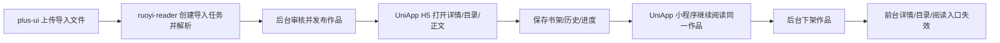

# Reader P0 Smoke Checklist

## 1. Purpose

This checklist is the shared smoke baseline for the first P0 reader loop on top of `RuoYi-Vue-Plus 6.X`.

- Backend: `RuoYi-Vue-Plus 6.X` + `ruoyi-reader`
- Admin frontend: `plus-ui`
- C-end frontend: `reader-uniapp` with `UniApp` output for `H5` and mini program

The goal of this document is to verify one complete path:

`plus-ui` import and publish -> `UniApp H5` read -> mini program continue reading -> bookshelf/history/progress persistence -> offline visibility rollback

## 2. Local verification environment

1. Use JDK 21:
   `export JAVA_HOME=/Library/Java/JavaVirtualMachines/liberica-jdk-21.jdk/Contents/Home`
2. Put JDK 21 first in `PATH`:
   `export PATH="$JAVA_HOME/bin:$PATH"`
3. Run the reader-module verification command:
   `mvn -pl ruoyi-modules/ruoyi-reader -am -Dmaven.test.skip=false test`

## 3. Smoke scope

| Scope | Must be covered in P0 smoke |
| --- | --- |
| Content ingest | EPUB novel import, comic package import, parse task result |
| Content governance | draft, pending review, published, offline |
| App reading | work detail, catalog, novel reader, comic reader |
| User persistence | bookshelf, history, reading progress |
| Cache and consistency | Redis progress buffering, flush-back, published-content cache refresh |
| Cross-end continuation | `UniApp H5` writes progress, mini program resumes the same work |

## 4. Recommended smoke flow

## 5. Test assets and preconditions

1. Prepare one valid `EPUB` novel file.
2. Prepare one valid comic package such as `CBZ` or project-supported comic import file.
3. Prepare one damaged import file for failure verification.
4. Prepare one backend operator account in `plus-ui`.
5. Prepare one reader account that can be used in both `UniApp H5` and mini program.
6. Ensure Redis and MySQL are available because progress buffering and published-content cache are part of the smoke scope.

## 6. Developer baseline

Fresh baseline should always be refreshed before claiming module stability.

- Verification command:
  `mvn -pl ruoyi-modules/ruoyi-reader -am -Dmaven.test.skip=false test`
- Fresh verification baseline on `2026-08-10`:
  `Tests run: 45, Failures: 0, Errors: 0, Skipped: 0`
- Notes:
  Maven effective-settings still reports a local `mirror` tag warning
  Mockito on JDK 21 still reports dynamic agent warnings
  neither warning blocks the current test pass result

## 6.1 Current minimum implementation notes

Before running the first manual smoke, align on the current code-level reality:

- `plus-ui` now has a real import-task creation entry:
  upload file to OSS -> submit `/reader/admin/import/tasks`
- current P0 import handling is a minimum usable implementation:
  `txt` and `epub` currently generate one draft novel chapter from extracted text
  `zip` and `cbz` currently generate one draft comic chapter and page rows from archive entries
- current import result status is created directly into `PENDING_REVIEW` instead of a long-running async parse pipeline
- audit approve now promotes both the work and its chapters to `PUBLISHED`, which is required for app-side reading APIs to return readable content
- `reader-uniapp` now triggers:
  detail page bookshelf add/remove
  novel reader progress save
  comic reader progress save
- the first shared smoke should validate this minimum working slice first, and should not assume that richer async parsing, refined chapter splitting, or visitor/login merge are already closed

## 7. Scenario A: Reader module test baseline

1. Run the full reader-module test command.
2. Confirm controller, service, cache, parser, enum, domain, and smoke tests are all discovered.
3. Confirm the current baseline remains:
   `Tests run: 45, Failures: 0, Errors: 0, Skipped: 0`
4. Record the fresh `Tests run / Failures / Errors / Skipped` result in the delivery note for the current day.

## 8. Scenario B: Novel import -> publish -> H5 reading

1. Log in to `plus-ui`.
2. Upload one `EPUB` novel file through the reader import flow.
3. Confirm an import task is created and currently reaches `PENDING_REVIEW`.
4. Confirm one draft work is generated with chapters and visible metadata.
5. Review the draft in the admin workflow and approve it.
6. Publish the work and confirm it becomes visible to app-side published queries.
7. Open the same work in `UniApp H5`.
8. Confirm these app APIs return valid published data:
   `/reader/app/works/{workId}`
   `/reader/app/works/{workId}/catalog`
   `/reader/app/reading/novels/{chapterId}`
9. Read several pages or chapters and confirm:
   one history record is written
   one progress record is saved
   bookshelf add/remove works

## 9. Scenario C: Comic import -> publish -> mini program reading

1. Upload one comic package through the admin import flow.
2. Confirm chapter and page data are generated into one minimum draft chapter after import creation.
3. Approve and publish the comic work.
4. Open the same work in the mini program client.
5. Confirm these app APIs return valid published data:
   `/reader/app/works/{workId}`
   `/reader/app/works/{workId}/catalog`
   `/reader/app/reading/comics/{chapterId}`
6. Flip several pages and confirm history and progress are updated.

## 10. Scenario D: Cross-end continuation and progress consistency

1. Start reading a published work in `UniApp H5`.
2. Save progress multiple times with different `pageNo` and `readPercent`.
3. Confirm the progress query endpoint returns the latest meaningful position:
   `/reader/app/reading/progress/{workId}`
4. Open the same work in the mini program.
5. Confirm the mini program resumes from the latest persisted chapter/page location.
6. If a Redis dirty progress entry exists, trigger the configured flush path and confirm MySQL and Redis converge on the latest progress rather than an older one.

## 11. Scenario E: Published-content cache refresh and offline rollback

1. Open one published work detail and catalog once to warm the published-content cache.
2. Confirm repeated app-side detail and catalog requests still return consistent published data.
3. Offline the work from the admin side.
4. Confirm these app endpoints no longer expose the work as published content:
   `/reader/app/works/{workId}`
   `/reader/app/works/{workId}/catalog`
   `/reader/app/reading/novels/{chapterId}` or `/reader/app/reading/comics/{chapterId}`
5. Confirm the offline action invalidates stale published-content visibility rather than serving cached old data.

## 12. Scenario F: Failure-path sanity checks

1. Upload one damaged import file.
2. If the current minimum import implementation still accepts the file into draft creation, record that as a known gap rather than marking smoke failed.
3. Confirm no published work is exposed to app-side read APIs before audit/publish.
4. Record whether damaged-file rejection needs to be added as the next hardening item after first shared smoke.

## 13. Mismatch checklist

During smoke execution, explicitly record whether any mismatch exists in:

- admin DTO field names vs app DTO field names
- `UniApp H5` and mini program progress semantics
- pagination and empty-state behavior
- publish/offline visibility timing
- history, bookshelf, and progress timestamp ordering
- cache invalidation after publish or offline
- parser failure messaging
