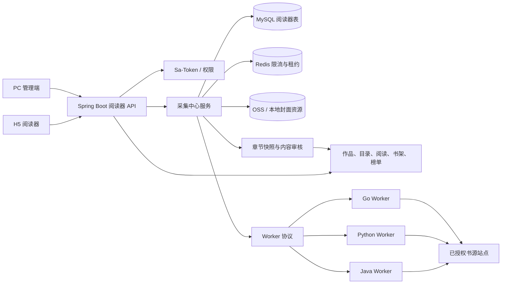
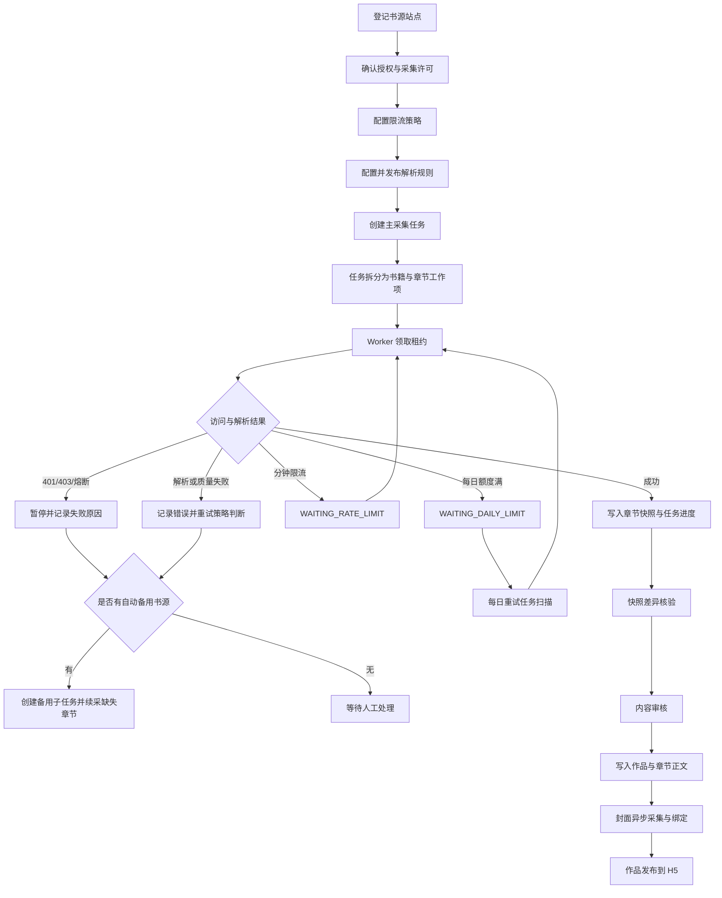

# 阅读器平台架构与核心流程

本文说明当前阅读器后端、采集中心和 Worker 的整体职责与数据流。图表使用 Mermaid 编写，GitHub 会直接渲染。

## 总体架构

## 阅读器核心流程

1. H5 通过应用接口加载首页、分类、榜单、搜索和作品详情。
2. 作品详情返回竖版封面、横版封面、背景配置、作者、分类和连载状态。
3. 目录接口支持分页，阅读页按章节请求正文，并保存阅读进度、页码和阅读位置。
4. 上下滚动模式将相邻章节拼接为连续阅读流；左右翻页模式根据排版后的正文计算页数，章节边界分别落到上一章末页和下一章首页。
5. 书架、历史、书签、评论和阅读统计均通过应用端接口持久化，访客登录后可合并访客数据。

## 采集中心流程

## 主任务与备用子任务

主任务保存用户选择的站点、规则、策略、采集范围和书籍数量限制。每本书会记录章节总量、已成功章节、缺失章节、最近错误和当前游标。站点出现 403、连续失败熔断、解析不可用或策略拒绝时，系统只在已登记且已授权的候选站点中自动生成备用子任务；子任务只领取主任务仍缺失的章节，成功章节通过内容指纹去重，避免重复写入。

备用子任务必须保留来源站点、规则版本、触发原因、开始章节、结束章节、重试次数和日志。没有合规可用站点时任务会明确停在人工处理状态，而不是无限重试。

## 安全与可审计边界

- 只访问管理员明确登记并确认授权的站点。
- 黑名单、robots 拒绝、私网/元数据地址和 SSRF 风险在服务端拦截。
- 401/403 不通过代理轮换、验证码绕过或指纹伪装规避。
- 每次领取、请求、解析、质量校验、入库、重试、备用切换和审核均写入日志。
- 任务列表展示运行状态、失败分类、每日额度重试次数和最近运行时间。

## 当前完成情况

- 阅读器作品、目录、正文、书架、搜索、分类、榜单、评论、反馈和阅读进度接口已接入。
- 作品支持横版与竖版封面、背景样式和异步封面候选任务。
- 采集中心包含站点、限流策略、解析规则、任务、运行记录、错误、日志、章节快照和任务明细。
- 采集协议已提供 Java、Python、Go 三种参考 Worker。
- 任务支持书籍数量限制、每日额度等待、失败分类、熔断重试、备用书源和主子任务明细。
- 章节快照可补偿写入作品管理、章节正文和内容审核，审核后再发布给阅读端。
- 后端单元测试与 Worker 测试已随源码保留，SQL 初始化和增量升级脚本位于 `script/sql`。

## 后续补充方向

- 将任务队列从单实例轮询进一步演进为可观测的分布式队列，并补充 Prometheus 指标和告警。
- 为每个书源增加可配置的结构化解析测试样本、回归测试和规则版本回滚。
- 为备用书源建立更严格的标题、作者、章节序号和正文指纹匹配策略。
- 完善大规模任务的暂停、续租、取消和跨天恢复压测。
- 将封面资源统一迁移到生产 OSS，并补充版权来源、缓存失效和资源清理策略。

