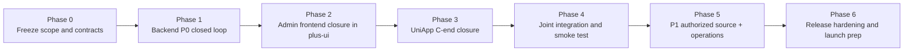

# Reader Master Delivery Plan

> **For agentic workers:** REQUIRED SUB-SKILL: Use superpowers:subagent-driven-development (recommended) or superpowers:executing-plans to implement this plan task-by-task. Steps use checkbox (`- [ ]`) syntax for tracking.

**Goal:** Turn the current novel/comic reader idea into a controlled, phased delivery plan that can be executed without losing track of scope, repository boundaries, or already-finished work.

**Architecture:** Keep the product split into one backend core (`RuoYi-Vue-Plus` + `ruoyi-reader`), one admin frontend (`plus-ui`), and one C-end frontend (`reader-uniapp` with `UniApp` for H5/mini-program/App). Use P0 to close the import -> audit -> publish -> reading -> bookshelf/progress loop first, then use P1/P2 for authorized source sync, operations, and non-core capabilities.

**Tech Stack:** Java 21, Spring Boot / RuoYi-Vue-Plus 6.X, MyBatis-Plus, Sa-Token, MySQL, Redis, OSS/CDN, `plus-ui` (`Vue 3 + TypeScript + Vite + Element Plus`), `UniApp`.

---

## Scope split

This master plan is an orchestration plan, not a replacement for the detailed subsystem plans:

- Backend P0 execution base: `/Users/yabin/code/ruoyi/RuoYi-Vue-Plus/docs/superpowers/plans/2026-08-09-reader-p0-core-implementation.md`
- Frontend foundation base: `/Users/yabin/code/ruoyi/RuoYi-Vue-Plus/docs/superpowers/plans/2026-08-09-reader-frontend-foundation-plan.md`
- PRD base: `/Users/yabin/code/ruoyi/RuoYi-Vue-Plus/doc/02-阅读器需求梳理与完善.md`
- System design base: `/Users/yabin/code/ruoyi/RuoYi-Vue-Plus/docs/superpowers/specs/2026-08-09-reader-system-design.md`

This plan answers one question only:

**What should we do next, in what order, on which repository, and what is already done?**

## Current fixed decisions

- Backend base repository: `/Users/yabin/code/ruoyi/RuoYi-Vue-Plus`
- Backend working branch: `analysis/reader-backend-fit`
- Admin frontend repository: `/Users/yabin/code/ruoyi/plus-ui`
- Admin frontend working branch: `analysis/reader-frontend-fit`
- C-end frontend directory: `/Users/yabin/code/ruoyi/reader-uniapp`
- C-end framework: `UniApp`
- Admin framework: `plus-ui`
- P0 content source: file import only
- P1 content source: authorized/compliant source sync only
- No P0 work may depend on unauthorized crawling, anti-ban bypass, captcha bypass, login impersonation, or identity spoofing

## Current actual status snapshot

### Already finished or mostly finished

- [x] Product PRD has been expanded in detail
- [x] System architecture, flowcharts, and sequence diagrams are documented
- [x] Backend fit analysis against `RuoYi-Vue-Plus 6.X` is documented
- [x] Frontend boundary decision is frozen: `plus-ui` for admin, `UniApp` for C-end
- [x] `plus-ui` no longer carries temporary C-end route/layout leftovers
- [x] `reader-uniapp` has a minimal project skeleton, page shell, request wrapper, and reader API type scaffold
- [x] `ruoyi-reader` backend module has closed the P0 core chain: import, draft, audit, publish, app reading, bookshelf, history, and progress
- [x] Backend P0 app reading APIs are closed for work detail, catalog, novel reading, and comic reading
- [x] Backend P0 reader persistence APIs are closed for bookshelf add/remove/list, batch bookshelf remove, history list/delete/clear, and reading progress save/query
- [x] Redis progress buffering, flush consistency correction, published-content cache readback, and publish-triggered cache refresh are implemented and verified
- [x] Reader-module smoke checklist and developer-side verification baseline are documented under JDK 21
- [x] `plus-ui` reader admin route, API layer, and minimal management pages are now connected to real backend list/audit/publish/offline contracts
- [ ] `plus-ui` reader admin menu visibility is still not fully closed in the real permission/menu system, so the module may remain hidden after login
- [x] `ruoyi-reader` admin API now exposes the minimum management endpoints needed by `plus-ui`: work list, import-task list, audit list, audit approve, publish, offline
- [x] `plus-ui` import-task page now provides a real upload + create-task entry based on the built-in OSS upload flow
- [x] `reader-uniapp` has been aligned with the official Vue3/Vite `UniApp` project structure
- [x] `reader-uniapp` H5 development startup and H5 / WeChat mini-program builds have been verified
- [x] `reader-uniapp` has an isolated Git branch for continued C-end work
- [x] `reader-uniapp` work detail and reader pages now trigger real bookshelf/progress API calls for the first P0 smoke path
- [x] `reader-uniapp` work detail page now supports progress readback and continue-reading entry for the first P0 smoke path
- [x] `reader-uniapp` bookshelf/history page now supports real work-detail jump and continue-reading jump
- [x] `reader-uniapp` novel/comic reader pages now read back saved progress and write platform-aware client type (`H5` / `MP_WEIXIN`)
- [ ] `reader-uniapp` home / discover / profile pages are still blueprint-like in parts and should not be treated as a finished C-end product shell
- [x] `ruoyi-reader` import-task creation now generates the minimum draft work + chapters/pages + pending-audit records from uploaded files
- [x] audit approve now promotes chapter-level publish status together with work-level publish status so app-side reading APIs can return正文/图片 after approval
- [x] first joint smoke baseline has been executed for both小说 and漫画 on H5, covering upload -> import -> audit -> publish -> detail -> reader -> bookshelf/history/progress

### In progress

- [ ] mobile identity closure still needs to be finished for visitor/login/WeChat merge after the first smoke baseline
- [ ] admin menu visibility and permission binding still need to be fully closed so reader admin pages are discoverable after login
- [ ] C-end home/profile productization still needs to be finished so the app does not feel like a mock screen set

### Not started or not closed

- [ ] Mobile login / WeChat login / visitor merge closed loop
- [ ] End-to-end smoke flow across backend + admin + H5 + mini-program
- [ ] P1 authorized source sync
- [ ] P1 operations center and data center

## Delivery roadmap

## Task 1: Freeze the single source of truth

**Files:**
- Reference: `/Users/yabin/code/ruoyi/RuoYi-Vue-Plus/doc/02-阅读器需求梳理与完善.md`
- Reference: `/Users/yabin/code/ruoyi/RuoYi-Vue-Plus/doc/01-RuoYi-Vue-Plus-6X后端项目解读.md`
- Reference: `/Users/yabin/code/ruoyi/RuoYi-Vue-Plus/doc/03-阅读器前端实施方案与界面蓝图.md`
- Reference: `/Users/yabin/code/ruoyi/RuoYi-Vue-Plus/doc/04-前端项目目录规划与方案设计.md`
- Create: `/Users/yabin/code/ruoyi/RuoYi-Vue-Plus/docs/superpowers/plans/2026-08-10-reader-master-delivery-plan.md`

- [ ] Confirm this master plan becomes the only document used to track delivery order
- [ ] Treat the PRD as feature source, the system design as architecture source, and this file as execution-order source
- [ ] Do not reopen framework selection unless a hard blocker appears
- [ ] Keep these frozen assumptions:
  C-end = `UniApp`
  Admin = `plus-ui`
  Backend core = `ruoyi-reader`
  P0 source = import only
  P1 source = authorized sync only

**Expected outcome:** no more ambiguity about repository ownership, frontend technology choice, or phase order.

## Task 2: Complete backend P0 closed loop first

**Files:**
- Reference plan: `/Users/yabin/code/ruoyi/RuoYi-Vue-Plus/docs/superpowers/plans/2026-08-09-reader-p0-core-implementation.md`
- Modify: `/Users/yabin/code/ruoyi/RuoYi-Vue-Plus/ruoyi-modules/ruoyi-reader/`
- Modify: `/Users/yabin/code/ruoyi/RuoYi-Vue-Plus/script/sql/ry_reader.sql`
- Modify: `/Users/yabin/code/ruoyi/RuoYi-Vue-Plus/ruoyi-admin/pom.xml`
- Modify: `/Users/yabin/code/ruoyi/RuoYi-Vue-Plus/ruoyi-modules/pom.xml`

- [ ] Finish the `ruoyi-reader` module from scaffold to usable P0 business core
- [ ] Close the minimum business chain in this order:
  work/content model
  import task and parse flow
  draft persistence
  audit state flow
  publish state flow
  app reading APIs
  bookshelf/history/progress
- [ ] Keep backend API boundaries split:
  `/reader/admin/*` only for admin
  `/reader/app/*` only for reader clients
- [ ] Freeze the P0 API contracts only after the first working chain exists
- [ ] Ensure backend does not add P1/P2 scope early:
  no payment
  no comments
  no unauthorized source sync
  no overbuilt operations center

**Verification:**
- [ ] `ruoyi-reader` compiles under JDK 21
- [ ] core module tests run
- [ ] import -> audit -> publish -> app read is reachable through backend APIs

**Expected outcome:** backend becomes the first truly usable product backbone.

**Latest backend status (2026-08-10):**
- App read endpoints have been implemented and verified: `/reader/app/works/{workId}`, `/reader/app/works/{workId}/catalog`, `/reader/app/reading/novels/{chapterId}`, `/reader/app/reading/comics/{chapterId}`
- Reader persistence endpoints have been implemented and verified: `/reader/app/works/{workId}/bookshelf`, `/reader/app/bookshelf`, `/reader/app/bookshelf/batch-remove`, `/reader/app/history`, `/reader/app/reading/progress`, `/reader/app/reading/progress/{workId}`
- Redis progress buffering, flush-back consistency, published-content cache readback, and publish-triggered cache refresh have been implemented and verified
- Task 11 deliverables are now in place: smoke verification baseline, integration checklist, and developer-facing delivery docs
- `plus-ui` admin flows have entered the minimum usable state for upload/create-task/list/audit/publish/offline verification
- `reader-uniapp` detail and reader pages now hit real bookshelf/progress APIs, and H5 / WeChat mini-program production builds both pass
- JDK 21 compile verification now passes after import-flow and audit-flow changes:
  `JAVA_HOME=$(/usr/libexec/java_home -v 21) PATH="$JAVA_HOME/bin:$PATH" mvn -pl ruoyi-modules/ruoyi-reader -am -DskipTests compile`
- The current remaining focus is no longer page scaffolding; it is identity closure (`visitor/login/WeChat merge`) and P1 authorized-source boundary design

## Task 3: Close admin frontend in `plus-ui`

**Files:**
- Reference plan: `/Users/yabin/code/ruoyi/RuoYi-Vue-Plus/docs/superpowers/plans/2026-08-09-reader-frontend-foundation-plan.md`
- Modify: `/Users/yabin/code/ruoyi/plus-ui/src/router/index.ts`
- Modify: `/Users/yabin/code/ruoyi/plus-ui/src/router/modules/reader-admin.ts`
- Modify: `/Users/yabin/code/ruoyi/plus-ui/src/api/reader/admin/`
- Modify: `/Users/yabin/code/ruoyi/plus-ui/src/views/reader-admin/`

- [ ] Keep `plus-ui` strictly admin-only
- [ ] Finish these admin modules in order:
  work management
  import task management
  audit management
  publish/offline operation
- [ ] Bind admin tables/forms to the real `/reader/admin/*` APIs
- [ ] Reuse existing `plus-ui` permission, route, table, upload, and request patterns
- [ ] Do not reintroduce H5 reading pages into `plus-ui`

**Verification:**
- [ ] Admin routes render under the reader admin menu chain
- [ ] Admin list/query/action pages can drive backend P0 content flow
- [ ] `plus-ui` build stays clean after reader admin additions

**Expected outcome:** operations staff can import, review, publish, and manage content from one admin console.

## Task 4: Close `reader-uniapp` as the only C-end project

**Files:**
- Reference plan: `/Users/yabin/code/ruoyi/RuoYi-Vue-Plus/docs/superpowers/plans/2026-08-09-reader-frontend-foundation-plan.md`
- Modify: `/Users/yabin/code/ruoyi/reader-uniapp/`

- [x] Keep `reader-uniapp` as the only reader-side codebase for H5 + mini-program + future App
- [ ] Finish the project in this order:
  dependency initialization
  local build run
  home/discover/detail shells
  novel reader
  comic reader
  bookshelf/history/progress
  login/visitor merge
- [ ] Make H5 and mini-program share the same API models and progress semantics
- [ ] Keep platform differences isolated to auth, share, safe-area, and container-specific behavior
- [x] If `reader-uniapp` remains an independent project, initialize Git and create an isolated working branch before larger implementation continues

**Verification:**
- [x] `reader-uniapp` can run as a minimal `UniApp` project
- [x] H5 shell opens
- [x] mini-program shell builds
- [x] app-facing request wrapper can call real `/reader/app/*` endpoints on the current P0 path

**Expected outcome:** C-end path is no longer conceptual; it becomes an actual executable project.

**Latest C-end status (2026-08-12):**
- work detail now reads `/reader/app/reading/progress/{workId}` and exposes `continue reading` / `start reading`
- bookshelf and history now support direct jump to work detail and direct resume to reader pages
- novel/comic readers now:
  read back saved progress on page load
  write platform-aware client type through one shared client resolver
  keep the minimum progress visualization needed for the first joint smoke
- H5 production build passes:
  `pnpm build:h5`
- WeChat mini-program production build passes:
  `pnpm build:mp-weixin`
- The next highest-value step is no longer another isolated page shell; it is the first joint manual smoke with real content files and one shared reader identity

## Task 5: Run the first joint smoke flow

**Files:**
- Reference: `/Users/yabin/code/ruoyi/RuoYi-Vue-Plus/docs/reader-p0-smoke-checklist.md`
- Reference: `/Users/yabin/code/ruoyi/RuoYi-Vue-Plus/docs/reader-p0-smoke-runbook.md`
- Modify if needed: `/Users/yabin/code/ruoyi/RuoYi-Vue-Plus/docs/reader-p0-smoke-checklist.md`

- [x] Run the first shared smoke path in exactly this order:
  admin uploads file
  backend creates import task
  admin reviews result
  admin approves/publishes work
  H5 opens work detail
  H5 opens novel/comic reader
  H5 writes progress
  mini-program resumes the same work
- [x] Record all mismatches found in field names, auth behavior, pagination, empty states, and progress semantics
- [x] Do not widen scope during smoke fixing; fix only issues blocking the P0 chain

**Verification:**
- [x] one novel import reaches published and readable state
- [x] one comic import reaches published and readable state
- [x] bookshelf and progress survive at least one cross-end continuation scenario

**Latest smoke result (2026-08-12):**
- `OSS -> import -> audit -> publish -> H5 read -> bookshelf/history/progress` has been verified for one novel and one comic
- `mini-program` continuation has been verified with `MP_WEIXIN`
- `downstream rollback` has been verified for both works

**Expected outcome:** P0 moves from “documents + skeletons” to “one real working slice.”

## Task 6: Finish the P1 authorized-source boundary correctly

**Files:**
- Reference: `/Users/yabin/code/ruoyi/RuoYi-Vue-Plus/doc/02-阅读器需求梳理与完善.md`
- Reference: `/Users/yabin/code/ruoyi/RuoYi-Vue-Plus/docs/superpowers/specs/2026-08-09-reader-system-design.md`
- Future modify: `/Users/yabin/code/ruoyi/RuoYi-Vue-Plus/ruoyi-modules/ruoyi-reader/`
- Future modify: `/Users/yabin/code/ruoyi/plus-ui/src/views/reader-admin/`

- [ ] Start P1 only after P0 import flow is stable
- [ ] Implement authorized source sync as a separate subsystem, not mixed into the P0 import closure
- [ ] Keep all source controls explicit and operator-owned:
  source enabled switch
  auth validity
  rate limit
  pause / circuit-break
  sync logs
  retry policy
- [ ] Stability measures may include:
  cache
  throttling
  interval control
  backoff
  pause on repeated failure
- [ ] Do not implement anything that attempts to bypass access restrictions or disguise identity

**Expected outcome:** P1 stays compliant and operationally controllable.

## Task 7: Finish P1/P2 operations only after the core loop is stable

**Files:**
- Future modify: `/Users/yabin/code/ruoyi/RuoYi-Vue-Plus/ruoyi-modules/ruoyi-reader/`
- Future modify: `/Users/yabin/code/ruoyi/plus-ui/src/views/reader-admin/`
- Future modify: `/Users/yabin/code/ruoyi/reader-uniapp/`

- [ ] Add recommendation slots, rankings, hot keywords, topics, notices, dashboards only after P0 and P1 are stable
- [ ] Add comments, reports, blacklists, messages, and deeper user center only after core reading data is trustworthy
- [ ] Add payment/membership only in a separate later plan

**Expected outcome:** enhancements do not destabilize the core reading chain.

## Task 8: Prepare release-quality hardening

**Files:**
- Modify as needed: `/Users/yabin/code/ruoyi/RuoYi-Vue-Plus/doc/02-阅读器需求梳理与完善.md`
- Modify as needed: `/Users/yabin/code/ruoyi/RuoYi-Vue-Plus/docs/reader-p0-smoke-checklist.md`
- Modify as needed: deployment and environment configs in the three codebases

- [ ] Close environment configuration:
  MySQL
  Redis
  OSS
  login credentials and client config
  mini-program config
- [ ] Close quality gates:
  build
  test
  smoke
  error handling
  empty states
  rollback strategy
- [ ] Close launch docs:
  deployment steps
  data init steps
  branch strategy
  smoke checklist
  issue handling owner map

**Expected outcome:** the project can move from development state to a controlled deployable state.

## Recommended execution order from today

1. Finish identity closure and cross-end continuity in `reader-uniapp` + backend
2. Close backend menu visibility so reader admin can be seen after login
3. Productize C-end home / profile pages so the shell feels like a real app
4. Start P1 authorized-source boundary design and implementation
5. Continue P1/P2 operations only after the core loop stays stable
6. Close release hardening and launch prep

## What you should look at first each day

1. This master plan for phase order
2. Backend P0 plan for backend task details
3. Frontend foundation plan for frontend task details
4. Git status of:
   `/Users/yabin/code/ruoyi/RuoYi-Vue-Plus`
   `/Users/yabin/code/ruoyi/plus-ui`
   `/Users/yabin/code/ruoyi/reader-uniapp`

## Short version

- P0 先做通：导入 -> 审核 -> 发布 -> 阅读 -> 书架/进度
- 后端先闭环，再补后台，再补 `UniApp`
- `plus-ui` 只做后台
- `reader-uniapp` 只做 C 端
- 合规来源同步放到 P1，且必须可控、可停、可审计

## Self-review

- Spec coverage check: covered backend, admin frontend, C-end frontend, integration, P1 source sync boundary, and release hardening
- Placeholder scan: no unresolved framework choice, no undefined repository boundary, no ambiguous frontend ownership
- Consistency check: all current decisions stay aligned with the frozen stack (`ruoyi-reader` + `plus-ui` + `UniApp`)
