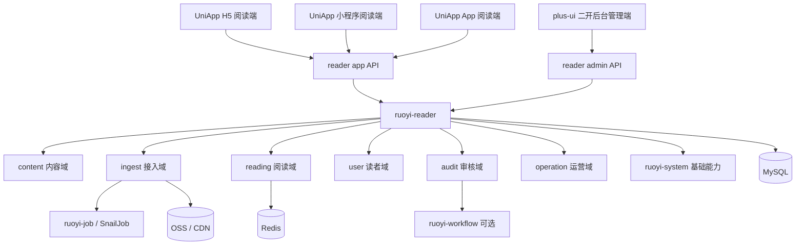
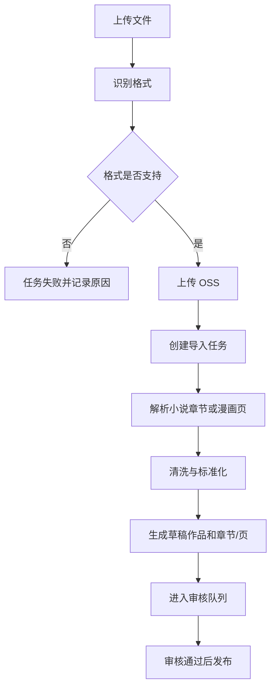
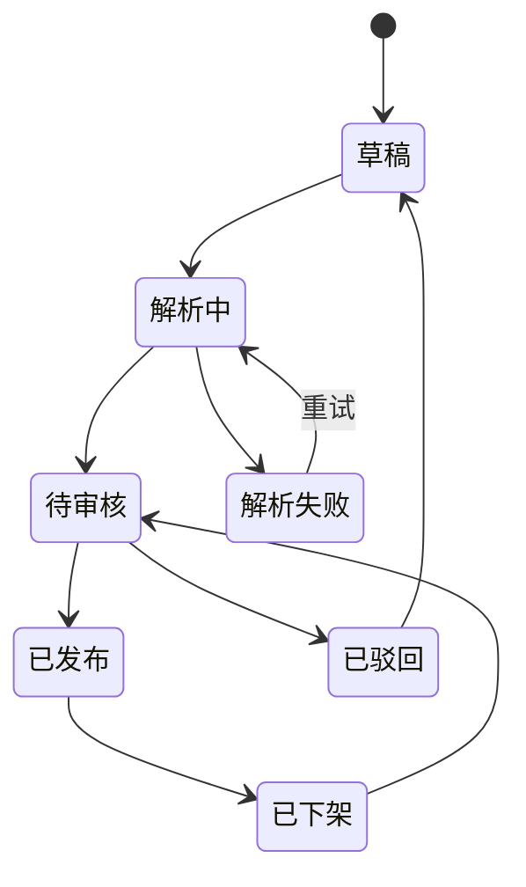
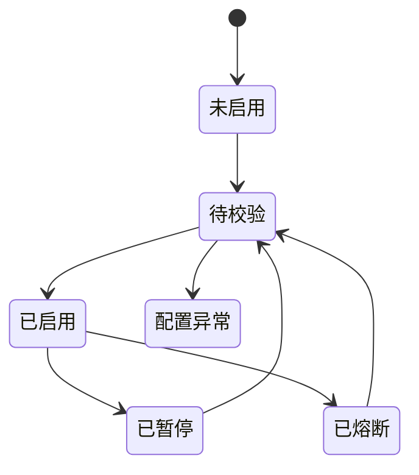
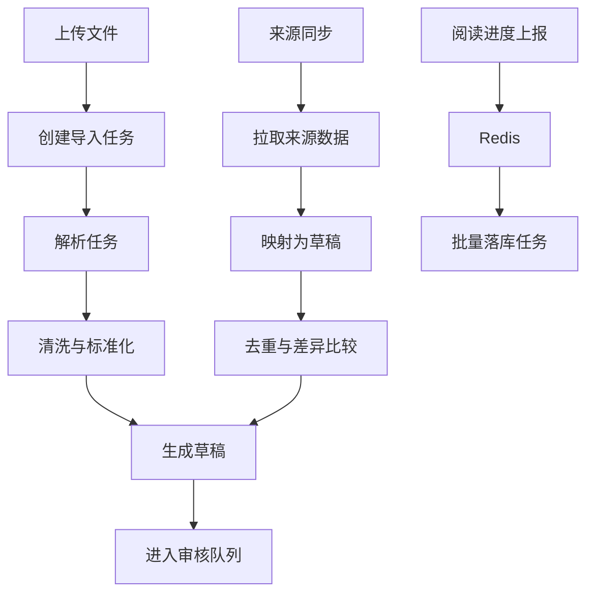

# 小说漫画阅读器系统拆分设计

## 1. 文档信息

- 设计日期：2026-08-09
- 设计目标：将“小说 + 漫画阅读器”从需求级描述收敛为可进入实现规划的系统拆分设计
- 适用底座：`RuoYi-Vue-Plus 6.X`
- 实现形态：模块化单体
- 后端核心模块：`ruoyi-reader`
- 配套文档：
  - [RuoYi-Vue-Plus 6.X 后端底座解读与阅读器实施蓝图](/Users/yabin/code/ruoyi/RuoYi-Vue-Plus/doc/01-RuoYi-Vue-Plus-6X后端项目解读.md:1)
  - [小说漫画阅读器 PRD：需求、边界与实施拆解](/Users/yabin/code/ruoyi/RuoYi-Vue-Plus/doc/02-阅读器需求梳理与完善.md:1)
  - [阅读器前端实施方案与界面蓝图](/Users/yabin/code/ruoyi/RuoYi-Vue-Plus/doc/03-阅读器前端实施方案与界面蓝图.md:1)

> 2026-08-09 最新修正：C 端前端统一由 `UniApp` 承担，输出 H5、小程序和后续 App；`plus-ui` 仅承担后台管理端。下文更早出现的“`plus-ui` H5 阅读端”旧描述，统一以本条为准覆盖。

## 2. 关键设计结论

| 决策项 | 结论 |
| --- | --- |
| 后端架构 | 采用模块化单体，保留 `ruoyi-admin` 统一入口，新建 `ruoyi-reader` 承载阅读业务 |
| 终端形态 | `UniApp` 统一输出 H5、小程序、App；`plus-ui` 承担后台管理端；前后台 API、DTO、权限独立 |
| C 端前端框架 | 使用 `UniApp` 作为统一前端实现框架，并在 H5、小程序和 App 之间共享尽可能多的页面结构、接口模型与状态约定 |
| 后台前端框架 | 后台页面基于 `RuoYi-Vue-Plus` 官方配套的 `plus-ui`（Vue + Element Plus）二次开发。仓库路径为 `/Users/yabin/code/ruoyi/plus-ui`，分支为 `6.X-Vue` |
| 读者登录 | 小程序使用微信登录，`UniApp H5` 使用手机号验证码登录，后台账号体系独立 |
| 内容来源 | P0 做文件导入，P1 才启用合规授权来源同步 |
| 收费模型 | P0 全部免费，但作品和章节模型预留免费/付费能力字段 |
| 首期规模 | 按 1 万部作品以内、百万级章节/漫画页设计，基础设施使用 MySQL + Redis + OSS/CDN |
| 前端结构 | 首页采用混合布局；一级导航统一为“首页 / 发现 / 书架 / 我的”；阅读器默认沉浸、按需唤起工具 |
| 合规边界 | 不做未经授权抓取，不做绕过访问限制、验证码、封禁或身份伪装 |

## 3. 系统目标与非目标

### 3.1 系统目标

1. 建立统一的小说/漫画内容库。
2. 建立从导入、审核、发布到阅读的完整链路。
3. 支持 H5 和小程序的跨端书架、阅读进度和历史同步。
4. 为未来的授权来源同步、会员和付费能力预留明确扩展边界。

### 3.2 非目标

1. 不在 P0 实现未经授权公开站点的采集。
2. 不在 P0 实现会员、支付、付费章节。
3. 不在 P0 拆分微服务。
4. 不在 P0 实现复杂社区关系链、创作者结算或国际化体系。

## 4. 总体架构



### 4.1 底座复用边界

- `ruoyi-system`：后台账号、角色、菜单权限、客户端管理、OSS 配置、系统参数、日志审计。
- `ruoyi-job`：导入解析、同步、重试、清理、批量落库等异步任务。
- `ruoyi-workflow`：审核、上架审批、投诉处理可按需接入。
- `ruoyi-reader`：阅读业务唯一核心模块，不将阅读业务散落到 `ruoyi-system`。

### 4.2 前端实现约束

- C 端明确选型 `UniApp`，不再并行评估 `Taro`、原生双写或其他跨端方案。
- 后台管理端明确选型 `plus-ui` 二开，仓库路径为 `/Users/yabin/code/ruoyi/plus-ui`，分支为 `6.X-Vue`，必须复用其路由、权限、请求封装、菜单和标签页体系。
- `reader app API` 在字段命名、分页模型、错误码和鉴权行为上，需同时服务 `UniApp` 输出的 H5、小程序与 App 页面。

## 5. `ruoyi-reader` 模块拆分

```text
ruoyi-reader
├── controller
│   ├── app
│   └── admin
├── application
├── domain
│   ├── content
│   ├── ingest
│   ├── reading
│   ├── user
│   ├── audit
│   └── operation
├── infrastructure
└── job
```

### 5.1 领域职责

| 领域 | 核心职责 |
| --- | --- |
| `content` | 作品、作者、分类、标签、小说卷章、漫画章节和页面 |
| `ingest` | 文件导入、格式识别、解析、清洗、来源适配器、同步任务 |
| `reading` | 书架、阅读历史、阅读进度、书签、笔记 |
| `user` | 读者扩展资料、微信绑定、游客数据合并 |
| `audit` | 草稿审核、发布、下架、版权投诉 |
| `operation` | 推荐位、榜单、专题、热词、阅读端公告 |

### 5.2 依赖方向

```text
Controller -> Application -> Domain -> Repository Interface
Infrastructure -> Domain Interface
```

约束：

- `controller.app` 不直接暴露数据库实体。
- `controller.admin` 不与读者端复用权限逻辑。
- `reading` 只读取已发布内容。
- `ingest` 只产出草稿，不绕过审核直接发布。
- `audit` 是唯一的发布状态变更入口。

## 6. 内容接入与发布链路

### 6.1 内容接入总方案

- P0：文件导入链路。
- P1：合规授权来源同步链路。
- 两条链路最终都进入统一的草稿、审核、发布流程。

### 6.2 文件导入流程



### 6.3 授权来源同步原则

1. 仅支持签约 API、来源推送或已授权数据包。
2. 每个来源必须配置授权主体、授权范围、有效期、频率和发布限制。
3. 避免封禁仅通过限流、缓存、条件请求、退避、熔断和人工暂停实现。
4. 授权失效、投诉处理中或连续失败达到阈值时必须自动暂停。

### 6.4 内容状态机



### 6.5 授权来源状态机



## 7. 数据模型

### 7.1 内容表

| 表 | 作用 |
| --- | --- |
| `reader_work` | 作品主表，承载小说/漫画共享元数据 |
| `reader_author` | 作者信息 |
| `reader_work_author` | 作品与作者多对多关系 |
| `reader_category` | 分类树 |
| `reader_tag` | 标签 |
| `reader_work_category` | 作品分类关系 |
| `reader_work_tag` | 作品标签关系 |
| `reader_novel_volume` | 小说卷 |
| `reader_novel_chapter` | 小说章节 |
| `reader_comic_chapter` | 漫画章节 |
| `reader_comic_page` | 漫画页面 |

#### `reader_work` 核心字段

- `id`
- `work_type`：`NOVEL` / `COMIC`
- `title`
- `subtitle`
- `author_summary`
- `intro`
- `cover_url`
- `landscape_cover_url`
- `serial_status`
- `publish_status`
- `source_type`：`IMPORT` / `AUTHORIZED_SOURCE` / `MANUAL`
- `allow_search`
- `allow_comment`
- `allow_share`
- `access_type`：预留 `FREE` / `VIP` / `PAID`

### 7.2 接入表

| 表 | 作用 |
| --- | --- |
| `reader_import_task` | 文件导入任务 |
| `reader_import_file` | 原始文件、校验值、OSS 地址、格式 |
| `reader_parse_error` | 解析异常 |
| `reader_content_source` | 来源配置 |
| `reader_source_auth` | 授权材料与有效期 |
| `reader_sync_task` | 同步任务 |
| `reader_sync_log` | 同步日志 |

### 7.3 审核与发布表

| 表 | 作用 |
| --- | --- |
| `reader_content_audit` | 审核记录 |
| `reader_publish_version` | 发布版本记录 |
| `reader_copyright_claim` | 版权投诉记录 |
| `reader_operation_log` | 高危操作审计 |

### 7.4 读者行为表

| 表 | 作用 |
| --- | --- |
| `reader_profile` | 读者扩展资料 |
| `reader_account_bind` | 微信 OpenID / UnionID 绑定 |
| `reader_visitor_data` | 游客本地数据迁移记录 |
| `reader_bookshelf` | 书架 |
| `reader_reading_progress` | 当前阅读进度 |
| `reader_reading_history` | 历史记录 |
| `reader_bookmark` | 书签 |
| `reader_note` | 笔记 |

### 7.5 运营表

| 表 | 作用 |
| --- | --- |
| `reader_recommend_slot` | 推荐位 |
| `reader_recommend_item` | 推荐作品 |
| `reader_ranking_config` | 榜单规则 |
| `reader_ranking_snapshot` | 榜单结果 |
| `reader_topic` | 专题活动 |
| `reader_search_keyword` | 热词 |
| `reader_notice` | 阅读端公告 |

### 7.6 数据所有权

| 数据类别 | 存储主体 | 约束 |
| --- | --- | --- |
| 原始文件 | `reader_import_file` + `sys_oss` | 不允许静默覆盖 |
| 解析产物 | 作品、章节、页面草稿 | 可生成新草稿版本 |
| 发布内容 | `reader_work` 及发布版本 | 不直接覆盖，保留版本记录 |
| 授权材料 | `reader_source_auth` | 保留有效期、授权主体、附件 |
| 阅读行为 | 书架、进度、历史、书签 | 按用户维度可追踪和可合并 |

## 8. 存储边界

| 存储 | 保存内容 | 不保存内容 |
| --- | --- | --- |
| MySQL | 作品、章节、页面元数据、任务、审核、书架、进度、历史 | 大体积原始文件和漫画正文图片 |
| Redis | 首页缓存、目录缓存、进度缓冲、幂等键、锁 | 长期业务真相 |
| OSS | 原始导入文件、封面、漫画原图、展示图、缩略图 | 复杂业务状态 |
| CDN | 已发布封面、漫画展示图 | 私有原始文件 |

## 9. 前端页面与交互基线

前端工程约束先行：

- C 端：`UniApp`
- 后台管理端：`plus-ui` 二开
- 三端共享接口契约，但页面布局和交互密度分层处理

### 9.1 一级导航

- 首页
- 发现
- 书架
- 我的

小说和漫画在发现页内切换，而不是成为底部一级 Tab。

### 9.2 首页

采用“混合首页”：

- 顶部搜索
- 继续阅读卡片
- 小说/漫画精选
- 热门榜单
- 最新更新
- 分类与专题

### 9.3 详情页与阅读器

- 详情页重点：继续阅读、加入书架、目录、简介、相关推荐。
- 阅读器重点：默认沉浸，点击屏幕后唤起目录、进度、设置、书签。
- 小说阅读器：滚动正文，支持字号、行距、主题。
- 漫画阅读器：长图滚动为默认模式，支持分页、左右翻页、缩放、预加载。

### 9.4 书架

书架页内整合三个视图：

- 全部
- 最近阅读
- 更新

### 9.5 H5 与小程序差异

- H5：基于 `UniApp`；更强搜索和筛选，更高信息密度，更好宽屏适配。
- 小程序：基于 `UniApp`；四个底部 Tab，强化继续阅读、安全区适配、微信分享和微信登录。

## 10. API 分层

### 10.1 前台 API

#### 首页与发现

```text
GET /reader/app/home
GET /reader/app/discover/config
GET /reader/app/discover/works
GET /reader/app/search/hot-keywords
GET /reader/app/search/suggest
GET /reader/app/search
```

#### 作品与目录

```text
GET /reader/app/works/{workId}
GET /reader/app/works/{workId}/catalog
GET /reader/app/works/{workId}/recommendations
POST /reader/app/works/{workId}/bookshelf
DELETE /reader/app/works/{workId}/bookshelf
```

#### 阅读器

```text
GET /reader/app/reading/novels/{chapterId}
GET /reader/app/reading/comics/{chapterId}
POST /reader/app/reading/progress
GET /reader/app/reading/progress/{workId}
POST /reader/app/reading/bookmarks
GET /reader/app/reading/bookmarks
POST /reader/app/reading/notes
GET /reader/app/reading/notes
```

#### 书架与历史

```text
GET /reader/app/bookshelf
POST /reader/app/bookshelf/batch-remove
GET /reader/app/history
DELETE /reader/app/history/{historyId}
DELETE /reader/app/history/clear
```

#### 用户中心

```text
GET /reader/app/me
PUT /reader/app/me/preferences
GET /reader/app/messages
PUT /reader/app/messages/read
POST /reader/app/auth/mobile-login
POST /reader/app/auth/wechat-login
POST /reader/app/auth/visitor-merge
```

### 10.2 后台 API

#### 内容管理

```text
GET /reader/admin/works
POST /reader/admin/works
PUT /reader/admin/works/{workId}
GET /reader/admin/works/{workId}
GET /reader/admin/works/{workId}/chapters
PUT /reader/admin/novels/chapters/{chapterId}
PUT /reader/admin/comics/chapters/{chapterId}
PUT /reader/admin/comics/pages/{pageId}
```

#### 接入管理

```text
POST /reader/admin/import/tasks
GET /reader/admin/import/tasks
GET /reader/admin/import/tasks/{taskId}
POST /reader/admin/import/tasks/{taskId}/retry
POST /reader/admin/import/tasks/{taskId}/cancel

POST /reader/admin/sources
GET /reader/admin/sources
PUT /reader/admin/sources/{sourceId}
POST /reader/admin/sources/{sourceId}/enable
POST /reader/admin/sources/{sourceId}/pause
POST /reader/admin/sync/tasks/{sourceId}/trigger
GET /reader/admin/sync/tasks
GET /reader/admin/sync/logs
```

#### 审核发布

```text
GET /reader/admin/audits
GET /reader/admin/audits/{auditId}
POST /reader/admin/audits/{auditId}/approve
POST /reader/admin/audits/{auditId}/reject
POST /reader/admin/works/{workId}/offline
POST /reader/admin/copyright/claims
GET /reader/admin/copyright/claims
```

#### 运营管理

```text
GET /reader/admin/recommend-slots
POST /reader/admin/recommend-slots
PUT /reader/admin/recommend-items/sort
GET /reader/admin/rankings
POST /reader/admin/rankings/refresh
GET /reader/admin/topics
GET /reader/admin/statistics/dashboard
```

## 11. 异步任务设计



### 11.1 P0 任务

- `import-parse-task`
- `import-clean-task`
- `import-retry-task`
- `progress-flush-task`
- `publish-refresh-task`

### 11.2 P1 任务

- `source-sync-task`
- `source-circuit-recover-task`
- `ranking-calc-task`
- `inactive-clean-task`

## 12. 状态设计

### 12.1 导入任务状态

```text
CREATED
UPLOADED
PARSING
PARSE_FAILED
CLEANING
PENDING_REVIEW
CANCELED
COMPLETED
```

### 12.2 内容状态

```text
DRAFT
PARSING
PENDING_REVIEW
REJECTED
PUBLISHED
OFFLINE
```

### 12.3 阅读进度生命周期

```text
REPORTED -> CACHED -> FLUSHED
```

### 12.4 来源状态

```text
DRAFT
PENDING_VERIFY
ACTIVE
PAUSED
CIRCUIT_OPEN
EXPIRED
```

## 13. 实施路线

### 13.1 Phase 0：底座准备

- 新增 `ruoyi-reader`
- 建立菜单权限、配置项、OSS 目录规范
- 初始化核心表
- 区分 `controller.app` 和 `controller.admin`
- 明确 `UniApp` H5 / 小程序 / App 与 `plus-ui` 后台前端的接口契约边界

### 13.2 Phase 1：导入到阅读闭环

- 内容模型
- 文件导入
- 审核发布
- `plus-ui` 后台管理基础页面
- `UniApp` H5 / 小程序基础页面
- 书架、历史、进度
- 推荐位、热词

### 13.3 Phase 2：运营与用户增强

- 书签、笔记、消息
- 榜单、专题、公告
- 评论举报
- 微信绑定和游客数据合并

### 13.4 Phase 3：授权来源同步

- 来源授权管理
- 来源适配器
- 同步任务和熔断恢复

## 14. 测试策略

### 14.1 单元测试

- 状态机流转
- 阅读进度冲突合并
- 章节排序和目录生成
- 漫画页序校验
- 授权来源有效性校验

### 14.2 集成测试

- 文件导入到草稿生成
- 审核通过到发布
- 作品详情、目录缓存命中与回填
- Redis 进度写入、脏标记刷新与落库
- 书架、历史、进度联动
- 发布后缓存刷新与下架后的前台可见性变化

### 14.3 端到端验收场景

1. 通过 `plus-ui` 导入一本 `EPUB` 小说、完成审核发布，并在 `UniApp H5` 阅读。
2. 通过 `plus-ui` 导入一个 `CBZ` 漫画包、完成审核发布，并在小程序继续阅读。
3. `UniApp H5` 与小程序跨端继续阅读，书架、历史、进度保持一致。
4. 作品下架后详情、目录、阅读入口全部失效，且不会命中旧发布缓存。
5. 损坏文件上传后任务失败但系统不产生脏数据。

## 15. 关键风险

| 风险 | 影响 | 规避方案 |
| --- | --- | --- |
| 文件解析质量不稳 | 导入成功率低 | 首期只支持最稳格式，失败可重试可人工修正 |
| 漫画图片量大 | 加载和成本压力高 | 原图入 OSS，前台走展示图和 CDN |
| 进度同步冲突 | 继续阅读不准 | Redis 优先，按 `progress_updated_at` 合并 |
| 小程序登录未补齐 | 无法形成跨端闭环 | Phase 1 内补完微信绑定逻辑 |
| 错误把阅读端并入后台壳 | 阅读体验差、移动端布局失真 | `plus-ui` 仅承载后台，C 端统一由 `UniApp` 输出 |
| 过早做来源同步 | 合规和实现风险高 | 严格后置到 Phase 3 |
| 前后台接口混杂 | 权限和 DTO 混乱 | 从首期开始拆 `app` / `admin` API |

## 16. 实现前置结论

这套设计的首要实现目标不是“把所有能力一次做完”，而是先形成以下闭环：

1. 文件导入
2. 草稿生成
3. 审核发布
4. H5 / 小程序阅读
5. 书架与跨端阅读进度

并且这条主链路默认绑定以下前端落地方式：

1. C 端 H5 / 小程序 / App 统一使用 `UniApp`
2. 后台管理端使用 `plus-ui` 二开

只有这条主链路和前端技术底座同时稳定后，再叠加运营增强和授权来源同步，整体复杂度才可控。
